# K8S 应用
---

## nodes
> 节点是 K8S 集群的基本单位，每个节点上都运行着一个 kubelet 进程，负责维护容器的运行状态，同时也负责与 master 节点通信，接收来自用户的请求，并将这些请求转发给 Pod 管理器。

> 分为 工作节点（node） 和 管理节点（master）

- 查询节点信息
  ```
  kubectl get nodes

  kubectl get nodes --show-labels
  ```
  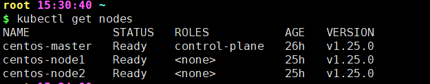

   查询详细信息
   ```
   kubectl describe nodes
   ```
  ---

   - 为节点添加新标签
      ```
      kubectl label nodes centos-node1 disktype=ssd
      ```

   - 删除节点标签
      ```
      kubectl label nodes centos-node1 disktype-
      ```

- 查看节点详情
   ```
   kubectl describe nodes centos-node1
   ```

## 创建 Pod

- 自主式 Pod
  > 直接定义一个Pod资源

   举个栗子

   ```
   vim pod-try-go.yaml
   ```

   较为简单的镜像内容
   ```
   apiVersion: v1          # api 版本
   kind: Pod               # 创建的资源
   metadata:
      name: go-test        # Pod 的名字
      namespace: default   # Pod 所在的名称空间
      labels:
         app: go           # 标签
         env: dev
   spec:                   # 规格说明（specification 的简称）
      containers:                         # 容器列表
         - name: gogogo                      # 容器的名字
            ports:
            - containerPort: 8080            # 容器端口
            # hostIP: 127.0.0.1            # 指定绑定的宿主机 IP
            # hostPort: 8080               # 在宿主机上映射的端口
            image: registry.cn-hangzhou.aliyuncs.com/ali-21-docker/ali-c317:try_go
            imagePullPolicy: IfNotPresent    # 镜像拉取策略
   ```
  
   呼啦啦属性全写的镜像
   ```
   apiVersion: v1          # api 版本
   kind: Pod               # 创建的资源
   metadata:
      name: go-test        # Pod 的名字
      namespace: default   # Pod 所在的名称空间
      labels:
         app: go           # 标签
         env: dev
   spec:                   # 规格说明（specification 的简称）
      # activeDeadlineSeconds: 600        # Pod 运行的最长时间
      restartPolicy: Always               # Pod 重启策略  
                                             # Always 重启
                                             # Never 不重启
                                             # OnFailure 只有容器退出码非 0 时才重启

   
      # --------- Node 节点选择 BEGAIN ---------
      # 两种方式指定 Pod 运行的节点
      nodeName: centos-node1              # 指定 Pod 运行的节点 （一定会分配到这个节点）
                                            # 可强制调度到 master 节点

      nodeSelector:                       # 指定 Pod 运行的节点标签
         disktype: ssd                    # 没有节点有 disktype: ssd 标签，则会创建一个 Pod ，但是容器会调度失败，不会放置在任何节点上
                                            # 只有节点有 disktype: ssd 标签，才会创建 Pod，并且会调度到这个节点上
                                            # 当检测到有 disktype: ssd 标签的节点，就会创建 Pod，并且会调度到这个节点上，无需重新创建 Pod

      # --------- Node 节点选择 END ------------

      affinity:                                           # 亲和性 [关联性]
      # --------- Node 节点亲和性 BEGAIN ---------         #  Pod 节点更应该自动部署到哪个指定条件的 Node 节点上

                                                            # https://kubernetes.io/zh-cn/docs/concepts/scheduling-eviction/assign-pod-node/

         nodeAffinity:                                      # 更灵活的节点选择方式
            requiredDuringSchedulingIgnoredDuringExecution: # [硬亲和性] 必须满足，否则不调度
                                                               # IgnoredDuringExecution 意味着如果节点标签在 Kubernetes 调度 Pod 后发生了变更，Pod 仍将继续运行。
               nodeSelectorTerms:                           # 节点选择条件
               - matchExpressions:                          # 匹配表达式 ，多个表达式之间是 与 关系
                 - key: disktype          
                   operator: In                             # 表达式
                                                               # 匹配表达式的 operator 值：
                                                               #  - In： 匹配表达式的值必须在列表中
                                                               #  - NotIn： 匹配表达式的值不能在列表中
                                                               #  - Exists： 匹配表达式的值必须存在
                                                               #  - DoesNotExist： 匹配表达式的值不能存在
                                                               #  - Gt： 匹配表达式的值必须大于指定的值
                                                               #  - Lt： 匹配表达式的值必须小于指定的值
                   values:
                   - ssd
                   - hdd
               - matchFields:                               # 匹配字段
                 - key: metadata.name                       # 字段名
                   values:
                   - centos-node1

            preferredDuringSchedulingIgnoredDuringExecution: # [软亲和性] 尽量满足，如果不满足，也会调度
            - weight: 100                                    # required 权重 同时满足的 则满足的条件的权重越高 则优先调度
              preference:                                    # required 条件
                matchExpressions:                         
                - key: disktype
                  operator: In
                  values:
                  - ssd
                 matchFields:                               
                   - key: metadata.name
                     values:
                     - centos-node1

      # --------- Node 节点亲和性 END ---------
      
      # --------- Pod 节点亲和性 BEGAIN ---------           # Pod 节点更应该自动部署到哪个拥有指定条件的 Pod 的 Node 节点上
                                                           # 首先，Node 节点上得有 Pod
         podAffinity:
            requiredDuringSchedulingIgnoredDuringExecution:    # [硬亲和性] 
               topologyKey: kubernetes.io/hostname             # required 拓扑键 指 label 必须拥有这个 key 的 Node 节点
               labelSelector:
                  matchExpressions:
                  - {key: app2, operator: In, values: ["myapp2"]} # 匹配条件 也可以像 Node 节点 matchExpressions 那样写
                                                                  #  - In： 匹配表达式的值必须在列表中
                                                                  #  - NotIn： 匹配表达式的值不能在列表中
                                                                  #  - Exists： 匹配表达式的值必须存在
                                                                  #  - DoesNotExist： 匹配表达式的值不能存在 
                  matchLabels:
                  - app2: myapp2
               
               namespaceSelector:
                  ...                                             # 命名空间选择条件 同 [labelSelector]
               namespaces:
               - default
                 xxx

            preferredDuringSchedulingIgnoredDuringExecution:   # [软亲和性] 
               weight: 100                                        # required 权重                    
               podAffinityTerm:                                   # required 条件
                  ...                                             # 条件 同 [硬亲和性] 

         podAntiAffinity:                                      # [反亲和性] Pod 不能部署到拥有指定条件的 Pod 的 Node 节点上
            ...                                                   # 条件 同 [podAffinity]
            
      # --------- Pod 节点亲和性 END ---------

      # --------- 初始化容器 BEGAIN ---------

      initContainers:                     # 初始化容器列表
                                          # 容器的顺序是从上到下顺序执行 有一个失败则 Pod 失败
      - name: initcontainer1
        image: busybox:1.28
        imagePullPolicy: IfNotPresent   
        command: ["sh", "-c", "sleep 3600"]
      - name: initcontainer2
         ...
         command:
         - wget
         - "-O"
         - "/index.html"
         - "https://www.baidu.com"

      # --------- 初始化容器 END ---------

      containers:                         # 容器列表
      - name: gogogo                      # 容器的名字
         ports:
         - containerPort: 8080            # 容器端口
           # hostIP: 127.0.0.1            # 指定绑定的宿主机 IP
           # hostPort: 8080               # 在宿主机上映射的端口
         image: registry.cn-hangzhou.aliyuncs.com/ali-21-docker/ali-c317:try_go
         imagePullPolicy: IfNotPresent    # 镜像拉取策略
                                             # Always：不管本地是否存在镜像，都要重新拉取镜像
                                             # Never： 从不拉取镜像
                                             # IfNotPresent：如果本地存在，使用本地的镜像，本地不存在，从官方拉取镜像
         lifecycle：                      # 容器生命周期钩子
            postStart:                       # 容器创建之后立刻执行，用于资源部署、环境准备等。
              exec:
                command: ["echo", "postStart"]

            preStop:                         # 容器销毁之前执行，用于资源回收、清理等。
              exec:  
                command: ["echo", "preStop"]

      # 写第二个镜像
      - name: busybox
        image: busybox:1.28
        command: ["sleep", "3600"]

   ```

   - 启动 Pod
      ```
      kubectl apply -f pod-try-go.yaml
      ```

      修改 yaml 文件后直接重新执行此命令可更新 Pod

   - 查看 Pod
      ```
      kubectl get pod

      kubectl get pod go-test

      kubectl get pod -owide -l app=go
      ```
      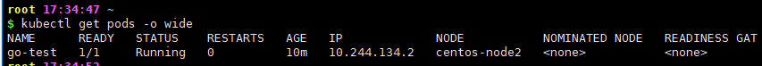

      - -n：指定名称空间
        - 指定在所有命名空间查询
            ```
            kubectl get pod --all-namespaces
            ```

      - -owide：显示详细信息
      
      - --show-labels：显示标签
        - 对已经存在的 Pod 添加新标签
            ```
            # kubectl label pod pod名称 标签key=标签value
            kubectl label pod go-test release=v1
            ```
        - 删除标签
            ```
            # kubectl label pod pod名称 标签key-
            kubectl label pod go-test release-
            ```
      - -l：根据标签过滤 Pod
        - 不展示标签 value
            ```
            kubectl get pod -l release=v1

            kubectl get pod -l release
            ```
            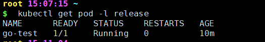

        - 展示标签 value
            ```
            kubectl get pod -L release

            kubectl get pod -L release,app
            ```
            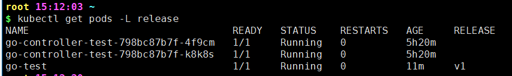

      - -w ：实时更新 ( --watch )

      K8S 集群环境内，可以通过 
      ```
      curl 10.244.134.2:8080
      ```
      进行访问

      ---

   - 查看pod日志

      ```
      kubectl logs go-test
      ```

   - 进入 Pod
      ```
      kubectl exec -it go-test -- /bin/bash
      ```

      - 进入 Pod 里的指定容器
        ```
        kubectl exec -it go-test --container=gogogo -- /bin/bash

        kubectl exec -it go-test -c gogogo -- /bin/bash
        ```

      - 退出
         ```
         exit
         ```
   
   - 查看 Pod 详细信息
     ```
     kubectl describe pods go-test
     ```

   - 查看 Pod 标签
     ```
     kubectl get pods --show-labels
     ```

   - 查看 Pod 完整自动填充完整的 yaml
     ```
     kubectl get pods -o yaml

     kubectl get pods [podName] -o yaml
     ```

       - 筛查  <a id="pod_uid"></a>
         ```
         kubectl get pods -o yaml | grep uid

         kubectl get pods [podName] -o yaml | grep uid
         ```
         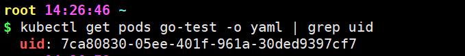

   - 删除 Pod
      ```
      kubectl delete pods go-test

      kubectl delete -f pod-try-go.yaml
      ```

      - 强制删除
         ```
         kubectl delete pods go-test --force --grace-period=0
         ```

         - --force
  
            这个选项的作用是强制删除Pod，即使Pod正在运行或者处于其他的非正常状态。在默认情况下，如果Pod正在运行，Kubernetes会尝试停止Pod，并在一段时间后删除它。但是，如果你使用了--force选项，Kubernetes会立即删除Pod，而不会尝试停止它。

         - --grace-period=0
         
            这个选项的作用是设置一个“优雅退出”的时间段为0。优雅退出时间段是Kubernetes给正在运行的Pod一个机会，让它能够自己清理并正常关闭的时间。如果Pod在这个时间段内完成了清理工作并停止运行，那么它就不会被强制停止。但是，如果你设置了--grace-period=0，那么Kubernetes会立即强制停止并删除Pod，而不会等待它自己关闭。

- 控制器式 Pod
   > 利用控制器来管理 Pod 资源，确保 Pod 始终维持在指定的副本数运行

   > 常见的管理Pod的控制器：Replicaset、Deployment、Job、CronJob、Daemonset、Statefulset。

   - #### Replicaset

      > 通过 Replicaset 管理 Pod

      > 似乎只有多副本管理，最基础的控制器

      查看 Replicaset 释义 可以简写为
      ```
      kubectl explain rs
      ```

      ```
      apiVersion: apps/v1
      kind: ReplicaSet
      metadata:
         name: go-test           # 定义的名称 将决定拉起的容器名称
         namespace: default
         labels:
            app: go
            tier: frontend
      spec:
         replicas: 3             # 副本数
         selector:
         matchLabels:
            tier1: frontend1
         template:                  # 定义 Pod 的模板
            metadata:               # 容器的元数据
                                    # 没有必要写 name 因为 pod 的名字会根据 ReplicaSet-metadata-name 自动生成
               labels:              # 容器的标签   
                  tier1: frontend1  # 容器的标签值 和 matchLabels 的值要一致才能被影响
            spec:
               containers:
               - name: go-con
                  ports:
                  - containerPort: 8080
                  image: registry.cn-hangzhou.aliyuncs.com/ali-21-docker/ali-c317:try_go
                  imagePullPolicy: IfNotPresent
      ``` 

      动态扩缩容：只需要更改 Replicaset 的 replicas 副本数后重新 apply 即可；
      更改镜像：需要更改文件且重新 apply 后还要手动删除 Pod，等待 Replicaset 重新建立新副本才生效；

      - 查看 Replicaset
         ```
         kubectl get replicaset

         kubectl get rs
         ```
   - #### Deployment

      > 通过 Deployment 管理 Pod

      > 建立在 Replicaset 之上，提供更高级的功能，例如滚动更新、回滚、扩缩容等。

      > 声明式定义，通过修改 yaml 文件并重新 apply 即可生效

      > 可以管理多个rs，每次更新镜像版本，都会生成一个新的rs，把旧的rs替换掉，多个rs同时存在，但是只有一个rs运行。
      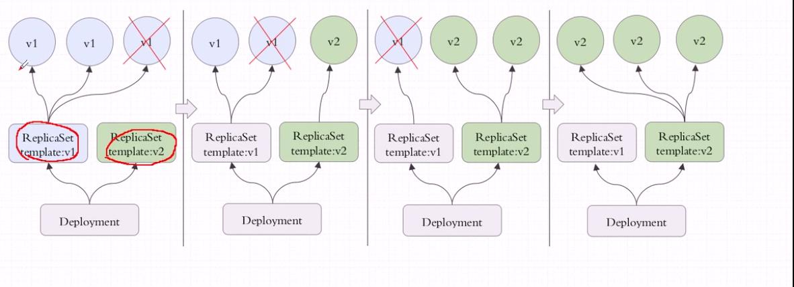

      查看 Replicaset 释义 可以简写为
      ```
      kubectl explain deployment

      kubectl explain deploy
      ```

      ```
      vim try-go-deploy.yaml
      ```
      ```
      apiVersion: apps/v1
      kind: Deployment
      metadata:
         name: go-deploy-test
         namespace: default                     # 定义的 deployment 名称 将决定拉起的容器名称
         labels:
            app: go
      spec:
         minReadySeconds: 0                     # 指定最小的 ready 时间
         paused: false                          # 是否暂停 为 true 则更新的时候创建 pod 后就暂停，不会继续进行下一步的替换操作
         progressDeadlineSeconds: 600           # 最大的 ready 时间，超过直接失败，paused 为 true 时，progressDeadlineSeconds 无效
         revisionHistoryLimit: 10               # 保留的历史版本数

         strategy:                              # 更新策略
            type: RollingUpdate                 # 更新策略类型 
                                                   # RollingUpdate 默认值，滚动更新
                                                   # Recreate 重建更新
            rollingUpdate:                      # 滚动更新策略
               maxSurge: 25%                    # 更新时最大的允许超出的指定的目标副本数的数量或比例 得数向上取整；据说设为 1 较好
               maxUnavailable: 25%               # 更新时最大的允许的未就绪的指定目标副本数的数量或比例 得数向下取整；据说设为 0 最好

         selector:                              # 标签选择器
            matchLabels:                        # 标签选择器 matchLabels 下定义的标签需要跟 template.metadata.labels 定义的标签一致
               app: app-go
         replicas: 3                            # 副本数
         template:                              # 定义 Pod 的模板
            metadata:
               labels:
                  app: app-go
            spec:
               containers:
               - name: go-con
                  ports:
                  - containerPort: 8080
                  image: registry.cn-hangzhou.aliyuncs.com/ali-21-docker/ali-c317:try_go
                  imagePullPolicy: IfNotPresent
      ```

      - 创建 Deployment
         ```
         kubectl create -f try-go-deploy.yaml
         ```
         声明式的定义，既可以创建资源，也可以动态更新资源

      - 查看 Deployment
         ```
         kubectl get deployment

         kubectl get deploy
         ```
         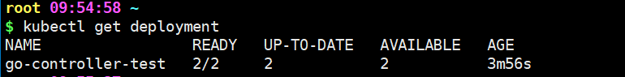

         1. NAME：列出名称空间中 deployment 的名称。
         2. READY：显示 deployment 有多少副本数。它遵循 ready/desired 的模式。
         3. UP-TO-DATE： 显示已更新到所需状态的副本数。
         4. AVAILABLE： 显示你的可以使用多少个应用程序副本。
         5. AGE ：显示应用程序已运行的时间。
      
      - 查看 deploy 创建的 replicaset
         ```
         kubectl get rs
         ```
         ReplicaSet的名称始终设置为 `[DEPLOYMENT-NAME]-[RANDOM-STRING]`

      - 命令行修改更新策略
        ```
        kubectl patch deployment go-deploy-test -p '{"spec":{"strategy":{"rollingUpdate": {"maxSurge":1,"maxUnavailable":1}}}}'
        ```
      ---
      其余命令与自主式 Pod 相同。

   - #### Statefulset

      > 通过 Statefulset 管理 Pod

      > Statefulset 是为有状态的 Pod 而设计的，例如 MySQL。
      >
      > 所管理的Pod、pv、pvc 的名称不随意变化， 是有序的

      ```
      vim try_statefulset.yaml
      ```
      ```
                                       # statefulset 必须有一个 Service
      apiVersion: v1
      kind: Service
      metadata:
         name: statefuset-service
         labels:
            app: statefulset
      spec:
         ports:
         - name: statefulset-go
         port: 80
         clusterIP: None
         selector:
         app: statefulset
      ---                              # 用以分隔多个资源定义
      apiVersion: apps/v1
      kind: StatefulSet
      metadata:
         name: try-staefulset
      spec:
         selector:
            matchLabels:
               app: statefulset-go
         serviceName: statefuset-service
         replicas: 2
         template:
            metadata:
               labels:
                  app: statefulset-go
            spec:
               containers:
               - name: con-go
                 image: registry.cn-hangzhou.aliyuncs.com/ali-21-docker/ali-c317:try_go
                 imagePullPolicy: IfNotPresent
                 ports:
                 - containerPort: 8080
      ```

      - 查看
         ```
         kubectl get statefulset
         ```

      - 查看 pod
         ```
         kubectl get pods -l app=statefulset-go
         ```

         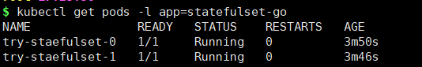

- 通过命令行创建 Pod
  > 通过 `kubectl run` 创建 Pod

  举个栗子
  ```
  kubectl run go-test --image=registry.cn-hangzhou.aliyuncs.com/ali-21-docker/ali-c317:try_go --port=8080 --image-pull-policy='IfNotPresent'
  ```

## 创建 Pod 的流程

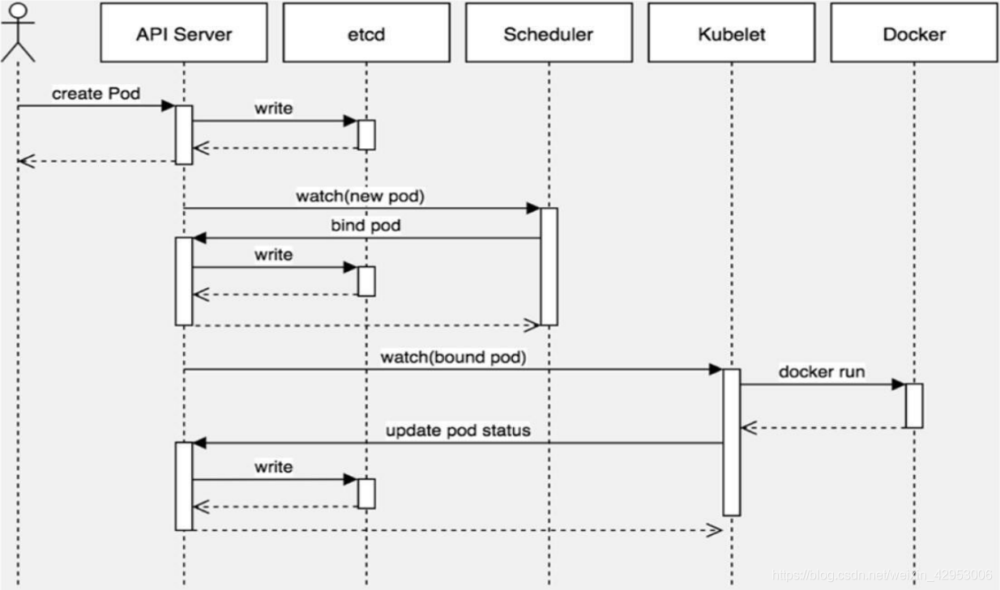

kubeconfig 环境变量 或 /root/.kube/config 中存储着 k8s 的集群信息，决定着 apiserver 、用户名等上下文信息；

- 第一步：
  
   基于 kubeconfig 或 /root/.kube/config 认证后，kubectl 向 apiserver 提交创建 pod 的请求，apiserver 接收到 pod 创建请求后，会将 pod 的属性信息(metadata)写入 etcd。

- 第二步：
  
   apiserver 触发 watch 机制准备创建 pod，信息转发给调度器 scheduler，调度器使用调度算法选择 node 节点，调度器将 node 信息给 apiserver，apiserver 将绑定的 node 信息写入 etcd。

- 第三步：
  
   apiserver 又通过 watch 机制，调用 kubelet，指定 pod 信息，调用容器运行时创建并启动 pod内的容器。

- 第四步：
  
   创建完成之后反馈给 kubelet, kubelet 又将 pod 的状态信息给 apiserver, apiserver 又将 pod 的状态信息写入 etcd。


---

## 命名空间 namespace

> Kubernetes 支持多个虚拟集群，它们底层依赖于同一个物理集群。   
> 这些虚拟集群被称为 命名空间。

> 可以给不同的用户、租户、环境或项目创建对应的命名空间

- 产看集群中的命名空间
   ```
   kubectl get namespaces
   ```
   

- 创建命名空间
   ```
   kubectl create namespace test-namespace

   kubectl create ns test-namespace
   ```

### 资源限制

```
vim namespace-quota.yaml
```
- quota：定额，限额；

写入
```
apiVersion: v1
kind: ResourceQuota           # 资源配额
metadata:
  name: mem-cpu-quota         # 资源配额名称
  namespace: test-namespace   # 资源配额所指定的命名空间
spec:
  hard:                       # 资源配额的硬限制

    requests.cpu: "2"         # Pod 所请求需要的 CPU 的最大数量
    # requests.cpu: "500m"    # 毫核 （1000m = 1核）

    requests.memory: "2Gi"
    # requests.memory: "500Mi"


    limits.cpu: "4"           # Pod 运行时 CPU 限制的最大数量
    limits.memory: "4Gi"
```

执行
```
kubectl apply -f namespace-quota.yaml
```

- 查看资源配额
   ```
   kubectl get resourcequota -n test-namespace
   ```
  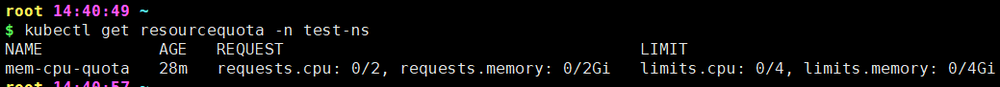

- 则 Pod.yaml
  ```
  vim pod-resourcequota.yaml
  ```
  ```
  apiVersion: v1
   kind: Pod
   metadata:
   name: pod-resourcequota-test
   namespace: test-namespace              # 分配该 Pod 到指定命名空间
   labels:
      app: app-go
   spec:
   containers:
   - name:  go_con
      ports:
      - containerPort: 8080
         image: registry.cn-hangzhou.aliyuncs.com/ali-21-docker/ali-c317:try_go
         imagePullPolicy: IfNotPresent
      resources:                          # 空间有限额 则必写
         requests:
            memory: "100Mi"               # 容器所需的内存 要小于资源配额的限制
            cpu: "500m"
         limits:                          # 容器运行时限制 要小于资源配额的限制
            memory: "2Gi"
            cpu: "2"
  ```

## 污点和容忍度

> taints (污点) / tolerations (容忍)
>
> 给了节点选则的主动权,可以决定拒绝哪些 Pod

> Pod 指定 tolerations, Node 指定 taints， Pod 根据 taints 调度到符合条件的 Node 上。

> 没有写 tolerations 的 Pod，不会调度到任何有 tolerations 的 Node 上。

- 查看 Node 节点上的污点
   ```
   kubectl describe nodes centos-node1|grep Taints
   ```

- 给 Pod 打上污点
  ```
  kubectl taint nodes node1 key=value:NoSchedule
  ```

  或修改 yaml 文件
   ```
   apiVersion: v1          
   kind: Pod               
   metadata:
      name: go-tolerations-test       
      namespace: default   
      labels:
         app: go-tolerations    
   spec:                   
      containers:                          
         - name: gogogo                     
            ports:
            - containerPort: 8080
            image: registry.cn-hangzhou.aliyuncs.com/ali-21-docker/ali-c317:try_go
            imagePullPolicy: IfNotPresent   
      tolerations:                        # 容忍度
         - key: "key"                      # 容忍度的键值对
            value: "value"                  # 容忍度的值
            operator: "Equal"               # 容忍度的操作符
            effect: "NoSchedule"            # 容忍度的影响
            # tolerationSeconds: 3600       # 容忍度的持续时间 当要被驱逐时，还可以运行的时间
   ```
   - effect 有三种：
      - PreferNoSchedule：【弱 - 柔性】不建议调度到该节点
      - NoSchedule：【中】不允许调度到该节点
      - NoExecute：【强】不允许运行 Pod / 中途修改 Node 污点，不符合则该 Pod 会被驱逐
   - operator 有三种：
      - Equal：【默认】相等 / 必须 key、value、operator 三者都相等才会被调度并执行
      - Exists：存在 /  key、value、operator 可以写任意多项， 写了的相等就可以

- 查看 Pod 上的容忍度
  ```
  kubectl describe pod pod-resourcequota-test -n test-namespace | grep Tolerations
  ```

## 生命周期

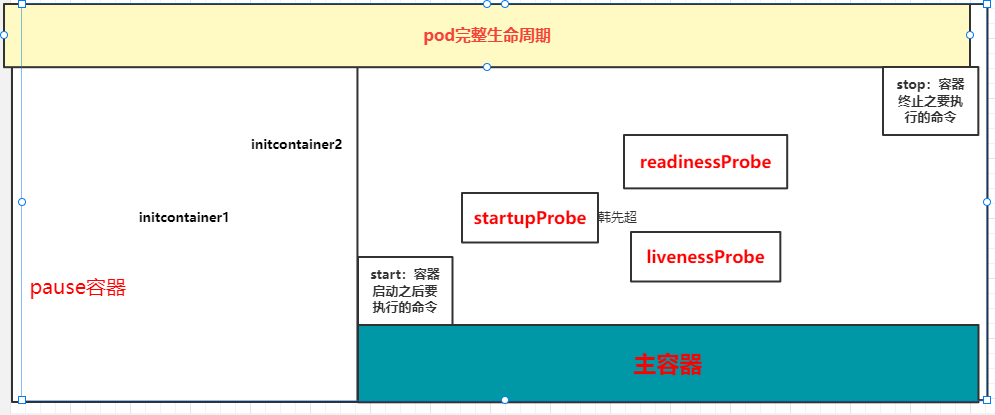

### pod 在整个生命周期的过程中总会处于以下几个状态：

- Pending：创建了pod资源并存入etcd中，但尚未完成调度。

- ContainerCreating：Pod 的调度完成，被分配到指定 Node 上。处于容器创建的过程中。通常是在拉取镜像的过程中。

- Running：Pod 包含的所有容器都已经成功创建，并且成功运行起来。

- Succeeded：Pod中的所有容器都已经成功终止并且不会被重启

- Failed：所有容器都已经终止，但至少有一个容器终止失败，也就是说容器返回了非0值的退出状态或已经被系统终止。

- Unknown：因为某些原因无法取得 Pod 的状态。这种情况通常是因为与 Pod 所在主机通信失败。


### pod 生命周期的重要行为

1. 在启动任何容器之前，先创建 pause 基础容器，它初始化Pod的环境并为后续加⼊的容器提供共享的名称空间。

2. 初始化容器（initcontainer）：
   
   一个pod可以拥有任意数量的init容器。init容器是按照顺序以此执行的，并且仅当最后一个init容器执行完毕才会去启动主容器。

3. 生命周期钩子：

   pod 允许定义两种类型的生命周期钩子，启动后(`postStart`)钩子和停止前(`preStop`)钩子

   这些生命周期钩子是基于每个容器来指定的，和 init 容器不同的是，init 容器是应用到整个 pod。而这些钩子是针对容器的，是在容器启动后和停止前执行的。

4. 容器探测：

   #### 对 Pod 健康状态诊断。分为三种：

      - Startupprobe (启动探测)：探测容器是否正常运行
      - Livenessprobe (存活性探测)：判断容器是否处于runnning状态，根据重启策略决定是否重启容器
      - Readinessprobe (就绪性检测)：判断容器是否准备就绪并对外提供服务，将容器设置为不可用，不接受service转发的请求

      书写位置

      ```
      apiVersion: v1
      kind: Pod
      spec:
         containers:
         - name: tomcat
           livenessProbe:     # 这儿
               ...
      ```

      ---

   #### 三种探针用于Pod检测：

      - ExecAction：在容器中执行一个命令，并根据返回的状态码进行诊断，只有返回0为成功

      - TCPSocketAction：通过与容器的某TCP端口尝试建立连接

      - HTTPGetAction：通过向容器IP地址的某指定端口的 path 发起 HTTP GET 请求。

      有一个探针探测失败则会根据重启策略进行重启，没有写明的探测则默认为成功

      --- 

   #### LivenessProbe和ReadinessProbe、startupprobe探测都支持下面三种探针：

      1. `exec`：在容器中执行指定的命令，如果执行成功，退出码为 0 则探测成功。
         ```
         xxxProbe:
            exec:
               command:
               - "/bin/sh"
               - "-c"
               - "aa ps aux | grep tomcat"
         ```
      2. `TCPSocket`：通过容器的 IP 地址和端口号执行 TCP 检 查，如果能够建立 TCP 连接，则表明容器健康。
         ```
         xxxProbe:
            tcpSocket:
               port: 80
         ```
      3. `HTTPGet`：通过容器的IP地址、端口号及路径调用 HTTP Get方法，如果响应的状态码大于等于200且小于400，则认为容器健康
         ```
            xxxProbe:
               httpGet:
                  scheme: HTTP
                  port: 80
                  path: /

               # 相当于访问 localhost:80/
         ```


   #### 探针探测结果有以下值：

      1. Success：表示通过检测。
      2. Failure：表示未通过检测。
      3. Unknown：表示检测没有正常进行。

      ---
      
   #### 探针相关的属性

      - `initialDelaySeconds`：容器启动后要等待多少秒后探针开始工作，单位“秒”，默认是 0 秒，最小值是 0 
      - `periodSeconds`： 执行探测的时间间隔（单位是秒），默认为 10s，单位“秒”，最小值是1
      - `timeoutSeconds`： 探针执行检测请求后，等待响应的超时时间，默认为1，单位“秒”。
      - `successThreshold`：连续探测几次成功，才认为探测成功，默认为 1
        - 在 Liveness 探针中必须为1
        - 最小值为1。
      - failureThreshold： 探测失败的重试次数，重试一定次数后将认为失败，
        - 在 readiness 探针中，Pod 会被标记为未就绪
        - 默认为 3，最小值为 1
   ---

   ReadinessProbe 和 livenessProbe 可以使用相同探测方式，只是对 Pod 的处置方式不同：
readinessProbe 当检测失败后，将 Pod 的 IP:Port 从对应的 EndPoint 列表中删除。
livenessProbe 当检测失败后，将杀死容器并根据 Pod 的重启策略来决定作出对应的措施。

### pod 的终止过程

1. 用户发出删除 pod 命令：`kubectl delete pods` / `kubectl delete -f yaml`

2. Pod 对象随着时间的推移更新，在宽限期（默认情况下30秒），pod 被视为“dead”状态

3. 将 pod 标记为“Terminating”状态

   同步的方式启动执行 preStop 钩子处理程序；若宽限期结束后，preStop 仍未执行结束，第二步会重新执行并额外获得一个2秒的小宽限期

   监控到 pod 对象为“Terminating”状态的同时启动 pod 关闭过程


4. endpoints 控制器监控到 pod 对象关闭，将 pod 与 service 匹配的 endpoints 列表中删除

5. Pod 内对象的容器收到 TERM 信号

6. 宽限期结束之后，若存在任何一个运行的进程，pod 会收到 SIGKILL 信号

7. Kubelet 请求 API Server 将此 Pod 资源宽限期设置为 0 从而完成删除操作


## Service 代理
> 四层代理 / 支持的是 TCP\UDP\SCTP 协议

> 在 kubernetes 中，Pod 是有生命周期的，且 pod ip在 k8s 集群之外无法访问的，如果 Pod 重启它的 IP 也很有可能会发生变化。如果我们的服务都是将 Pod 的 IP 地址写死，Pod 挂掉或者重启，和刚才重启的 pod 相关联的其他服务将会找不到它所关联的Pod，为了解决这个问题，在 kubernetes 中定义了 service 资源对象，Service 定义了一个服务访问的入口，客户端通过这个入口即可访问服务背后的应用集群实例，service 是一组Pod的逻辑集合，这一组 Pod 能够被 Service 访问到，通常是通过 Label Selector 实现的。
> 
> 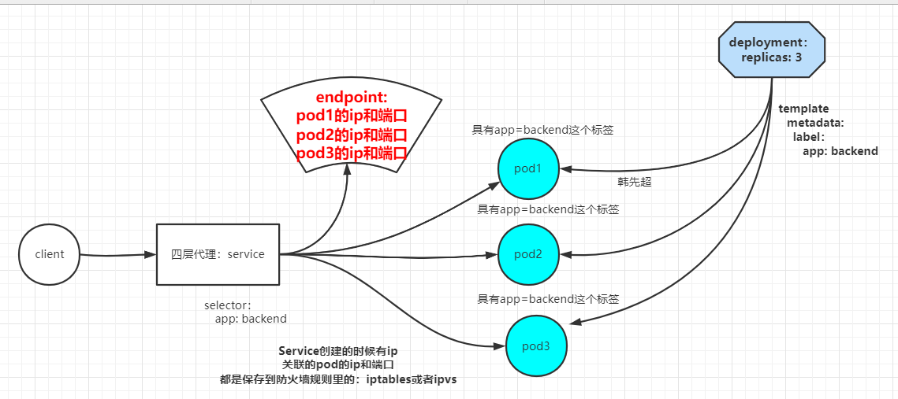
>
> Pod 就绪后才会被加入 Service

### ClusterIP 类型

> 为 Service 分配一个集群内部的IP地址，用于对后端Pod进行负载均衡。

```
vim try_service_ci.yaml
```

```
apiVersion: v1
kind: Service
metadata:
   name: try-service-ci
   labels:
      app: try-service
spec:
   type: ClusterIP
   ports:
   - port: 80                    # service 的端口，暴露给 k8s 集群内部服务访问
      protocol: TCP              # 协议
      targetPort: 80             # 指定代理的容器中定义的端口，容器可能有多个端口
   selector:
      app: go                    # 指定代理拥有 app: go 标签的 Pod
```

- 查看 service 
   ```
   kubectl get svc

   kubectl get svc try-service-ci

   kubectl get svc -l app=try-service

   kubectl get services --all-namespaces
   ```

   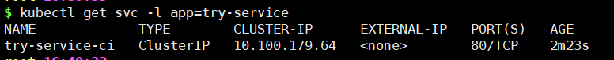

- 访问 service 
   ```
   curl 10.100.179.64:80
   ```

   在集群任何节点均可

- 查看 service 详情
   ```
   kubectl describe svc

   kubectl describe svc try-service-ci

   kubectl describe svc -l app=try-service
   ```

   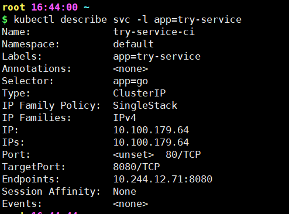

   其中 endpoints 字段显示了 service 关联的 pod 列表，可以看到 pod 的 ip 地址，端口号，协议等信息。

- 查看 endpoints
   ```
   kubectl get endpoints

   kubectl get ep

   kubectl get endpoints -l app=try-service
   ```
   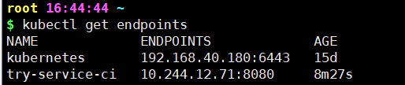

   可见 endpoints 的名称与 service 的名称相同，他们根据名称进行关联

---

每一个 service 服务创建完成后都会在集群 dns （domain name server）中动态添加一个资源记录，格式为 

   `服务名.命名空间.域名后缀`

   `SVC_NAME.NS_NAME.DOMAIN.LTD.`
   - SVC_NAME：表示 service 的名称
   - NS_NAME：service 的命名空间
   - DOMAIN：dns 的域名
     - 集群默认的域名后缀是 `svc.cluster.local.`
   - LTD：dns的后缀
  
   以上栗子会生成记录：

   `try-service-ci.default.svc.cluster.local`


   在集群任何节点内均可访问该记录

---

可通过 `ipvsadm -Ln` 查看 ip 负载；

### NodePort 类型

> 可在集群外访问

```
vim try_service_np.yaml
```
```
apiVersion: v1
kind: Service
metadata:
   name: try-service-np
   labels:
      app: try-service
spec:
   type: NodePort
   ports:
   - port: 80                   
     protocol: TCP            
     targetPort: 8080             
     nodePort: 30380
   selector:
      app: go 
```

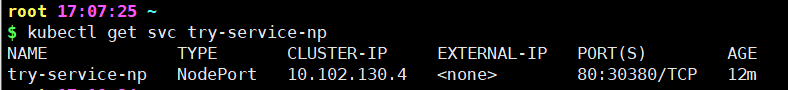
- 访问 service 
   - 集群内访问
      ```
      curl 10.102.130.4:80
      ```
      `10.102.130.4:80` 是 k8s 集群内部的 service ip 地址，只能在 k8s 集群内部访问，在集群外无法访问。

   - 集群外访问
   
      `物理机的IP地址:nodePort`

      栗：在浏览器中应访问

      `http://192.168.40.180:30380/`

      请求流向：客户端请求物理机 ip -> docker0 虚拟网卡 ip -> service ip ->  分配至 pod ip

### LoadBalancer 类型
   ...

### ExternalName 类型
> 可用于跨名称空间访问 service
> 
> 还可用于将外部服务导入到 k8s 集群中，并将外部服务的地址作为 service 的地址暴露给 k8s 集群内部的服务。


```
vim try_service_en.yaml
```
```
apiVersion: v1
kind: Service
metadata:
   name: try-service-en
   namespace: test-ns                                       # 指定命名空间
spec:
   type: ExternalName
   externalName: try-service-ci.default.svc.cluster.local   # 外部服务的软链地址
   ports:
   - port: 80                   
     protocol: TCP  
     targetPort: 8080             
```

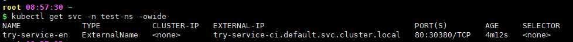

随后 test-ns 命名空间中的 service 就可以访问到 try-service-ci.default.svc.cluster.local 这个服务了。

---

### 映射外部服务

> 通过创建一个 service，将外部服务的地址作为 service 的地址暴露给 k8s 集群内部的服务。

创建一个 service
```
vim service_mysql.yaml
```

```
apiVersion: v1
kind: Service
metadata:
   name: mysql
spec:
   type: ClusterIP
   ports:
   - port: 3306
```
`apply` 后通过 `kubectl describe svc mysql` 查看 service 详情，发现 `mysql` `service` 的 `endpoind`为空

创建同名 endpoint
```
vim endpoint_mysql.yaml
```
```
apiVersion: v1
kind: Endpoints
metadata:
   name: mysql
subsets:
 - addresses:
   - ip: 192.168.40.182          # 外部服务（mysql）的地址 
   ports:
   - port: 3306                  # 外部服务（mysql）的端口
```

此时 `mysql` `service` 的 `endpoind` 为 `192.168.40.182:3306`。


## 存储方案

### emptyDir
> 临时目录 （[官文](https://kubernetes.io/zh-cn/docs/concepts/storage/volumes/#emptydir)）
> 
> 在 Pod 所在 Node 节点创建一个临时目录，目录在 Pod 退出后会自动删除。

```
vim try_pod_emptydir.yaml
```
```
apiVersion: v1
kind: Pod
metadata:
   name: try-pod-emptydir
spec:
   containers:
    - name: gogogo                     
      ports:
      - containerPort: 8080
      image: registry.cn-hangzhou.aliyuncs.com/ali-21-docker/ali-c317:try_go
      imagePullPolicy: IfNotPresent   
      volumeMounts:                    # 挂载数据卷
       - name: try-emptydir            # 指定数据卷名称
         mountPath: /cache             # 挂载的容器内目录
   volumes:                            # 定义数据卷
    - name: try-emptydir               
      emptyDir: {}                     # emptyDir
```

- 查看 emptyDir 创建位置

   Pod 被调度的 Node 节点的
   `/var/lib/kubelet/pods/`[[pod_uid](#pod_uid)]`/volumes/kubernetes.io~empty-dir/` 下
   ```
   yum install tree -y

   tree /var/lib/kubelet/pods/38e5a2fa-1fad-47d2-bda0-4f905b6ba2e3
   ```
   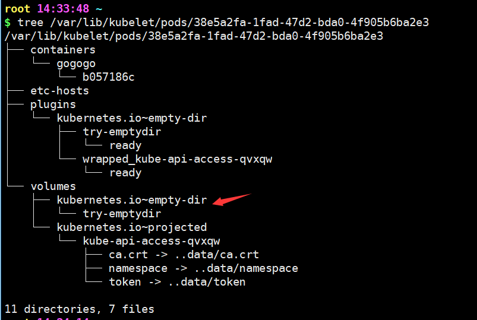


### hostPath
> 在 Pod 所在 Node 节点创建一个持久化存储目录，Pod 退出后不会删除。
>
> 但是 Pod 被调度到别的 Node 节点也不会同步。

```
vim try_pod_hostPath.yaml
```
```
apiVersion: v1
kind: Pod
metadata:
   name: try-pod-hostpath
spec:
   containers:
    - name: gogogo                     
      ports:
      - containerPort: 8080
      image: registry.cn-hangzhou.aliyuncs.com/ali-21-docker/ali-c317:try_go
      imagePullPolicy: IfNotPresent   
      volumeMounts:                    # 挂载数据卷
       - name: try-hostpath            # 指定数据卷名称 要和 volumes 中的 name 一致
         mountPath: /cache             # 挂载的容器内目录
   volumes:                            # 定义数据卷
    - name: try-hostpath               
      hostPath:
         path: /volume/hostPath
         type: DirectoryOrCreate       # ↓ DirectoryOrCreate：创建目录，Directory：目录必须存在 ↓↓↓
```
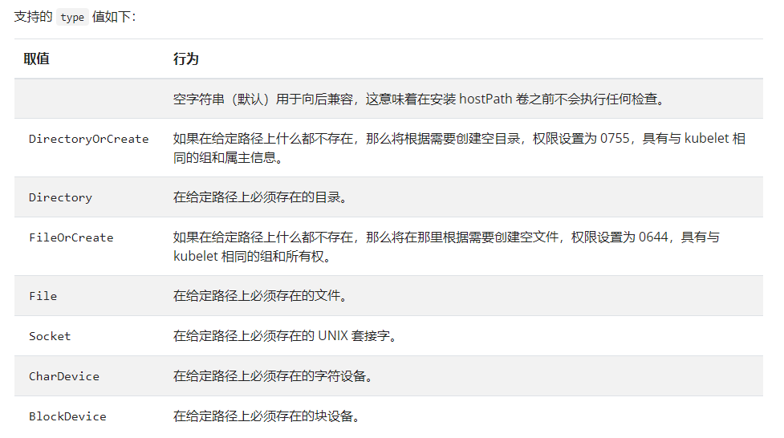

直接到 Pod 被调度的 Node 宿主机上查看目录 `/volume/hostPath`。


### NFS

> NFS：网络文件系统 (Network File System)
>
> 由 SUN 公司研制的 UNIX 表示层协议 (presentation layer protocol)，能使使用者访问网络上别处的文件就像在使用自己的计算机一样

#### 搭建 NFS 服务器

1. 安装 NFS 服务
   ```
   yum install nfs-utils -y
   ```
2. 在宿主机创建共享目录 
   栗：master 节点
   ```
   mkdir /data/volumes -pv
   ```
   - -p：逐级创建目录
   - -v：显示详细信息
3. 配置
   ```
   vim /etc/exports
   ```
   ```
   /data/volumes *(rw,no_root_squash)
   ```
   - `/data/volumes`：要共享的目录。任何挂载了这个 NFS 共享目录的客户端都可以访问这个目录以及其下的文件和子目录。

   - *(rw,no_root_squash)：针对前面目录的访问控制设置。

      - *：表示允许所有客户端访问
      - rw：允许读写访问
      - no_root_squash：默认情况下，NFS会对客户端的root用户进行"squash"（压平）处理，也就是说，root用户在访问NFS共享目录时会被映射成匿名用户，只拥有有限的权限。但是，当设置了no_root_squash后，NFS 不会对 root 用户进行压平处理，而是给予其完全的读写权限。这意味着客户端的root用户可以像在本地系统上一样完全控制这个 NFS 共享目录。

4. 使配置生效
   ```
   exportfs -arv
   ```
   - -a：这个选项表示“全部挂载或卸载”。当与 `exportfs -av` 一起使用时，它会列出所有当前导出的共享目录。
   - -r：这个选项表示“重新挂载”。当与 `exportfs -av` 一起使用时，它会重新导出所有共享目录。
   - -u：这个选项表示“卸载某个目录”。你需要指定要卸载的目录的路径。
   - -v：这个选项表示“显示共享目录”。当与 `exportfs -av` 一起使用时，它会显示共享目录的详细信息。
 
   重启
   ```
   service nfs restart
   ```
  
5. 启动

   设置开机自启
   ```
   systemctl enable nfs
   ```
   ---
   ```
   systemctl enable  nfs –now
   ```
   ---

6. 状态查看
   ```
   systemctl status nfs
   ```

---

7. 其他节点安装 NFS 服务并挂载
   - 安装
      ```
      yum install nfs-utils -y
      systemctl enable nfs –now
      ```
   - 挂载
     ```
     mkdir /nfs/test -pv
     ```
     ```
     mount 192.168.40.180:/data/volumes /nfs/test

     mount [nfs 服务器 IP]:[nfs 共享目录] [本地挂载目录]
     ```

   - 查看挂载信息
      ```
      df -h

      df -h | grep nfs
      ```
      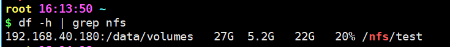

   - 卸载
     ```
     umount /nfs/test
     ```

#### Pod 挂载 NFS 共享目录

```
vim try_pod_nfs.yaml
```
```
apiVersion: v1
kind: Pod
metadata:
   name: try-pod-nfs
spec:
   containers:
    - name: gogogo                     
      ports:
      - containerPort: 8080
      image: registry.cn-hangzhou.aliyuncs.com/ali-21-docker/ali-c317:try_go
      imagePullPolicy: IfNotPresent   
      volumeMounts:                    # 挂载数据卷
       - name: try-nfs                 # 指定数据卷名称
         mountPath: /cache             # 挂载的容器内目录
   volumes:                            # 定义数据卷
    - name: try-nfs                    # 数据卷名称
      nfs:                             # NFS
         path: /data/volumes           # NFS 共享目录
         server: 192.168.40.180        # NFS 服务器 IP
```

### PV

> PersistentVolume (PV)：持久化存储
>
> PV 的创建和配置由管理员进行，而 PV 的使用则通过 PV Claim（Persistent Volume Claim，持久化卷声明）来实现。PVC 表达的是用户对存储的请求，类似于Pod对计算能力的请求。用户可以请求特定大小和访问模式的 PV 资源。

> **PV 一对一 PVC 多对多 POD**


#### PV 创建
```
vim try_pv.yaml
```
```
apiVersion: v1
kind: PersistentVolume                 # PV
metadata:
   name: try-pv
   labels:
      pv: try
spec: 
   nfs:                                # 选用 NFS 作为存储类型
      server: 192.168.40.180           
      path: /data/volumes
   accessModes: ["ReadWriteOnce"]      # ↓↓↓ PV 的访问模式，可选：ReadWriteOnce、ReadOnlyMany、ReadWriteMany ↓↓↓
   capacity:                           # 容量
      storage: 1Gi                     # 1G
   persistentVolumeReclaimPolicy: Retain   # PV 的回收策略，可选：
                                             # Recycle
                                             # Retain [默认值]
                                             # Delete
                                             # 当前版本测试没啥影响啊？！
```
```
kubectl apply -f try_pv.yaml
```

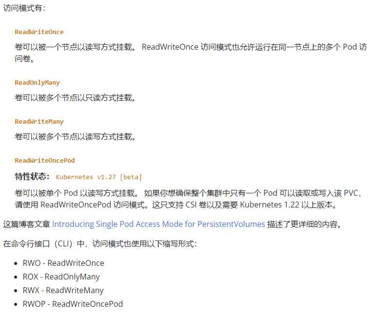

- 查看
   ```
   kubectl get pv
   ```

   ↑↑↑
   
   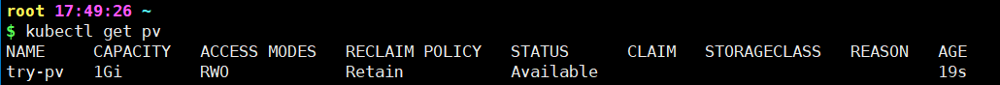 


#### PVC 创建

```
vim try_pvc.yaml
```
```
apiVersion: v1
kind: PersistentVolumeClaim
metadata:
   name: try-pvc
spec:
   accessModes: ["ReadWriteOnce"]      # 应包含在 pv 的 accessModes 内
   selector:
      matchLabels:
         pv: try                       # 与 pv 的 label 一致
   resources:
      requests: 
         storage: 1Gi
```
```
kubectl apply -f try_pvc.yaml
```

- 查看
   ```
   kubectl get pvc
   ```
   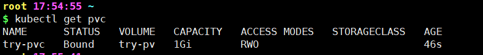

- 删除
   ```
   kubectl delete pvc try-pvc
   ```
   此时对应 pv 状态变为 Released

   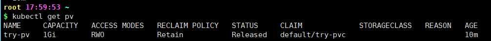

   单单重新应用 pvc 不会重新绑定 pv

   因为此时 pv 内存的 PV 与 PVC 的映射关系未被删除

   ```
   kubectl describe pv try-pv
   ```
   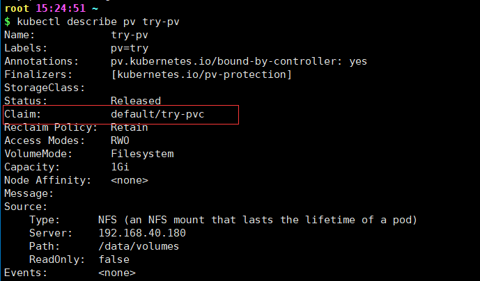

   **可以选择删除 pv，重新创建 pvc，pvc 重新绑定 pv**

   `/! 或 !/` 通过编辑 pv，手动删除 pv 内部的 PV 与 PVC 的映射关系
   ```
   kubectl edit pv try-pv
   ```

   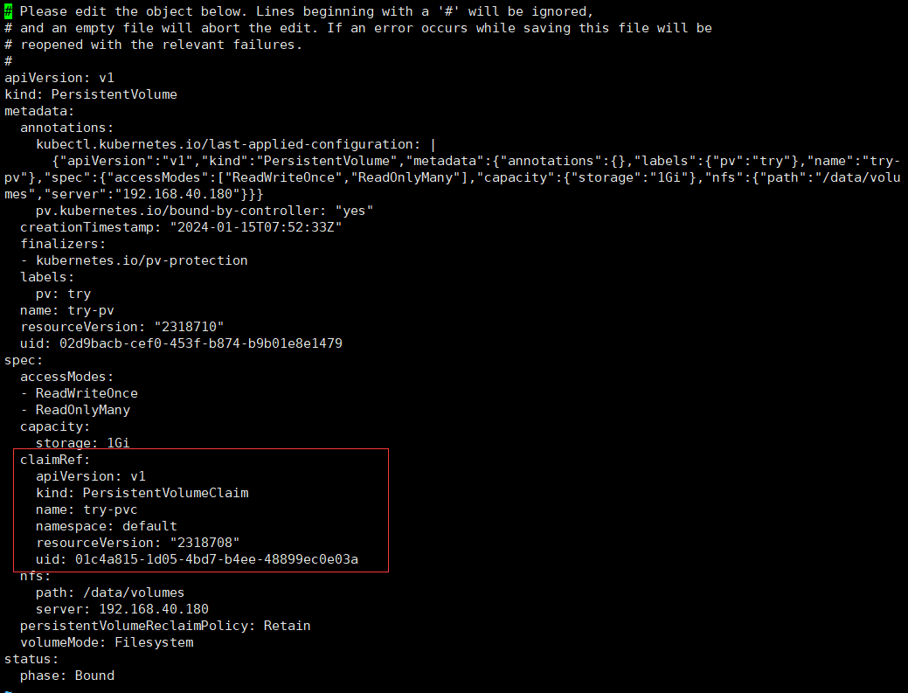


   - 不同操作下的 pv pvc 状态
      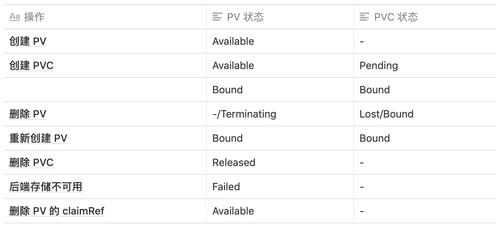

#### 绑定 pod
```
vim try_pod_pvc.yaml
```
```
apiVersion: v1
kind: Pod
metadata:
   name: try-pod-pvc
spec:
   containers:
    - name: gogogo                     
      ports:
      - containerPort: 8080
      image: registry.cn-hangzhou.aliyuncs.com/ali-21-docker/ali-c317:try_go
      imagePullPolicy: IfNotPresent   
      volumeMounts:                    # 挂载数据卷
       - name: try-pvc-vol                # 指定数据卷名称
         mountPath: /cache             # 挂载的容器内目录
   volumes:                            # 定义数据卷
    - name: try-pvc-vol                   # 数据卷名称
      persistentVolumeClaim:           # PVC
         claimName: try-pvc            # PVC 名称
```

---

---
---

#### storageClass

> pvc 可以通过 storageClass 自动创建 pv

> 以 NFS Provider 为例
> ##### [用 NFS 为 Kubernetes 提供网络存储](https://zhuanlan.zhihu.com/p/606727209)
> 
> ##### [[官] nfs-subdir-external-provisioner](https://github.com/kubernetes-sigs/nfs-subdir-external-provisioner)
>


