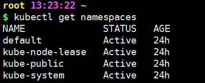

# K8S 应用
---

## nodes
> 节点是 K8S 集群的基本单位，每个节点上都运行着一个 kubelet 进程，负责维护容器的运行状态，同时也负责与 master 节点通信，接收来自用户的请求，并将这些请求转发给 Pod 管理器。

> 分为 工作节点（node） 和 管理节点（master）

- 查询节点信息
  ```
  kubectl get nodes

  kubectl get nodes --show-labels
  ```
  

   查询详细信息
   ```
   kubectl describe nodes
   ```
  ---

   - 为节点添加新标签
      ```
      kubectl label nodes centos-node1 disktype=ssd
      ```

   - 删除节点标签
      ```
      kubectl label nodes centos-node1 disktype-
      ```

- 查看节点详情
   ```
   kubectl describe nodes centos-node1
   ```

## 创建 Pod

- 自主式 Pod
  > 直接定义一个Pod资源

   举个栗子

   ```
   vim pod-try-go.yaml
   ```

   较为简单的镜像内容
   ```
   apiVersion: v1          # api 版本
   kind: Pod               # 创建的资源
   metadata:
      name: go-test        # Pod 的名字
      namespace: default   # Pod 所在的名称空间
      labels:
         app: go           # 标签
         env: dev
   spec:                   # 规格说明（specification 的简称）
      containers:                         # 容器列表
         - name: gogogo                      # 容器的名字
            ports:
            - containerPort: 8080            # 容器端口
            # hostIP: 127.0.0.1            # 指定绑定的宿主机 IP
            # hostPort: 8080               # 在宿主机上映射的端口
            image: registry.cn-hangzhou.aliyuncs.com/ali-21-docker/ali-c317:try_go
            imagePullPolicy: IfNotPresent    # 镜像拉取策略
   ```
  
  呼啦啦属性全写的镜像
   ```
   apiVersion: v1          # api 版本
   kind: Pod               # 创建的资源
   metadata:
      name: go-test        # Pod 的名字
      namespace: default   # Pod 所在的名称空间
      labels:
         app: go           # 标签
         env: dev
   spec:                   # 规格说明（specification 的简称）
      # activeDeadlineSeconds: 600        # Pod 运行的最长时间


   
      # --------- Node 节点选择 BEGAIN ---------
      # 两种方式指定 Pod 运行的节点
      nodeName: centos-node1              # 指定 Pod 运行的节点 （一定会分配到这个节点）
                                            # 可强制调度到 master 节点

      nodeSelector:                       # 指定 Pod 运行的节点标签
         disktype: ssd                    # 没有节点有 disktype: ssd 标签，则会创建一个 Pod ，但是容器会调度失败，不会放置在任何节点上
                                            # 只有节点有 disktype: ssd 标签，才会创建 Pod，并且会调度到这个节点上
                                            # 当检测到有 disktype: ssd 标签的节点，就会创建 Pod，并且会调度到这个节点上，无需重新创建 Pod

      # --------- Node 节点选择 END ------------

      affinity:                                           # 亲和性 [关联性]
      # --------- Node 节点亲和性 BEGAIN ---------         #  Pod 节点更应该自动部署到哪个指定条件的 Node 节点上

                                                            # https://kubernetes.io/zh-cn/docs/concepts/scheduling-eviction/assign-pod-node/

         nodeAffinity:                                      # 更灵活的节点选择方式
            requiredDuringSchedulingIgnoredDuringExecution: # [硬亲和性] 必须满足，否则不调度
                                                               # IgnoredDuringExecution 意味着如果节点标签在 Kubernetes 调度 Pod 后发生了变更，Pod 仍将继续运行。
               nodeSelectorTerms:                           # 节点选择条件
               - matchExpressions:                          # 匹配表达式 ，多个表达式之间是 与 关系
                 - key: disktype          
                   operator: In                             # 表达式
                                                               # 匹配表达式的 operator 值：
                                                               #  - In： 匹配表达式的值必须在列表中
                                                               #  - NotIn： 匹配表达式的值不能在列表中
                                                               #  - Exists： 匹配表达式的值必须存在
                                                               #  - DoesNotExist： 匹配表达式的值不能存在
                                                               #  - Gt： 匹配表达式的值必须大于指定的值
                                                               #  - Lt： 匹配表达式的值必须小于指定的值
                   values:
                   - ssd
                   - hdd
               - matchFields:                               # 匹配字段
                 - key: metadata.name                       # 字段名
                   values:
                   - centos-node1

            preferredDuringSchedulingIgnoredDuringExecution: # [软亲和性] 尽量满足，如果不满足，也会调度
            - weight: 100                                    # required 权重 同时满足的 则满足的条件的权重越高 则优先调度
              preference:                                    # required 条件
                matchExpressions:                         
                - key: disktype
                  operator: In
                  values:
                  - ssd
                 matchFields:                               
                   - key: metadata.name
                     values:
                     - centos-node1

      # --------- Node 节点亲和性 END ---------
      
      # --------- Pod 节点亲和性 BEGAIN ---------           # Pod 节点更应该自动部署到哪个拥有指定条件的 Pod 的 Node 节点上
                                                           # 首先，Node 节点上得有 Pod
         podAffinity:
            requiredDuringSchedulingIgnoredDuringExecution:    # [硬亲和性] 
               topologyKey: kubernetes.io/hostname             # required 拓扑键 指 label 必须拥有这个 key 的 Node 节点
               labelSelector:
                  matchExpressions:
                  - {key: app2, operator: In, values: ["myapp2"]} # 匹配条件 也可以像 Node 节点 matchExpressions 那样写
                                                                  #  - In： 匹配表达式的值必须在列表中
                                                                  #  - NotIn： 匹配表达式的值不能在列表中
                                                                  #  - Exists： 匹配表达式的值必须存在
                                                                  #  - DoesNotExist： 匹配表达式的值不能存在 
                  matchLabels:
                  - app2: myapp2
               
               namespaceSelector:
                  ...                                             # 命名空间选择条件 同 [labelSelector]
               namespaces:
               - default
                 xxx

            preferredDuringSchedulingIgnoredDuringExecution:   # [软亲和性] 
               weight: 100                                        # required 权重                    
               podAffinityTerm:                                   # required 条件
                  ...                                             # 条件 同 [硬亲和性] 

         podAntiAffinity:                                      # [反亲和性] Pod 不能部署到拥有指定条件的 Pod 的 Node 节点上
            ...                                                   # 条件 同 [podAffinity]
            
      # --------- Pod 节点亲和性 END ---------


      containers:                         # 容器列表
      - name: gogogo                      # 容器的名字
         ports:
         - containerPort: 8080            # 容器端口
           # hostIP: 127.0.0.1            # 指定绑定的宿主机 IP
           # hostPort: 8080               # 在宿主机上映射的端口
         image: registry.cn-hangzhou.aliyuncs.com/ali-21-docker/ali-c317:try_go
         imagePullPolicy: IfNotPresent    # 镜像拉取策略
                                             # Always：不管本地是否存在镜像，都要重新拉取镜像
                                             # Never： 从不拉取镜像
                                             # IfNotPresent：如果本地存在，使用本地的镜像，本地不存在，从官方拉取镜像
      # 写第二个镜像
      - name: busybox
        image: busybox:1.28
        command: ["sleep", "3600"]

   ```

   - 启动 Pod
      ```
      kubectl apply -f pod-try-go.yaml
      ```

      修改 yaml 文件后直接重新执行此命令可更新 Pod

   - 查看 Pod
      ```
      kubectl get pod

      kubectl get pod go-test

      kubectl get pod -owide -l app=go
      ```
      

      - -n：指定名称空间
        - 指定在所有命名空间查询
            ```
            kubectl get pod --all-namespaces
            ```

      - -owide：显示详细信息
      
      - --show-labels：显示标签
        - 对已经存在的 Pod 添加新标签
            ```
            # kubectl label pod pod名称 标签key=标签value
            kubectl label pod go-test release=v1
            ```
        - 删除标签
            ```
            # kubectl label pod pod名称 标签key-
            kubectl label pod go-test release-
            ```
      - -l：根据标签过滤 Pod
        - 不展示标签 value
            ```
            kubectl get pod -l release=v1

            kubectl get pod -l release
            ```
            

        - 展示标签 value
            ```
            kubectl get pod -L release

            kubectl get pod -L release,app
            ```
            

      K8S 集群环境内，可以通过 
      ```
      curl 10.244.134.2:8080
      ```
      进行访问

      ---

   - 查看pod日志

      ```
      kubectl logs go-test
      ```

   - 进入 Pod
      ```
      kubectl exec -it go-test -- /bin/bash
      ```

      - 进入 Pod 里的指定容器
        ```
        kubectl exec -it go-test --container=gogogo -- /bin/bash

        kubectl exec -it go-test -c gogogo -- /bin/bash
        ```

      - 退出
         ```
         exit
         ```
   
   - 查看 Pod 详细信息
     ```
     kubectl describe pods go-test
     ```

   - 查看 Pod 标签
     ```
     kubectl get pods --show-labels
     ```

   - 删除 Pod
      ```
      kubectl delete pods go-test

      kubectl delete -f pod-try-go.yaml
      ```

      - 强制删除
         ```
         kubectl delete pods go-test --force --grace-period=0
         ```

         - --force
  
            这个选项的作用是强制删除Pod，即使Pod正在运行或者处于其他的非正常状态。在默认情况下，如果Pod正在运行，Kubernetes会尝试停止Pod，并在一段时间后删除它。但是，如果你使用了--force选项，Kubernetes会立即删除Pod，而不会尝试停止它。

         - --grace-period=0
         
            这个选项的作用是设置一个“优雅退出”的时间段为0。优雅退出时间段是Kubernetes给正在运行的Pod一个机会，让它能够自己清理并正常关闭的时间。如果Pod在这个时间段内完成了清理工作并停止运行，那么它就不会被强制停止。但是，如果你设置了--grace-period=0，那么Kubernetes会立即强制停止并删除Pod，而不会等待它自己关闭。

- 控制器式 Pod
  > 利用控制器来管理 Pod 资源，确保 Pod 始终维持在指定的副本数运行

  > 常见的管理Pod的控制器：Replicaset、Deployment、Job、CronJob、Daemonset、Statefulset。

   举个栗子：通过 Deployment 管理Pod

   ```
   vim pod-try-go-controller.yaml
   ```
   ```
   apiVersion: apps/v1
   kind: Deployment
   metadata:
      name: go-controller-test
      namespace: default
      labels:
         app: go
   spec:
      selector:
      matchLabels:
         app: app-go
      replicas: 2
      template:
      metadata:
         labels:
            app: app-go
      spec:
         containers:
         - name: go-con
            ports:
            - containerPort: 8080
            image: registry.cn-hangzhou.aliyuncs.com/ali-21-docker/ali-c317:try_go
            imagePullPolicy: IfNotPresent
   ```

   - 查看 Deployment
      ```
      kubectl get deployment
      ```
      

   其余命令与自主式 Pod 相同。

- 通过命令行创建 Pod
  > 通过 `kubectl run` 创建 Pod

  举个栗子
  ```
  kubectl run go-test --image=registry.cn-hangzhou.aliyuncs.com/ali-21-docker/ali-c317:try_go --port=8080 --image-pull-policy='IfNotPresent'
  ```

## 创建 Pod 的流程


kubeconfig 环境变量 或 /root/.kube/config 中存储着 k8s 的集群信息，决定着 apiserver 、用户名等上下文信息；

- 第一步：
  
   基于 kubeconfig 或 /root/.kube/config 认证后，kubectl 向 apiserver 提交创建 pod 的请求，apiserver 接收到 pod 创建请求后，会将 pod 的属性信息(metadata)写入 etcd。

- 第二步：
  
   apiserver 触发 watch 机制准备创建 pod，信息转发给调度器 scheduler，调度器使用调度算法选择 node 节点，调度器将 node 信息给 apiserver，apiserver 将绑定的 node 信息写入 etcd。

- 第三步：
  
   apiserver 又通过 watch 机制，调用 kubelet，指定 pod 信息，调用容器运行时创建并启动 pod内的容器。

- 第四步：
  
   创建完成之后反馈给 kubelet, kubelet 又将 pod 的状态信息给 apiserver, apiserver 又将 pod 的状态信息写入 etcd。


---

## 命名空间 namespace

> Kubernetes 支持多个虚拟集群，它们底层依赖于同一个物理集群。   
> 这些虚拟集群被称为 命名空间。

> 可以给不同的用户、租户、环境或项目创建对应的命名空间

- 产看集群中的命名空间
   ```
   kubectl get namespaces
   ```
   

- 创建命名空间
   ```
   kubectl create namespace test-namespace

   kubectl create ns test-namespace
   ```

### 资源限制

```
vim namespace-quota.yaml
```
- quota：定额，限额；

写入
```
apiVersion: v1
kind: ResourceQuota           # 资源配额
metadata:
  name: mem-cpu-quota         # 资源配额名称
  namespace: test-namespace   # 资源配额所指定的命名空间
spec:
  hard:                       # 资源配额的硬限制

    requests.cpu: "2"         # Pod 所请求需要的 CPU 的最大数量
    # requests.cpu: "500m"    # 毫核 （1000m = 1核）

    requests.memory: "2Gi"
    # requests.memory: "500Mi"


    limits.cpu: "4"           # Pod 运行时 CPU 限制的最大数量
    limits.memory: "4Gi"
```

执行
```
kubectl apply -f namespace-quota.yaml
```

- 查看资源配额
   ```
   kubectl get resourcequota -n test-namespace
   ```
  

- 则 Pod.yaml
  ```
  vim pod-resourcequota.yaml
  ```
  ```
  apiVersion: v1
   kind: Pod
   metadata:
   name: pod-resourcequota-test
   namespace: test-namespace              # 分配该 Pod 到指定命名空间
   labels:
      app: app-go
   spec:
   containers:
   - name:  go_con
      ports:
      - containerPort: 8080
         image: registry.cn-hangzhou.aliyuncs.com/ali-21-docker/ali-c317:try_go
         imagePullPolicy: IfNotPresent
      resources:                          # 空间有限额 则必写
         requests:
            memory: "100Mi"               # 容器所需的内存 要小于资源配额的限制
            cpu: "500m"
         limits:                          # 容器运行时限制 要小于资源配额的限制
            memory: "2Gi"
            cpu: "2"
  ```

## 污点和容忍度

> taints (污点) / tolerations (容忍)
>
> 给了节点选则的主动权,可以决定拒绝哪些 Pod

> Pod 指定 tolerations, Node 指定 taints， Pod 根据 taints 调度到符合条件的 Node 上。

> 没有写 tolerations 的 Pod，不会调度到任何有 tolerations 的 Node 上。

- 查看 Node 节点上的污点
   ```
   kubectl describe nodes centos-node1|grep Taints
   ```

- 给 Pod 打上污点
  ```
  kubectl taint nodes node1 key=value:NoSchedule
  ```

  或修改 yaml 文件
   ```
   apiVersion: v1          
   kind: Pod               
   metadata:
      name: go-tolerations-test       
      namespace: default   
      labels:
         app: go-tolerations    
   spec:                   
      containers:                          
         - name: gogogo                     
            ports:
            - containerPort: 8080
            image: registry.cn-hangzhou.aliyuncs.com/ali-21-docker/ali-c317:try_go
            imagePullPolicy: IfNotPresent   
      tolerations:                        # 容忍度
         - key: "key"                      # 容忍度的键值对
            value: "value"                  # 容忍度的值
            operator: "Equal"               # 容忍度的操作符
            effect: "NoSchedule"            # 容忍度的影响
            # tolerationSeconds: 3600       # 容忍度的持续时间 当要被驱逐时，还可以运行的时间
   ```
   - effect 有三种：
      - PreferNoSchedule：【弱 - 柔性】不建议调度到该节点
      - NoSchedule：【中】不允许调度到该节点
      - NoExecute：【强】不允许运行 Pod / 中途修改 Node 污点，不符合则该 Pod 会被驱逐
   - operator 有三种：
      - Equal：【默认】相等 / 必须 key、value、operator 三者都相等才会被调度并执行
      - Exists：存在 /  key、value、operator 可以写任意多项， 写了的相等就可以

- 查看 Pod 上的容忍度
  ```
  kubectl describe pod pod-resourcequota-test -n test-namespace | grep Tolerations
  ```