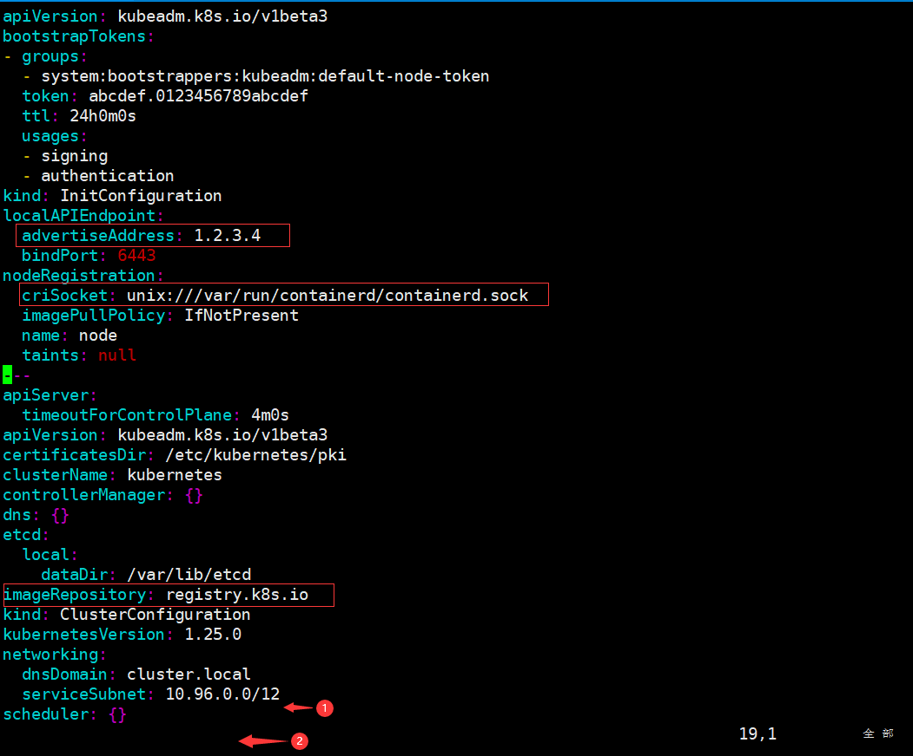
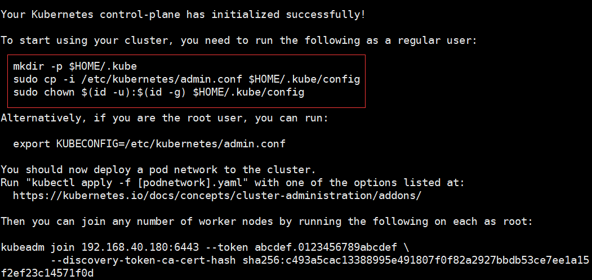
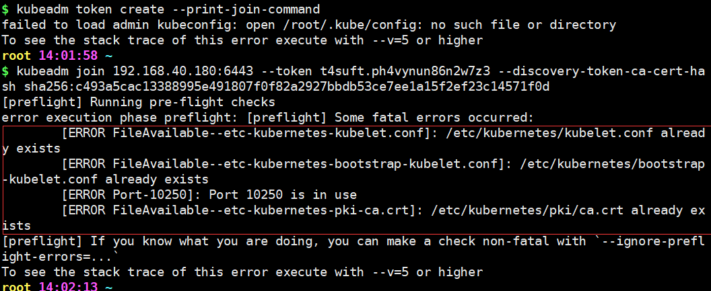
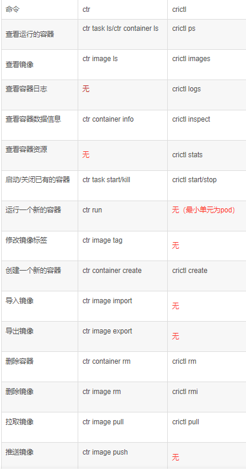

# K8S 1.25

> 基于 containerd 服务 （1.24 及之前基于 docker 服务）

> Centos 7.9 系统

## 准备

准备工作参考 [常用命令 'K8S 准备' 关键字](./常用命令.md) 、 [网络配置](./网络配置.md)

## 安装基础包
```
yum install -y device-mapper-persistent-data lvm2 wget net-tools nfs-utils lrzsz gcc gcc-c++ make cmake libxml2-devel openssl-devel curl curl-devel unzip sudo ntp libaio-devel wget vim ncurses-devel autoconf automake zlib-devel  python-devel epel-release openssh-server socat  ipvsadm conntrack telnet ipvsadm
```

## 安装 containerd 服务

```
yum install containerd.io-1.6.6 -y
```

- 生成 containerd 的配置文件

   ```
   mkdir -p /etc/containerd
   containerd config default > /etc/containerd/config.toml
   ```

- 修改配置文件

   ```
   vi /etc/containerd/config.toml
   ```

   修改如下内容：

   ```
   # SystemdCgroup = false
   SystemdCgroup = true

   ...

   # sandbox_image = "k8s.gcr.io/pause:3.6"
   sandbox_image="registry.aliyuncs.com/google_containers/pause:3.7"
   ```

  - `SystemdCgroup`

     用于指定是否使用 systemd cgroup 分离器。

     Systemd cgroup 分离器允许容器在 systemd 管理的 cgroups 中运行，这可以提供更好的资源管理和隔离。

     > Systemd Cgroups 配置器是一种用于管理 Linux 系统资源的工具。它通过创建和控制 Cgroups（Control Groups）来实现资源管理和限制。Cgroups 是 Linux 内核的一个特性，用于限制、记录和隔离进程组的资源使用（如 CPU、内存、磁盘 I/O 等）。

     > Systemd Cgroups 配置器可以用来创建和管理 Cgroups，从而实现系统资源的精细控制和优化。它可以限制进程组的资源使用量，记录其资源使用情况，并在资源不足时进行相应的处理。此外，Systemd Cgroups 配置器还可以与其他 Systemd 服务一起使用，以实现系统资源的整体管理和调度。

     > 总的来说，Systemd Cgroups 配置器是一种用于管理和优化 Linux 系统资源的工具，可以帮助管理员更好地控制和监视系统资源的分配和使用。

  - `sandbox_image`

     用于指定容器运行时的沙箱镜像。沙箱镜像用于提供一个安全的容器运行环境，它可以限制容器的资源使用和隔离其他容器。通过指定沙箱镜像，可以定制容器运行时的安全性和隔离性。


- 启动 containerd 服务

   ```
   systemctl start containerd
   systemctl enable containerd
   ```
   - ctl：control

   简写
   ```
   systemctl enable containerd  --now
   ```


- 修改 /etc/crictl.yaml 文件
  > 以 查看 K8S 中的镜像
  ```
  vim /etc/crictl.yaml
  ```
   ```
   runtime-endpoint: unix:///run/containerd/containerd.sock
   image-endpoint: unix:///run/containerd/containerd.sock
   timeout: 10
   debug: false
   ```
   - `runtime-endpoint`

     指定了运行时与 containerd 守护进程通信的 UNIX 套接字的路径。这意味着运行时将通过这个套接字与 containerd 进行交互

   - `image-endpoint`

     指定了镜像服务与 containerd 守护进程通信的 UNIX 套接字的路径。镜像服务通常用于下载、查询和管理容器镜像。

   - `timeout`

     定义了与 containerd 守护进程通信的超时时间（以秒为单位）。

   - `debug`

     控制是否启用调试模式。

   修改后，重启 containerd 服务
   ```
   systemctl restart containerd
   ```

## 安装 docker / 非必须

> 非必须 为了能方便的基于 dockerfile 构建镜像

```
yum install docker-ce -y
```
- docker-ce：社区版

启用
```
systemctl enable docker --now
```

## 配置镜像加速

- containerd 镜像加速
  ```
  vim /etc/containerd/config.toml
  ```
  - `/etc/containerd/config.toml`：containerd 的主要配置文件

  ```
  # config_path = "",

  config_path = "/etc/containerd/certs.d"
  ```
  ```
  mkdir /etc/containerd/certs.d/docker.io/ -p
  ```
  - -p：确保目录名存在，不存在则创建。如果上级目录不存在，则会自动创建上级目录。
  ```
  vim /etc/containerd/certs.d/docker.io/hosts.toml
  ```
  写入
  ```
  [host."https://au6mz9hv.mirror.aliyuncs.com",host."https://registry.docker-cn.com"]  capabilities = ["pull"]
  ```
  - 重启 containerd 服务
  ```
  systemctl restart containerd
  ```
- docker 镜像加速
  ```
  vim /etc/docker/daemon.json
  ```
  写入
  ```
  {
    "registry-mirrors":["https://au6mz9hv.mirror.aliyuncs.com","https://registry.docker-cn.com","https://docker.mirrors.ustc.edu.cn","https://dockerhub.azk8s.cn","http://hub-mirror.c.163.com"]
  }
  ```
  重启 docker
  ```
  systemctl restart docker
  ```

## 安装初始化k8s需要的软件包
```
yum install -y kubelet-1.25.0 kubeadm-1.25.0 kubectl-1.25.0
```
- kubelet：kubernetes 节点组件，运行于每个工作节点上，负责维护容器的运行状态，并向容器管理器汇报自身的状态，确保容器和 Pod 按照预期的方式运行，并提供了必要的资源管理、网络配置和存储卷管理等功能。
- kubeadm：用于初始化 k8s 集群的工具
- kubectl：kubernetes 命令行工具，用于与 k8s 集群进行交互
  - ctl：control

设置自启动
```
systemctl enable kubelet
```

- 查看 kubelet 状态
  ```
  systemctl status kubelet
  ```

## 使用 kubeadm 初始化 k8s 集群
> 仅在 控制节点 上执行
1. 生成默认配置文件
   ```
   kubeadm config print init-defaults > kubeadm-config.yaml
   ```
   
2. 修改配置文件
   ```
   advertiseAddress: 192.168.40.180 # 修改为 控制节点 ip
   ```
   ```
   criSocket: /run/containerd/containerd.sock # 指定容器运行时 改为 containerd.sock 真实目录
   ```
   - 查找 containerd.sock 位置
     ```
     find / -name containerd.sock
     ```
   ```
   name: centos_master # 改为控制节点主机名
   ```
   ```
   imageRepository: registry.cn-hangzhou.aliyuncs.com/google_containers # 指定可访问的镜像仓库
   ```

   于 ← 1 处指定 pod 网段
   ```
   podSubnet: 10.244.0.0/16
   ```

   于 ← 2 处（最后）插入以下内容，（要带着---）：
   ```
   ---
   apiVersion: kubeproxy.config.k8s.io/v1alpha1
   kind: KubeProxyConfiguration
   mode: ipvs
   ---
   apiVersion: kubelet.config.k8s.io/v1beta1
   kind: KubeletConfiguration
   cgroupDriver: systemd
   ```
   1. Kube 代理 指定 ipvs 模式
   
      - KubeProxy 用于生成防火墙规则

      - 注意：如果不指定，则默认使用 iptables 模式

      - ipvs 提供负载平衡功能的技术，主要用于TCP和UDP服务请求的转发 相比 iptables 更为高效

   2. 设置 Kubelet 驱动为 systemd
      
      - 和 containerd 的保持一致
      - systemd 是一个初始化系统，用于在 Linux 操作系统上启动和管理进程
      - Kubelet 将通过 systemd 的 API 与 systemd 进行通信，以启动、停止和重启容器
      
## 初始化k8s集群
```
kubeadm init --config=kubeadm-config.yaml
```
或
```
kubeadm init --config=kubeadm-config.yaml --ignore-preflight-errors=SystemVerification
```
- --config：指定配置文件
- --ignore-preflight-errors：忽略检查项

查看 images
```
ctr -n=k8s.io images ls
```
- ctr 是 containerd 自带的工具，有命名空间的概念，若是 k8s 相关的镜像，都默认在 k8s.io 这个命名空间

安装完毕后


- 执行命令以使用集群
  ```
  mkdir -p $HOME/.kube
  sudo cp -i /etc/kubernetes/admin.conf $HOME/.kube/config
  sudo chown $(id -u):$(id -g) $HOME/.kube/config
  ```
  - 若没有 /.kube/config 则无法执行 kubectl 命令
  - 可以将这个文件复制到其他节点同样位置 以执行 kubectl 命令
  
    - 在 Node 节点创建 .kube
      ```
      mkdir $HOME/.kube/
      ```
    - 在 Master 节点执行
      ```
      scp /root/.kube/config Node节点hostname:/root/.kube/
      ```
   
- 查看节点及状态
  ```
  kubectl get nodes
  ```

- 查看 pod 状态
  ```
  kubectl get pods -A
  ```

  查看命名空间下的
  ```
  kubectl get pods -n kube-system -owide
  ```
  - -n：指定命名空间
  - -owide：显示详细信息

- 查看节点状态
  ```
  kubectl get nodes -o wide
  ```

## 扩容（添加）K8S 工作节点
- 生成 token
  > 在 控制节点 执行
  ```
  kubeadm token create --print-join-command
  ```
  得到类似结果
  ```
  kubeadm join 192.168.40.180:6443 --token 6hhzv0.9qytcc5ax67j70c7 --discovery-token-ca-cert-hash sha256:c493a5cac13388995e491807f0f82a2927bbdb53ce7ee1a15f2ef23c14571f0d
  ```

- 复制 token
  - 复制 token 到其他节点
  - 粘贴到其他节点执行命令
  ```
  kubeadm join 192.168.40.180:6443 --token <token> --discovery-token-ca-cert-hash sha256:<hash> --ignore-preflight-errors=SystemVerification
  ```
   - --ignore-preflight-errors：忽略检查项
   - 仅可运行一次，若
     
     可删除文件后再执行

## 网络插件 calico
- 安装
  ```
  kubectl apply -f https://docs.projectcalico.org/manifests/calico.yaml
  ```
  点击下载 <a href="/_media/猎魔笔记/安装_K8S_1.25/calico.yaml" download="jswebrtc.js">calico.yaml</a>

  - Calico 架构图
      

  - Calico 网络模型主要工作组件：
      1. Felix：运行在每一台 Host 的 agent 进程，主要负责网络接口管理和监听、路由、ARP 管理、ACL 管理和同步、状态上报等。保证跨主机容器网络互通。
      2. etcd：分布式键值存储，相当于k8s集群中的数据库，存储着Calico网络模型中IP地址等相关信息。主要负责网络元数据一致性，确保 Calico 网络状态的准确性；
      3. BGP Client（BIRD）：Calico 为每一台 Host 部署一个 BGP Client，即每台host上部署一个BIRD。 主要负责把 Felix 写入 Kernel 的路由信息分发到当前 Calico 网络，确保 Workload 间的通信的有效性；
      4. BGP Route Reflector：在大型网络规模中，如果仅仅使用 BGP client 形成 mesh 全网互联的方案就会导致规模限制，因为所有节点之间俩俩互联，需要 N^2 个连接，为了解决这个规模问题，可以采用 BGP 的 Router Reflector 的方法，通过一个或者多个 BGP Route Reflector 来完成集中式的路由分发。 
   
  - calico-node 服务的主要参数如下:
    - CALICO_IPV4POOL_IPIP：
      
      是否启用IPIP模式。

      启用IPIP模式时，Calico 将在 Node 上创建一个名为 tunl0 的虚拟隧道。

      IP Pool 可以使用两种模式：BGP或IPIP。
      
      使用IPIP模式时，设置 `CALICO_IPV4POOL_IPIP="Always"`，不使用 IPIP 模式时，设置`CALICO_IPV4POOL_IPIP="Off"`，此时将使用BGP模式。

    - IP_AUTODETECTION_METHOD：
      获取 Node IP 地址的方式，默认使用第 1 个网络接口的IP地址，对于安装了多块网卡的 Node，可以使用正则表达式选择正确的网卡，例如`"interface=eth.*"`表示选择名称以 eth 开头的网卡的IP地址。
      ```
      - name: IP_AUTODETECTION_METHOD
        value: "interface=ens33"
      ```
      

     - 扩展：calico的IPIP模式和BGP模式对比分析

         1. IPIP
         
            把一个IP数据包又套在一个IP包里，即把IP层封装到IP层的一个 tunnel，它的作用其实基本上就相当于一个基于IP层的网桥，一般来说，普通的网桥是基于mac层的，根本不需要IP，而这个ipip则是通过两端的路由做一个tunnel，把两个本来不通的网络通过点对点连接起来；

            calico 以 ipip 模式部署完毕后，node 上会有一个 tunl0 的网卡设备，这是 ipip 做隧道封装用的,也是一种 overlay 模式的网络。当我们把节点下线，calico 容器都停止后，这个设备依然还在，执行 rmmodipip 命令可以将它删除。

         2. BGP

            BGP模式直接使用物理机作为虚拟路由路（vRouter），不再创建额外的tunnel

            边界网关协议（BorderGateway Protocol, BGP）是互联网上一个核心的去中心化的自治路由协议。它通过维护IP路由表或‘前缀’表来实现自治系统（AS）之间的可达性，属于矢量路由协议。BGP不使用传统的内部网关协议（IGP）的指标，而是基于路径、网络策略或规则集来决定路由。因此，它更适合被称为矢量性协议，而不是路由协议，通俗的说就是将接入到机房的多条线路（如电信、联通、移动等）融合为一体，实现多线单IP；

            BGP 机房的优点：服务器只需要设置一个IP地址，最佳访问路由是由网络上的骨干路由器根据路由跳数与其它技术指标来确定的，不会占用服务器的任何系统；

            官方提供的calico.yaml模板里，默认打开了ip-ip功能，该功能会在node上创建一个设备tunl0，容器的网络数据会经过该设备被封装一个ip头再转发。这里，calico.yaml中通过修改calico-node的环境变量：CALICO_IPV4POOL_IPIP来实现ipip功能的开关：默认是Always，表示开启；Off表示关闭ipip。

            ```
            - name:  CLUSTER_TYPE
              value: "k8s,bgp"
              # Auto-detect the BGP IP address.
              - name: IP
              value: "autodetect"
              # Enable IPIP
              - name: CALICO_IPV4POOL_IPIP
              value: "Always"
            ```
            

         总结：

         calico BGP 通信是基于 TCP 协议的，所以只要节点间三层互通即可完成，即三层互通的环境bird就能生成与邻居有关的路由。但是这些路由和 flannel host-gateway 模式一样，需要二层互通才能访问的通，因此如果在实际环境中配置了BGP模式生成了路由但是不同节点间pod访问不通，可能需要再确认下节点间是否二层互通。
         为了解决节点间二层不通场景下的跨节点通信问题，calico 也有自己的解决方案 ——IPIP 模式，通过在节点间建立一个 tunl0 设备，把节点间的pod数据包封装在 tunl0 设备上，这样就实现了节点间的二层通信，从而实现跨节点通信。         

---

## 验证

...

## ctr 和crictl 区别

1. ctr 是 containerd 自带的 CLI 命令行工具，crictl 是 k8s 中 CRI（容器运行时接口） 的客户端，k8s 使用该客户端和 containerd 进行交互；

2. ctr 和 crictl 命令具体区别如下，也可以--help查看。

   crictl 缺少对具体镜像的管理能力，可能是 k8s 层面镜像管理可以由用户自行控制，能配置 pod 里面容器的统一镜像仓库，镜像的管理可以有 habor；

   