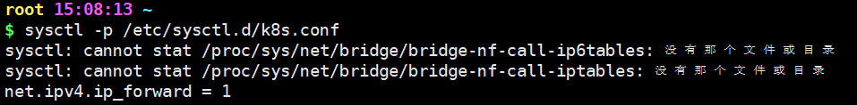

# 常用命令

## 命令

- 删除当前文件夹下所有文件:
  ```
  rm -rf *
  ```

- 查看空间使用情况：
  ```
  df -h
  ```

- cpu、内存等使用情况：
  ```
  top
  ```

- 查看进程：
  ```
  ps -A|grep xxx
  ```

- 独立进程运行不受终端关闭影响：
  ```
  nohup 程序的启动命令 ( npm start 之类 ) &

  使用exit退出才能使之生效，直接关闭终端不生效
  
  exit
  ```
- 查看当前时间
  ```
  date

  date +%Y-%m-%d_%H:%M:%S
  ```

## 解压缩

- 解压文件：
  ```
  tar -xzvf 文件名.tar.gz -C ./解压目标路径
  ```

- 解压zip 文件：
  ```
  unzip 文件名.zip -d 解压目标路径
  ```

## 端口

centos 默认安装了 firewalld 可以进行防火墙管理。

- 永久开启端口：
  80 端口为例
  ```
  firewall-cmd --permanent --zone=public --add-port=80/tcp
  ```

- 临时开启端口：8080-8081
  ```
  firewall-cmd --zone=public --add-port=8080-8081/tcp
  ```

- 查看所有打开的端口：
  ```
  firewall-cmd --zone=public --list-ports
  ```

- 关闭端口：
  80 端口为例
  ```
  firewall-cmd --zone=public --remove-port=80/tcp --permanent
  ```
需重启防火墙以生效

- 查看特定端口占用进程：
  3000 端口为例
  ```
  ss -lnp|grep 3000
  ```

---
-- K8S 准备开始 --

## 防火墙

- 启动防火墙：
  ```
  systemctl start firewalld.service
  ```

- 停止防火墙：
  ```
  systemctl stop firewalld.service
  ```

- 禁用防火墙（开机不自启）：
  ```
  systemctl disable firewalld.service
  ```

- 重启防火墙：
  ```
  systemctl restart firewalld.service 
  ```

## 修改主机名

- 修改主机名：
  ```
  hostnamectl set-hostname 新主机名
  ```

- 查看主机名：
  ```
  hostname
  ```

## 配置 hosts 文件
> 可以使主机之间通过主机名互相访问

- 编辑 hosts 文件：
  ```
  vi /etc/hosts
  ```

- 添加内容：
  ```
  # 127.0.0.1   localhost
  # 127.0.1.1   hostname.localdomain hostname
  # ip 主机名
  ...
  ```

- 保存并退出：
  ```
  :wq!
  ```

## 配置主机之间无密码登录
1. 本地生成密钥文件和私钥文件
   ```
   ssh-keygen
   ```
2. 把本地生成的公钥文件拷贝到远程主机
   ```
   ssh-copy-id 远程主机用户名@远程主机IP
   ```
   依次输入 `yes` 、对应主机密码 即可完成

   ---
   若修改过 hosts 文件后
   ```
   ssh-copy-id 远程主机名
   ```

## 交换分区 SWAP
> 文心一言：

> 交换分区（Swap）是Linux系统中的一种特殊分区，用于实现虚拟内存的功能。当物理内存不足时，系统会将一部分硬盘空间虚拟成内存使用，从而解决内存容量不足的情况。

> 当物理内存使用完之后，系统会将一些长时间没有什么操作的程序的数据存放到交换分区中，腾出内存来让别的程序运行。当这些程序要运行时，系统会从交换分区中恢复保存的数据到内存中。

> 总的来说，交换分区的作用是在物理内存不足的情况下，提供额外的内存空间，提高系统的运行效率。

- 临时关闭交换分区：
   ```
   swapoff -a
   ```
   - a 选项表示对所有交换分区进行操作

- 开启交换分区：
   ```
   swapon -a
   ```
---
- 永久关闭交换分区：
   ```
   vi /etc/fstab
   ```
   注释
   ```
   # /dev/mapper/centos-swap swap                    swap    defaults        0 0
   ```

### 为 K8S 关闭交换分区
> swap 分区的性能较低，k8s设计的时候为了能提升性能，默认是不允许使用交换分区的。Kubeadm初始化的时候会检测swap是否关闭，如果没关闭，那就初始化失败。如果不想要关闭交换分区，安装k8s的时候可以指定 `--ignore-preflight-errors=Swap` 来解决。


## 修改机器内核参数

为 k8s ➷

加载 br_netfilter 模块
```
modprobe br_netfilter
```
> modprobe 是一个用于在Linux系统中动态加载或卸载内核模块的工具。它可以用于添加、删除或查询内核模块。

> br_netfilter是一个内核模块，用于将桥接流量转发至 iptables 链。该模块在 Linux 主机上有多个网卡时特别有用，因为一个网卡收到的信息可以被传递给其他网卡，实现数据包转发，从而支持 VxLAN 等功能。


### 配置Kubernetes（k8s）的网络设置
```
cat > /etc/sysctl.d/k8s.conf <<EOF
net.bridge.bridge-nf-call-ip6tables = 1
net.bridge.bridge-nf-call-iptables = 1
net.ipv4.ip_forward = 1
EOF
```

- 使用 `cat` 命令来创建或覆盖 /etc/sysctl.d/k8s.conf 文件，并将后续的输入内容写入这个文件
`<<EOF`是一个叫做 “here document” 的 shell 结构，它允许你输入多行文本，直到遇到一个单独的 EOF（End of File） 标记。

- `net.bridge.bridge-nf-call-ip6tables = 1`

   这行代码设置了一个内核参数，它允许桥接数据包通过ip6tables进行过滤。ip6tables是IPv6版本的iptables，用于执行数据包过滤和网络地址转换（NAT）。

- `net.bridge.bridge-nf-call-iptables = 1`

   这行代码同样设置了一个内核参数，它允许桥接数据包通过iptables进行过滤。iptables是Linux系统上的一个用户空间工具，用于配置内核防火墙。

- `net.ipv4.ip_forward = 1`
  
  这行代码启用 IP 转发功能，使得 Linux 系统能够作为路由器转发网络数据包。在 Kubernetes 环境中，通常需要启用 IP 转发，以便容器可以与外部网络通信。

- 配置完这些内核参数后，通常需要运行`sysctl --system`命令来使更改生效。这样，新的内核参数设置就会应用到当前运行的内核中。

```
sysctl -p /etc/sysctl.d/k8s.conf
```
- -p   从指定的文件加载系统参数，如不指定即从 /etc/sysctl.conf 中加载
  
- 错误处理
  
   
   如果出现上述错误，说明没有加载 br_netfilter 模块，需要执行以下命令加载：
   ```
   modprobe br_netfilter
   ```

## 配置 repo 源

为 docker/containerd ➷
```
yum install yum-utils -y
```

```
yum-config-manager --add-repo http://mirrors.aliyun.com/docker-ce/linux/centos/docker-ce.repo
```

为 k8s 组件 ➷
```
cat >  /etc/yum.repos.d/kubernetes.repo <<EOF
[kubernetes] # 定义名为"kubernetes"的YUM仓库组
name=Kubernetes # 给这个仓库组起了一个名字，即"Kubernetes"
baseurl=https://mirrors.aliyun.com/kubernetes/yum/repos/kubernetes-el7-x86_64/ # 设置了仓库的基本URL
enabled=1 # 启用仓库
gpgcheck=0 # 不进行 GPG 签名检查
EOF
```


-- K8S 准备结束 --

---