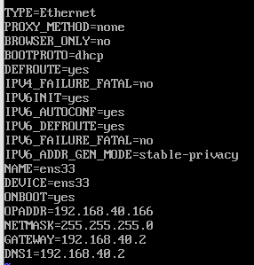

`ip addr` 可查看网卡设备名称，每台机器名称未必一致

一般为 `ifcfg-ens33`

> ifcfg-ens33 网络配置文件，通常位于 /etc/sysconfig/network-scripts/ 目录下。用于配置网络接口的参数和设置。



## 修改为静态IP地址

编辑文件，将其中的内容修改为如下内容：

```bash
BOOTPROTO=static # 指定网络接口的引导协议，可以是“static”（静态IP）、“dhcp”（动态IP）或“none”（不指定）。
ONBOOT=yes # 指定网络接口是否在系统启动时启动。
IPADDR=192.168.40.166 # 指定静态IP地址。
NETMASK=255.255.255.0 # 指定子网掩码。
GATEWAY=192.168.40.2 # 指定默认网关。
DNS1=192.168.40.2 # 指定DNS服务器地址。
```

保存后，重启网关
```bash
service network restart
```

验证

```bash
ip addr
```

### 修改 selinux 以便 xshell 连接
```
vi /etc/selinux/config
```
```
# SELINUX=enforcing # 改为 disable
SELINUX=disabled
```
```
reboot -f # 重启使之生效
```
- -f ： 强制重启