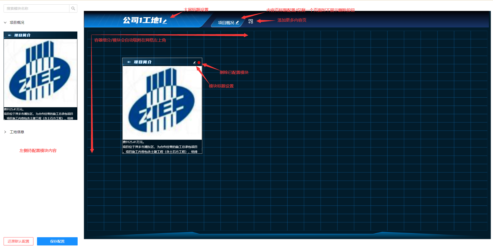

## 需求
【ZD】工地项目单工地大屏各页面、各组件需自定义配置，所以准备使用拖动功能开发一个小框架；

## 效果



## 代码实现

### 布局

采用 flex 左右布局，左侧竖列以手风琴组件展示各个需要配置的组件，作为组件库；
右侧为大屏容器，以 1920 * 1080 等比缩放，保持最佳观感；

- 左右布局，右侧宽度自适应示例：
```
 <div style={{ display: 'flex', height: '100vh' }} >
	<div style={{
		width: 320, 
	}}>
		// 左侧固定宽度，组件库
	</div>
	
	 <div style={{  flex: 1 }}>
		 // 右侧宽度通过 flex：1 自适应
	 </div>
 </div>
```

- 1080 等比缩放示例
```
// 定义一些基础数值
const itemContainWidth = isSetting ? 320 : 0
const bigScreenStandardWidth = 1920
const bigScreenStandardHeight = 1080
//
// 计算缩放比例
	// 容器视口大小
	let bigScreenWidth = clientWidth - itemContainWidth
	let bigScreenHeight = clientHeight
	// 标准比例
	const ratio = bigScreenStandardWidth / bigScreenStandardHeight;

	let bigScreenRadio = 1
	if (bigScreenWidth / bigScreenHeight > ratio) {
		// 宽度过宽 则高度不足 需要缩放高度以适应
		bigScreenRadio = bigScreenHeight / bigScreenStandardHeight
	} else {
		// 高度过高 则宽度不足 需要缩放宽度以适应
		bigScreenRadio = bigScreenWidth / bigScreenStandardWidth
	}
	
 {/* 大屏 */}
 // 通过 flex 样式试大屏容器 'super-screen-wrapper 始终在视口中央位置
 // 通过 bigScreenRadio 属性对大屏进行缩放
<div style={{ display: 'flex', flex: 1, alignItems: 'center', justifyContent: 'center' }}>
	<div id='super-screen-wrapper' style={{
		background: '#021C2B',
		position: 'absolute',
		width: bigScreenStandardWidth,
		height: bigScreenStandardHeight,
		transform: `scale(${bigScreenRadio})`,
	}} draggable={false}>
		// 大屏内容
	</div>
</div>
```

### 拖动
- 对于被拖动的组件
```
<div 
	// 定义可被拖动
	draggable 
	onDragStart={(event) => {
			// 拖动开始的回调

			// 可以通过 event.dataTransfer.getData('item') 传递拖数据至拖动的目标容器
			event.dataTransfer.setData('item', JSON.stringify({
					key: item.key,
					across: item.across.split('*').map(s => parseInt(s))
			}));

			// ! 以下被注释代码通过改变 dragShadow 的样式，以改变被拖动虚影的样式 
			// let dragShadow = document.getElementById('dragShadow');
			// dragShadow.innerHTML = event.target.innerHTML

			// dragShadow.style.width =
			//     acrossArr[0] * paramsWH.gridWidth
			//     // * paramsWH.bigScreenRadio 
			//     + 'px'
			// dragShadow.style.height =
			//     acrossArr[1] * paramsWH.gridHeight
			//     //  * paramsWH.bigScreenRadio 
			//     + 'px'
			// dragShadow.style.opacity = 1
			// event.dataTransfer.setDragImage(dragShadow, 4, 4);

			// setDragImage 既可以用于设置拖动虚影的图片，也可以用于设置拖动虚影的位置 
			// 此处设置鼠标所在虚影的位置为左上角偏 4 像素的位置
			event.dataTransfer.setDragImage(event.target, 4, 4);
			event.dataTransfer.effectAllowed = 'move';
	}}
	onDrag={(event) => {
			// 拖动过程中每个步骤的回调
	}}
	onDragEnd={(event) => {
			// 拖动结束后的回调
	}}
>
	// 组件内容
</div>
```

- 对于拖动的目标容器
```
 <div
	style={{
			width: '100%',
			height: `calc(100% - ${headerHeight}px - ${footerHeight}px)`,
			position: 'relative'
	}}
	onDragOver={(event) => {
			// 元素在此容器内被拖动时的回调
			event.preventDefault();
	}}
	onDrop={(event) => {
			// 元素在此容器内被释放时的回调
			event.preventDefault();
			// 获得基于整个屏幕的坐标
			const { clientX, clientY } = event
			// 获得传输的数据
			const item = JSON.parse(event.dataTransfer.getData('item'));
	}}
	onDragEnter={(event) => {
			// 元素进入此容器时的回调
			event.preventDefault();
	}}
	onDragLeave={(event) => {
			// 元素离开此容器时的回调
			event.preventDefault();
	}}
> 
	// 在这里可以通过获得的坐标以 position：absolute 定位元素，实现最终的拖动效果
	// 元素上再次定义 draggable 以便重新移动位置
</div>
```

## 模块配置
配置每个待拖动配置的模块的信息，以便按规则渲染：

```
// 这下面引入所有的组件
import ProjectBrief from '../../components/projectOverview/newleft1';
import Milestone from '../../../singleSiteBoard/components/projectOverview/newbottom'

...

const [cardItems, setCardItems] = useState([{
	// 分组名称
	group: '项目概况',
	// 组件
	items: [{
			// 组件的默认标题
			defaultTitle: '项目简介',
			// 组件的 key 全局不得重复
			key: 'projectBrief',
			// 组件对应的组件，不要写 < />
			comment: ProjectBrief,
			// 全局参数，除必要的全局外，其他参数要在组件内自行获取，减少当前文件的复杂度
			commentProps: {
					sites: sites
			},
			// commentImg 展示模块样式 优先级高于 comment
			// 没有这个图片，在配置的是就会渲染组件，这样会加重浏览器负担
			commentImg: 'projectBrief.png',
			// 组件的 宽*高 占比 当前将容器分为 上下24格，across 表示组件占用的比例
			across: `5*12`,
			// 影响组件渲染的层级
			zIndex: 9,
	},]
}, {
	group: '工地信息',
	items: [{
		defaultTitle: '项目里程碑',
		key: 'milestone',
		comment: Milestone,
		across: `12*8`,
		zIndex: 9,
	}]
}])
```

## 改造现有模块
1. 当前回向每个组件传递 configTitle、isSetting 两个属性，分别表示 更改后的组件名称、当前是否是在配置页面调用此组件，根据 isSetting 可以进一步对组件进行改造，比如在配置时渲染组件，但是没有数据，可以根据 isSetting 状态加载假数据以演示；
```
const NewLeft1 = ({ sites, configTitle, isSetting }) => {
	
	...
	
	return (
        <div className='newleft1'>
            <Boxcardheader title={configTitle || "项目简介"} />
            ...
        </div>
    )
}
```

2. 样式修改：原大屏实现有很多相对的样式是相对整个大屏的宽高，在新的可配置大屏中，每个组件最外围都被包裹了一层 `position: relative` 的 `div`，致使所有的相对定位都会相对于元素本身的宽高，需要注意并进行修改；
