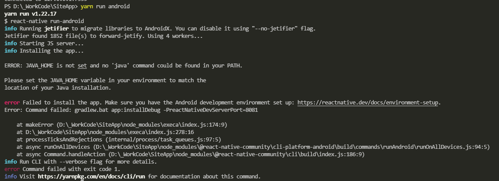
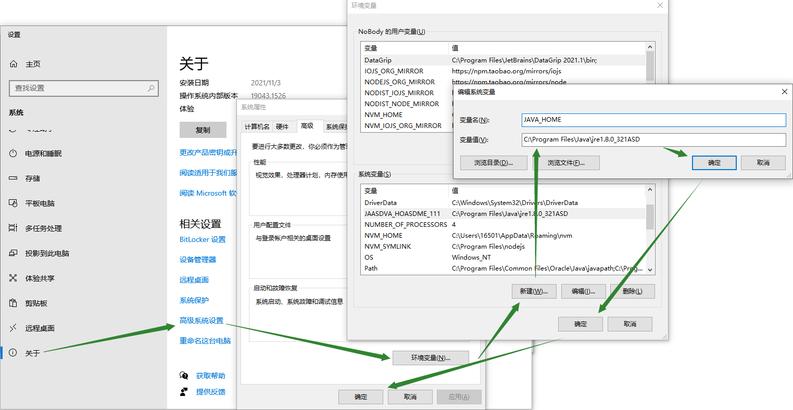
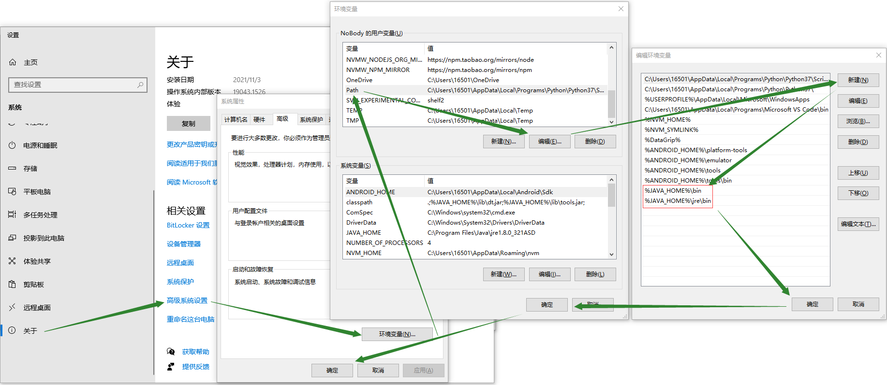
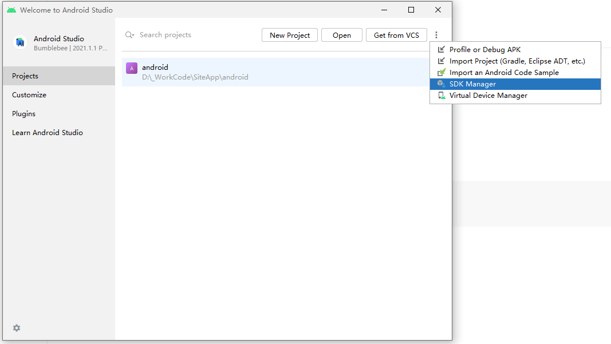
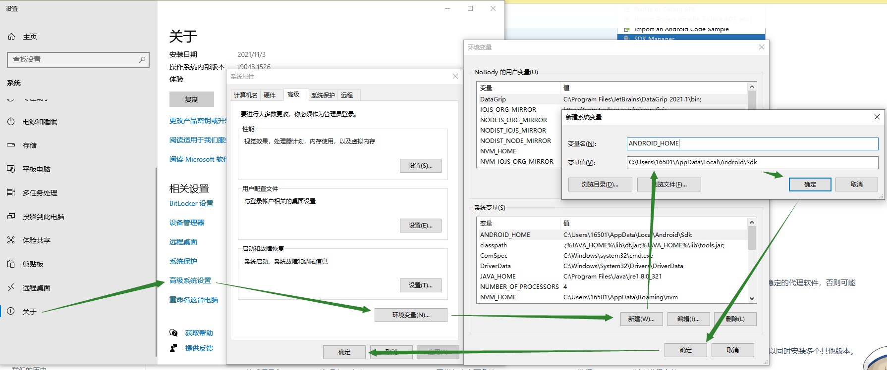
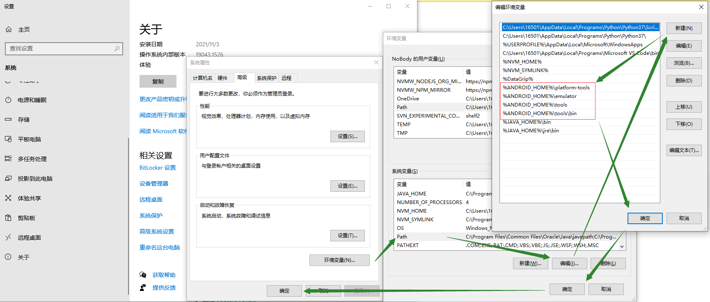
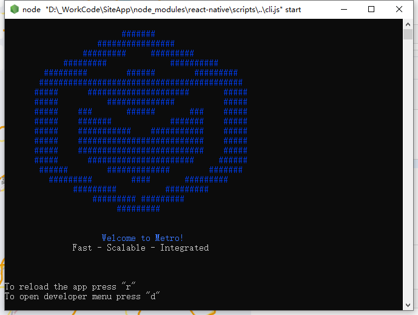
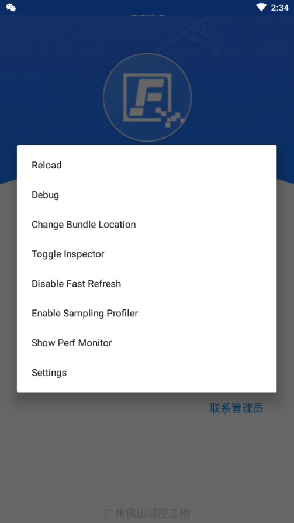
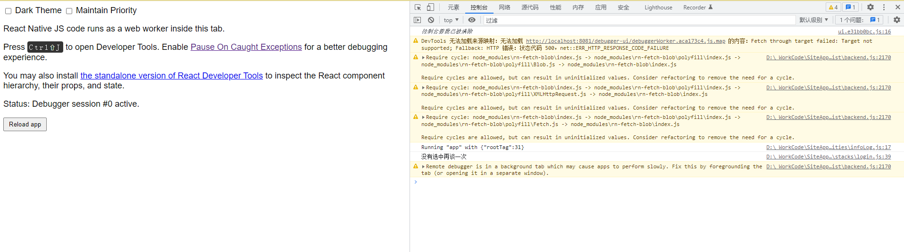

# ReactNative的安装使用与调试

2022-02-28

[中文网站直达](https://www.react-native.cn/)
[英文官网直达](https://reactnative.dev/)
[github源码](https://github.com/facebook/react-native)

> 基于 react-native v0.67 / node v12.22.7 / Android Studio 2021.1.1.21

> 开发平台 windows 10 / 目标平台 Android

---

## 安装

必须安装的依赖有：Node、JDK 和 Android Studio。

- ###### 确保 node 版本 >= 12

    不要使用 cnpm, 所以我使用 yarn

    ```shell
    npm install yarn -g
    ```
- ###### 安装 [Java Runtime Environment](https://www.java.com/zh-CN/) [JRE]
  
  > 若运行时遇到如下错误，则需要安装 java 提供 jave 运行时环境，配置 JAVA_HOME

  

  安装成功后，需配置环境变量 JAVA_HOME

  操作路径:  <kbd>我的电脑/此电脑（右键）</kbd> > <kbd>属性</kbd> > <kbd>关于</kbd> > <kbd>[相关设置]高级系统设置</kbd> > <kbd>环境变量</kbd> > <kbd>[系统变量]新建</kbd>

  

  - 添加工具目录到环境变量 Path

  操作路径:  <kbd>我的电脑/此电脑（右键）</kbd> > <kbd>属性</kbd> > <kbd>关于</kbd> > <kbd>[相关设置]高级系统设置</kbd> > <kbd>环境变量/用户变量</kbd> > <kbd>Path</kbd> > <kbd>编辑</kbd>
  
  依次添加

  ```
    %JAVA_HOME%\bin
    %JAVA_HOME%\jre\bin
  ```

  

- ###### 需要 Java Development Kit [JDK] 版本 >= 11

    在命令行中输入 `javac -version` 可查看当前安装版本

    > 低于 0.67 版本的 React Native 需要 JDK 1.8 版本（官方也称 8 版本）。

    [亲测可用的 jdk-17_windows-x64_bin.exe](https://www.aliyundrive.com/s/fW6wGPraaoT)

- ###### 安装 [Android Studio](https://developer.android.google.cn/studio/)

    下载后打开安装程序，选择 Custom

    确保选中

    - Android SDK
    - Android SDK Platform
    - Android Virtual Device

-  ###### 安装 Android SDK

    默认安装路径：`C:\Users\你的用户名\AppData\Local\Android\Sdk` (影响 ANDROID_HOME 环境变量配置)

  Android Studio 默认会安装最新版本的 Android SDK。目前编译 React Native 应用需要的是Android 10 (Q)版本的 SDK（注意 SDK 版本不等于终端系统版本，RN 目前支持 android 5 以上设备）。可以在 Android Studio 的 SDK Manager 中选择安装各版本的 SDK。

  

  在 SDK Manager 中选择"SDK Platforms"选项卡，然后在右下角勾选"Show Package Details"。展开Android 10 (Q)选项，确保勾选了下面这些组件（重申你必须使用稳定的代理软件，否则可能都看不到这个界面）：

    - Android SDK Platform 29
    - Intel x86 Atom_64 System Image（官方模拟器镜像文件，使用非官方模拟器不需要安装此组件)

  然后点击"SDK Tools"选项卡，同样勾中右下角的"Show Package Details"。展开"Android SDK Build-Tools"选项，确保选中了 React Native 所必须的29.0.2版本。你可以同时安装多个其他版本。

  然后还是在"SDK Tools"选项卡，点击"NDK (Side by side)"，同样勾中右下角的"Show Package Details"，选择20.1.5948944版本进行安装。

  最后点击"Apply"来下载和安装这些组件。

- ###### 配置 ANDROID_HOME 环境变量
  
  React Native 需要通过环境变量来了解你的 Android SDK 装在什么路径，从而正常进行编译。

  操作路径:  <kbd>我的电脑/此电脑（右键）</kbd> > <kbd>属性</kbd> > <kbd>关于</kbd> > <kbd>[相关设置]高级系统设置</kbd> > <kbd>环境变量</kbd> > <kbd>[系统变量]新建</kbd>

  

- ###### 添加工具目录到环境变量 Path

  操作路径:  <kbd>我的电脑/此电脑（右键）</kbd> > <kbd>属性</kbd> > <kbd>关于</kbd> > <kbd>[相关设置]高级系统设置</kbd> > <kbd>环境变量/用户变量</kbd> > <kbd>Path</kbd> > <kbd>编辑</kbd>
  
  依次添加

  ```
    %ANDROID_HOME%\platform-tools
    %ANDROID_HOME%\emulator
    %ANDROID_HOME%\tools
    %ANDROID_HOME%\tools\bin
  ```

  

> 你需要关闭现有的命令符提示窗口然后重新打开或重启计算机，这样新的环境变量才能生效。

## 创建新项目

使用 React Native 内建的命令行工具来创建一个名为"AwesomeProject"的新项目。这个命令行工具不需要安装，可以直接用 node 自带的npx命令来使用：

```
npx react-native init AwesomeProject
```

ATTENTION 尤其需要注意：

- 【命名】整个完整文件路径中，不可以有中文、空格等特殊符号；
- 【命名】请不要单独使用常见的关键字作为项目名（如 class, native, new, package 等等）；
- 【命名】请不要使用与核心模块同名的项目名（如 react, react-native 等）；

- 【权限】不要在某些权限敏感的目录例如 System32 目录中 init 项目！会有各种权限限制导致不能运行！

- 【终端】不要使用一些移植的终端环境，例如 git bash 或 mingw 等等，这些在 windows 下可能导致找不到环境变量。请使用系统自带的命令行（CMD 或 powershell）运行。

## 准备 Android 设备

- [使用 Android 真机](https://www.react-native.cn/docs/running-on-device)
- 使用 Android 模拟器
  - [使用 Android Studio 创建 虚拟设备](https://developer.android.com/studio/run/managing-avds.html)
  - [使用网易MuMu模拟器](https://mumu.163.com/)
    
    下载安装并打开后，在命令行[执行](https://mumu.163.com/2017/12/19/25241_730476.html?mnqjc)
    
    ```
    adb connect 127.0.0.1:7555
    ```

    即可使用，相较 Android Studio 创建的 虚拟设备，更快、更便捷。

## 编译并运行 React Native 应用

```
cd AwesomeProject
# 安装依赖
yarn
# 运行
yarn android
# 或者
yarn react-native run-android
```



在上面弹出的终端中输入 r 可以重新编译运行；

输入 d 可以调出操作菜单，可以选择其中的  Debug 打开自带的调试工具；



## 调试

- Chrome
  
  在终端中输入 d 调出操作菜单，选择 Debug 后一般会默认打开 chrome 浏览器，在打开的页面按下 f12 ，即可更为方便的查看日志信息；

  

  在此模式下，目前尽可以查看日志信息、堆栈信息、代码断点；无法查看网络请求信息；

- VSCode
  
  安装插件 React Native Tools

- NPM 启动服务
  
  安装 react-native-debugger

- filpper
  
  FaceBook 官方工具；

  V react-native >= 0.62