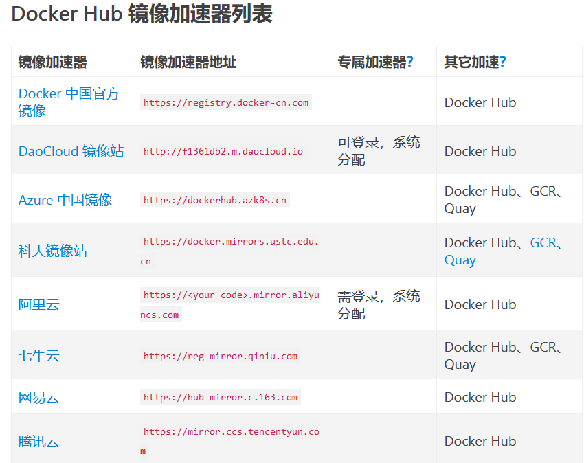

## 环境安装和配置

> 以 Centos 为例

### 1. 更改主机名称
   ```
   hostnamectl set-hostname docker-learn && bash
   ```
   `bash` ：更新环境变量

### 2. 禁用防火墙

   1. 停止
        ```
        systemctl stop firewalld
        ```

   1. 禁用
        ```
        systemctl disable firewalld
        ```

        如遇报错`Failed to disable unit: Access denied`
        ```
        sudo systemctl disable firewalld
        ```
### 3. 禁用 SELinux
   
   SELinux代表安全增强型Linux（Security-Enhanced Linux），它是Linux内核的一个安全模块，旨在提供强化的访问控制和安全策略机制。它通过强制访问控制（MAC）机制，为Linux系统提供了更细粒度的安全策略。

   1. 临时禁用
      ```
      sudo setenforce 0
      ```
      命令中的 setenforce 是一个工具，用于修改SELinux的执行模式。SELinux有三种执行模式：

      - Enforcing（强制执行）：在这种模式下，SELinux会强制执行安全策略，阻止未经授权的访问。

      - Permissive（宽容模式）：在这种模式下，SELinux会记录但不阻止违规操作，通常用于诊断和调试。

      - Disabled（禁用）：这个状态下，SELinux被完全禁用，不会对系统进行任何访问控制。

      执行 `sudo setenforce 0` 会将SELinux切换到宽容模式（Permissive），这意味着SELinux会记录违反安全策略的操作，但不会阻止它们。这在诊断系统问题时可能有用，因为你可以查看SELinux日志，了解哪些操作被拦截。

      需要注意的是，这种修改只是临时的。一旦系统重启，SELinux会恢复到它之前的状态。

   2. 永久禁用    
      更改配置文件
      ```
      sudo vi /etc/selinux/config
      ```
      修改为
      ```
      #SELINUX=enforcing
      SELINUX=disabled
      ```
      重启
      ```
      reboot
      ```
      验证
      ```
      getenforce
      ```
      若修改成功，则输出`DISABLED`

### 4. 时间同步
   1. 安装同步软件 ntpdate
   
      Centos < 8：
      ```
      yum install -y ntpdate

      配置 ntpdate 时间源
      ntpdate cn.pool.ntp.org
      ```

      Centos >= 8: 使用 chrony
      ```
      yum install -y chrony

      ·
      ·
      ·
      ```

## 安装 docker

> docker-ce 社区版

### 1. 配置国内 yum 源（阿里云）
   ```
   yum-config-manager --add-repo http://mirrors.aliyun.com/docker-ce/linux/centos/docker-ce.repo
   ```

### 2. 安装 docker 依赖包
   ```
   yum install -y yum-utils device-mapper-persistent-data lvm2
   ```

### 3. 安装 docker-ce
   ```
   yum install -y docker-ce
   ```

### 4. 查看版本
   ```
   docker version
   ```

### 5. 启动并设置开机启动
   ```
   systemctl start docker && systemctl enable docker
   ```

### 6. 查看运行状态
   ```
   systemctl status docker
   ```

   ---

### 7. 修改内核参数、开启包转发功能  
   - 内核参数修改：br_netfilter 模块用于将桥接流量转发至 iptables 链
  
      加载内核模块
      ```
      modprobe br_netfilter
      ```
      >modprobe 是一个用于管理 Linux 内核模块的命令。Linux 内核模块是一种动态加载到内核中的软件组件，用于添加新的功能、设备驱动或修改内核行为。

      >modprobe 命令允许你在运行时加载、卸载、列出和管理这些内核模块。它通常用于加载特定的驱动程序或添加所需的内核模块，以便操作系统能够支持新的硬件设备或特定的功能。

   - 开启包转发：
     - 配置配置文件：
        ```
        cat > /etc/sysctl.d/docker.conf <<EOF
        net.bridge.bridge-nf-call-ip6tables = 1
        net.bridge.bridge-nf-call-iptables = 1
        net.ipv4.ip_forward = 1
        EOF
        ```

        `net.bridge.bridge-nf-call-ip6tables = 1`  
        `net.bridge.bridge-nf-call-iptables = 1`  
        可解决 WARNING: bridge-nf-call-iptables is disabled

        `net.ipv4.ip_forward = 1`  
        将Linux系统作为路由或者VPN服务就必须要开启IP转发功能。当linux主机有多个网卡时一个网卡收到的信息是否能够传递给其他的网卡 ，如果设置成1 的话 可以进行数据包转发，可以实现VxLAN 等功能。不开启会导致docker部署应用无法访问

      - 加载并应用
         ```
         sysctl -p /etc/sysctl.d/docker.conf
         ```
         > sysctl：用于查看和修改内核运行时参数的工具。

         >-p：表示 "load in sysctl settings from the file specified or /etc/sysctl.conf if none given"，即从指定的文件加载系统参数设置。

      重启后模块失效，配置开机自动加载模块的脚本

      - 创建文件 rc.sysinit
         ```
         cat /etc/rc.sysinit
         ```
         > 在 Linux 引导过程中，rc.sysinit 负责执行一些基本的系统初始化任务
     - 写入循环加载逻辑
         ```
         #!/bin/bash
         for file in /etc/sysconfig/modules/*.modules ; do
         [ -x $file ] && $file
         done
         ```
      - 创建文件 br_netfilter.modules
         ```
         cat /etc/sysconfig/modules/br_netfilter.modules
         ```
      - 写入内核模块加载命令
         ```
         modprobe br_netfilter
         ```
      - 增加权限
         ```
         chmod 755 /etc/sysconfig/modules/br_netfilter.modules
         ```
   ---
### 8. 配置镜像加速  
   - 配置镜像地址
      ```
      vi /etc/docker/daemon.json
      ```
      ```
      "registry-mirrors":["https://y8y6vosv.mirror.aliyuncs.com","https://registry.docker-cn.com","https://docker.mirrors.ustc.edu.cn","https://dockerhub.azk8s.cn","http://hub-mirror.c.163.com"]
      ```
   - 使生效
      ```
      sudo systemctl daemon-reload
      sudo systemctl restart docker
      ```
   阿里云镜像地址查看：https://cr.console.aliyun.com/cn-hangzhou/instances/mirrors

   

## 镜像操作 (以centos镜像为例)
### 1. 查找
   ```
   docker search centos
   ```
### 2. 下载
   ```
   docker pull centos
   ```
### 3. 查看本地镜像
   ```
   docker images
   ```
### 4. 把镜像做成离线压缩包
   ```
   docker save -o centos.tar.gz centos
   ```  

   `-o` 为指定输出
### 5. 解压离线镜像包
   ```
   docker load -i centos.tar.gz
   ```
### 6. 删除镜像
   ```
   docker rmi -f centos:latest
   ```

## 容器操作
### 1. 以交互式方式启动并进入容器
   ```
   docker run --name=hello -it centos /bin/bash
   ```
   - --name：制定容器名称
   - -i：交互式
   - -t：分配伪终端
   - /bin/bash：说明 shell 类型为 bash

### 2. 以守护进程方式启动容器
   ```
   docker run --name=hello1 -td centos
   ```
   - -d：在后台运行

   产看正在运行的容器
   ```
   docker ps
   ```
   
   进入容器
   ```
   docker exec -it hello1 /bin/bash
   ```

### 3. 常用命令
   - 查看正在运行的容器
      ```
      docker ps
      ```

   - 产看所有容器
      ```
      docker ps -a
      ```
   
   - 停止容器
      ```
      docker stop hello1
      ```

   - 启动已经停止的容器
      ```
      docker start hello1
      ```
   
   - 进入容器
      ```
      docker exec -it hello1 /bin/bash
      ```
   
   - 强制删除容器
      ```
      docker rm -f hello1
      ```

   - 查看docker帮助命令
      ```
      docker --help
      ```