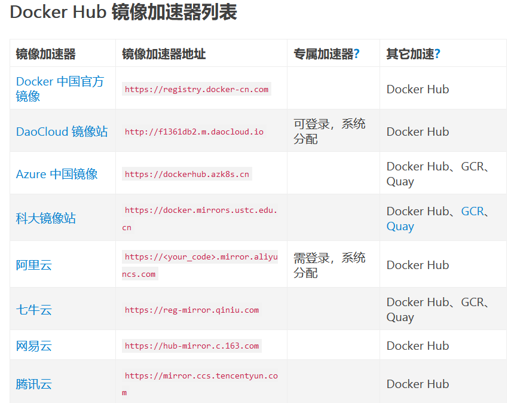
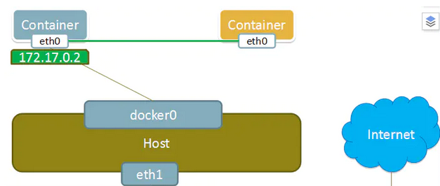
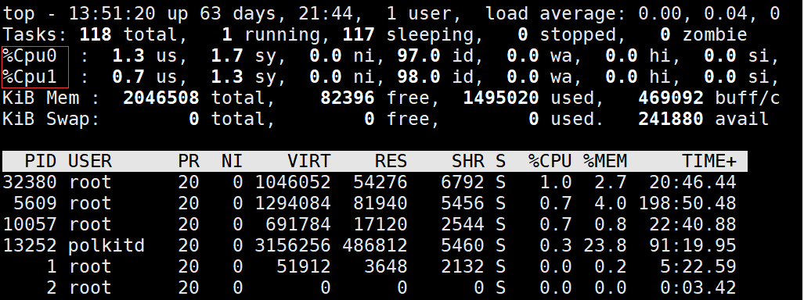

## 环境安装和配置

> 以 Centos 为例

### 1. 更改主机名称
   ```
   hostnamectl set-hostname docker-learn && bash
   ```
   `bash` ：更新环境变量

### 2. 禁用防火墙

   1. 停止
        ```
        systemctl stop firewalld
        ```

   1. 禁用
        ```
        systemctl disable firewalld
        ```

        如遇报错`Failed to disable unit: Access denied`
        ```
        sudo systemctl disable firewalld
        ```
### 3. 禁用 SELinux
   
   SELinux代表安全增强型Linux（Security-Enhanced Linux），它是Linux内核的一个安全模块，旨在提供强化的访问控制和安全策略机制。它通过强制访问控制（MAC）机制，为Linux系统提供了更细粒度的安全策略。

   1. 临时禁用
      ```
      sudo setenforce 0
      ```
      命令中的 setenforce 是一个工具，用于修改SELinux的执行模式。SELinux有三种执行模式：

      - Enforcing（强制执行）：在这种模式下，SELinux会强制执行安全策略，阻止未经授权的访问。

      - Permissive（宽容模式）：在这种模式下，SELinux会记录但不阻止违规操作，通常用于诊断和调试。

      - Disabled（禁用）：这个状态下，SELinux被完全禁用，不会对系统进行任何访问控制。

      执行 `sudo setenforce 0` 会将SELinux切换到宽容模式（Permissive），这意味着SELinux会记录违反安全策略的操作，但不会阻止它们。这在诊断系统问题时可能有用，因为你可以查看SELinux日志，了解哪些操作被拦截。

      需要注意的是，这种修改只是临时的。一旦系统重启，SELinux会恢复到它之前的状态。

   2. 永久禁用    
      更改配置文件
      ```
      sudo vi /etc/selinux/config
      ```
      修改为
      ```
      # SELINUX=enforcing
      SELINUX=disabled
      ```
      重启
      ```
      reboot
      ```
      验证
      ```
      getenforce
      ```
      若修改成功，则输出`DISABLED`

### 4. 时间同步
   1. 安装同步软件 ntpdate
   
      Centos < 8：
      ```
      yum install -y ntpdate

      配置 ntpdate 时间源
      ntpdate cn.pool.ntp.org
      ```

      Centos >= 8: 使用 chrony
      ```
      yum install -y chrony

      ·
      ·
      ·
      ```

## 安装 docker

> docker-ce 社区版

### 1. 配置国内 yum 源（阿里云）
   ```
   yum-config-manager --add-repo http://mirrors.aliyun.com/docker-ce/linux/centos/docker-ce.repo
   ```

### 2. 安装 docker 依赖包
   ```
   yum install -y yum-utils device-mapper-persistent-data lvm2
   ```

### 3. 安装 docker-ce
   ```
   yum install -y docker-ce
   ```

### 4. 查看版本
   ```
   docker version
   ```

### 5. 启动并设置开机启动
   ```
   systemctl start docker && systemctl enable docker
   ```

### 6. 查看运行状态
   ```
   systemctl status docker
   ```

   ---

### 7. 修改内核参数、开启包转发功能  
   - 内核参数修改：br_netfilter 模块用于将桥接流量转发至 iptables 链
  
      加载内核模块
      ```
      modprobe br_netfilter
      ```
      >modprobe 是一个用于管理 Linux 内核模块的命令。Linux 内核模块是一种动态加载到内核中的软件组件，用于添加新的功能、设备驱动或修改内核行为。

      >modprobe 命令允许你在运行时加载、卸载、列出和管理这些内核模块。它通常用于加载特定的驱动程序或添加所需的内核模块，以便操作系统能够支持新的硬件设备或特定的功能。

   - 开启包转发：
     - 配置配置文件：
        ```
        cat > /etc/sysctl.d/docker.conf <<EOF
        net.bridge.bridge-nf-call-ip6tables = 1
        net.bridge.bridge-nf-call-iptables = 1
        net.ipv4.ip_forward = 1
        EOF
        ```

        `net.bridge.bridge-nf-call-ip6tables = 1`  
        `net.bridge.bridge-nf-call-iptables = 1`  
        可解决 WARNING: bridge-nf-call-iptables is disabled

        `net.ipv4.ip_forward = 1`  
        将Linux系统作为路由或者VPN服务就必须要开启IP转发功能。当linux主机有多个网卡时一个网卡收到的信息是否能够传递给其他的网卡 ，如果设置成1 的话 可以进行数据包转发，可以实现VxLAN 等功能。不开启会导致docker部署应用无法访问

      - 加载并应用
         ```
         sysctl -p /etc/sysctl.d/docker.conf
         ```
         > sysctl：用于查看和修改内核运行时参数的工具。

         >-p：表示 "load in sysctl settings from the file specified or /etc/sysctl.conf if none given"，即从指定的文件加载系统参数设置。

      重启后模块失效，配置开机自动加载模块的脚本

      - 创建文件 rc.sysinit
         ```
         cat /etc/rc.sysinit
         ```
         > 在 Linux 引导过程中，rc.sysinit 负责执行一些基本的系统初始化任务
     - 写入循环加载逻辑
         ```
         #!/bin/bash
         for file in /etc/sysconfig/modules/*.modules ; do
         [ -x $file ] && $file
         done
         ```
      - 创建文件 br_netfilter.modules
         ```
         cat /etc/sysconfig/modules/br_netfilter.modules
         ```
      - 写入内核模块加载命令
         ```
         modprobe br_netfilter
         ```
      - 增加权限
         ```
         chmod 755 /etc/sysconfig/modules/br_netfilter.modules
         ```
   ---
### 8. 配置镜像加速  
   - 配置镜像地址
      ```
      vi /etc/docker/daemon.json
      ```
      ```
      "registry-mirrors":["https://y8y6vosv.mirror.aliyuncs.com","https://registry.docker-cn.com","https://docker.mirrors.ustc.edu.cn","https://dockerhub.azk8s.cn","http://hub-mirror.c.163.com"]
      ```
   - 使生效
      ```
      sudo systemctl daemon-reload
      sudo systemctl restart docker
      ```
   阿里云镜像地址查看：https://cr.console.aliyun.com/cn-hangzhou/instances/mirrors

   

## 镜像操作 (以centos镜像为例)
### 1. 查找
   ```
   docker search centos
   ```
### 2. 下载
   ```
   docker pull centos
   ```
### 3. 查看本地镜像
   ```
   docker images
   ```
### 4. 把镜像做成离线压缩包
   ```
   docker save -o centos.tar.gz centos
   ```  

   `-o` 为指定输出
### 5. 解压离线镜像包
   ```
   docker load -i centos.tar.gz
   ```
### 6. 删除镜像
   ```
   docker rmi -f centos:latest
   ```

### 7. 常用命令
   - 查看服务状态
      ```
      systemctl status docker
      ```

   - 查看正在运行的容器
      ```
      docker ps
      ```

   - 产看所有容器
      ```
      docker ps -a
      ```
   
   - 停止容器
      ```
      docker stop hello1
      ```

   - 启动已经停止的容器
      ```
      docker start hello1
      ```
   
   - 进入容器
      ```
      docker exec -it hello1 /bin/bash
      ```
   
   - 强制删除容器
      ```
      docker rm -f hello1
      ```

   - 查看docker帮助命令
      ```
      docker --help
      ```

   - 产看详细信息
      ```
      docker inspect 容器名称/id
      ```
   ---
   - 构建镜像

      ```
      docker build -t="镜像名:版本号" -f 指定的Dockerfile路径 .
      ```
   - 查看本地所有镜像
      ```
      docker images
      ```
      - 过滤
      ```
      docker images | grep xxx
      ```
   - 重命名镜像
      ```
      docker tag 旧镜像名:旧版本号 新镜像名:新版本号
      ```
      实际上是为该镜像添加一个新标签，此时新旧标签共存

   - 删除镜像
      ```
      docker rmi 镜像名:版本号
      ```
      实际上就是删除标签，当删除最后一个标签的时候，镜像即被删除
   ---
   - 运行镜像 / 基于镜像创建容器
      ```
      docker run -d -p 80 --name 创建的容器名 镜像名:版本号
      ```
   - 查看容器日志
      ```
      docker logs 容器名
      ```
      ```
      docker logs -f -t --since=20m --tail=10 容器名
      ```
      - -f 实时查看
      - -t 显示时间戳
      - --since 显示指定时间之后的日志
      - --tail 显示最新N条日志

   - 进入容器
      - 以交互式方式启动并进入容器
         ```
         docker run --name=hello -it centos /bin/bash
         ```
         - --name：指定容器名称
         - -i：交互式
         - -t：分配伪终端
         - /bin/bash：说明 shell 类型为 bash
           
      - 以守护进程方式启动容器
         ```
         docker run --name=hello1 -td centos
         ```
         - -d：在后台运行

         产看正在运行的容器
         ```
         docker ps
         ```
         
         进入容器
         ```
         docker exec -it hello1 /bin/bash
         ```

      - 或
        ```
        docker attach <容器ID或名称>
        ```

      ---

      某些轻量级基础镜像不包含 bash，而只包含sh
      ```
      docker exec -it <容器ID或名称> /bin/sh
      ```


      

## Dockerfile

>[参考：51CTO](https://blog.51cto.com/u_16099335/7334441)

---

1. `FROM` 基础镜像
   ```
   FROM centos
   ```
   指定基础镜像 为 centos

2. `MAINTAINER` 作者
   
   ```
   MAINTAINER xxx
   ```

3. `RUN` 指定当前镜像构建时运行的 linux 命令

   ```
   RUN <command> 
   ```

   🌰 Shell 模式
   ```
   RUN echo hello_docker
   ```

   🌰 exec 模式
   ```
   RUN ["指定 Shell","命令参数","命令"]

   RUN ["/bin/shell","-c","echo hello_docker"]
   ```

   - -c 指定后续是一条命令

4. `EXPOSE` 指定端口（一个或多个）
   ```
   EXPOSE 80 81 
   ```

   - -P 将暴露的端口在物理机进行随机映射
      ```
      docker run -P
      ```
   - -p 进行容器端口映射指定
      ```
      docker run -p 主机端口:容器端口      
      ```
      ```
      docker run -p 容器端口
      ```
      不指定主机端口则会随机进行映射

5. `CMD` 指定镜像运行时命令
   
   CMD 在镜像运行 (docker run) 时执行 , 可以用于运行时启动某些功能
   ```
   CMD ["","",""]
   ```
   ```
   CMD echo hello_docker
   ```
   多条 CMD 命令 仅最后一条会生效

6. `ENTRYPOINT`
   
   ENTRYPOINT 类似 CMD 但是不会被 docker run 命令行参数指定的命令覆盖，而且这些命令会作为参数赋给 ENTRYPOINT 所指定的程序命令
   ```
   FROM nginx
   ENTERYPOINT ["nginx","-c"] # 定参
   CMD ["/etc/nginx/nginx.conf"] # 变参
   ```

   - 运行时传递变参
      ```
      docker run --name a_container_name:customer_tag /etc/nginx/other.conf
      ```

   若 docker run 指定 --entrypoint ，则依然覆盖 ENTRYPOINT 命令
   ```
   ENTRYPOINT ["","",""]

   ENTRYPOINT echo hello_docker
   ```

   多条 ENTRYPOINT 命令，仅最后一条生效

7. `COPY` 复制指定文件到目标路径

   ```
   COPY [--chown=<user>:<group>] <源路径> <目标路径>
   ```
   - `[--chown=<user>:<group>]` ：可选参数，改变复制到容器内的文件的拥有者和属组
   - `<源路径>`：可使用满足 GO 的 filepath.Match 规则的通配符
   
     ```
     COPY hom* /dir/
     ```
     ```
     COPY hom?.txt /dir/
     ```
   - `<目标路径>`：不必事先建立，若不存在会自动创建

8. `ADD` 自动解压压缩包内容并复制到指定路径下
   
   类似 COPY

9. `VOLUME` 卷 - 挂载持久数据

   数据卷是经过特殊设计的目录，可以绕过联合文件系统（UFS），为一个或者多个容器提供访问，数据卷设计的目的，在于数据的永久存储，它完全独立于容器的生存周期，因此，docker 不会在容器删除时删除其挂载的数据卷，也不会存在类似的垃圾收集机制，对容器引用的数据卷进行处理，同一个数据卷可以只支持多个容器的访问。

   - 特点：

      1. 数据卷在容器启动时初始化，如果容器使用的镜像在挂载点包含了数据，这些数据会被拷贝到新初始
      化的数据卷中
      2. 数据卷可以在容器之间共享和重用
      3. 可以对数据卷里的内容直接进行修改
      4. 数据卷的变化不会影像镜像的更新
      5. 卷会一直存在，即使挂载数据卷的容器已经被删除

   - 语法
      ```
      VOLUMN ["/data"]
      ``` 

      在容器中创建 `/data` 目录并挂载于物理机下，相互同步  
      默认挂载在 `docker/容器名/容器id/data` 下

   - 指定挂载位置
     ```
     docker run --name volume_test -v /指定的物理机目录:/data -d -P 镜像名:tag名称
     ```
     指定的物理机目录 会自动创建

     ```
     docker run --name volume_test -v ~/指定的物理机目录:/data -d -P 镜像名:tag名称
     ```

     - ~ 代表当前用户的家目录：`/root`
         
   - 指定多个
      ```
      VOLUMN ["/data1","/data2"]
      ```

   - 为数据卷添加访问权限
     ```
     docker run --name volume_test -v /指定的物理机目录:/data:ro -d -P 镜像名:tag名称
     ```
     - ro : 只读
     - 添加只读权限之后在 docker 容器的 /data 目录下不再能创建文件
     - 宿主机下的 /指定的物理机目录 下可创建内容

   ---
   ---

   - 数据卷容器
      > 命名的容器挂载数据卷，其他容器通过挂载这个容器实现数据共享，挂载数据卷的容器，就叫做数据卷容器

      - 挂载(应用)数据卷容器
        ```
        docker run --volumes-from [container name]
        ```

   - 卷的备份和还原
     - 备份
       ```
       docker run --volumes-from 包含要备份的镜像的容器名 -v /指定的宿主机保存路径:/容器内保存备份路径 --name 要运行的容器名称 镜像名 tar zcvf /容器内保存备份路径/备份文件名.tar.gz /容器内数据卷路径
       ```

       - 镜像名：当前容器运行的基础镜像
         - centos ：可以，但是忒大了
         - alpine ：可以，不大
       - tar zcvf ：压缩命令
         - c：创建新的归档文件。
         - z：使用 gzip 压缩归档文件。
         - v：显示详细的输出信息，以便查看归档或解压的过程。
         - f：指定归档文件的名称。
  
     - 还原
       ```
       docker run --volumes-from 包含要还原的镜像的容器名 -v /指定的宿主机保存路径:/容器内保存备份路径 --name 要运行的容器名称 镜像名 tar xzvf /容器内保存备份路径/备份文件名.tar.gz -C /容器内数据卷路径
       ```
       - tar xzvf ：解压缩命令
         - x：提取归档文件中的内容。
         - z：使用 gzip 解压缩归档文件。
         - v：显示详细的输出信息，以便查看解压的过程。
         - f：指定要解压的归档文件的名称。
     
     ---
      直接压缩挂载文件多方便 ...

   ---

10.   `WORKDIR` 指定工作目录  
    
    必须是提前创建好的
    ```
    WORKDIR /path/work
    ```
    则创建容器后进入后会默认进入 `/path/work`

    >通过WORKDIR设置工作目录后，Dockerfile中其后的命令RUN、CMD、ENTRYPOINT、ADD、COPY等命令都会在该目录下执行。在使用docker run运行容器时，可以通过-w参数覆盖构建时所设置的工作目录。

11.   `ENV` 设置环境变量  
    ```
    ENV <key> <value>

    ENV <key>=<value>
    ```
    设置的环境变量，可以在后续命令中以 $key 引用；
    ```
    ENV NODE_VERSION=12.22.2

    RUN curl -SLO "https://nodejs.org/dist/v$NODE_VERSION/node-v$NODE_VERSION-linux-x64.tar.xz"
    ```

12.   `USER` 指定执行后续命令的用户和用户组
    
    用户和用户组必须已经存在；

    ```
    USER <用户名>[:<用户组>]
    ```
    ```
    USER user
    USER uid
    USER user:group
    ```

13.   `ONBUILD` 
    
    创建第一个镜像的 dockerfile_onbuild
    ```
    ···
    ONBUILD COPY A.html /B/
    ONBUILD echo hello_docker
    ···
    ```
    构建第一个镜像
    ```
    docker build -t="onbuild-test:v1" -f dockerfile_onbuild . --load
    ```

    ---
    
    创建应用第一个镜像的 dockerfile_useonbuild
    ```
    FROM onbuild:v1
    ···
    ```

    在构建第二个镜像的时候
    ```
    docker build -t="onbuild-test:v2" -f dockerfile_useonbuild . --load
    ```
    > 会默认从 dockerhub 查找基础镜像 - 【未解】
    
    此时会执行 dockerfile_onbuild 中的命令

---

## 构建镜像

```
docker build -t="镜像名:版本号" -f 指定的Dockerfile路径 .
```
最后的 `.` 代表构建的是当前目录

## 容器互联

### docker 容器的网络基础知识
   1. docker0
   
      安装docker的时候，会生成一个docker0的虚拟网桥

      可以使用 `ip addr` 查看

      ```
      ...
      docker0: <BROADCAST,MULTICAST,UP,LOWER_UP> mtu 1500 qdisc noqueue state UP group default 
         link/ether 02:42:28:ae:c0:42 brd ff:ff:ff:ff:ff:ff
         inet 172.17.0.1/16 brd 172.17.255.255 scope global docker0
            valid_lft forever preferred_lft forever
         inet6 fe80::42:28ff:feae:c042/64 scope link
      ...
      ```
   
   2. Linux 虚拟网桥的特点

      - 可以设置ip地址
      - 相当于拥有一个隐藏的虚拟网卡
      - 每运行一个 docker 容器都会生成一个 veth 设备对，这个 veth 一个接口在容器里，一个接口在物理机上。

   3. 网桥管理工具
      ```
      yum install bridge-utils -y
      ```
      - 查看网桥信息
         ```
         brctl show
         ```
## 网络模式 --net
   
   docker run 创建 Docker 容器时，可以用 `--net` 选项指定容器的网络模式 
   - bridge 模式：--net=bridge  默认设置
     
     容器启动后会通过DHCP获取一个地址

   - host 模式：--net=host
     
     共享宿主机的网络

     - 容器与宿主机共享一个网络栈，容器中的应用可以直接使用宿主机的网络设备，比如：ping 宿主机，或者安装网络管理工具，比如：ifconfig，ip等。

   - none 模式：--net=none
     
      创建的容器没有网络地址，只有lo网卡

      可以使用 `ip addr` 查看
      ```
      1: lo: <LOOPBACK,UP,LOWER_UP> mtu 65536 qdisc noqueue state UNKNOWN group default qlen 1000
         link/loopback 00:00:00:00:00:00 brd 00:00:00:00:00:00
         inet 127.0.0.1/8 scope host lo
            valid_lft forever preferred_lft forever
      ```

   - container 模式：--net=container:NAME or ID
     
     创建新容器的时候，通过--net container参数，指定其和已经存在的某个容器共享一个 Network Namespace。

     ```bash
     docker run -itd --net=container:预共享的容器名称或id centos /bin/bash
     ```

     

   ---

   ```
   privileged=true 
   ```
  
   > 在 Docker 中，`privileged=true` 表示以特权模式运行容器。这意味着容器内的进程将拥有与宿主机几乎相同的权限，可以访问和操作宿主机上的设备、文件等资源。
  

## 资源配额

- 显示系统中各个进程的资源占用状况的命令
   ```
   top
   ```

   按 `1` 可以展开 CPU 核心使用情况

   

- 查看 docker 资源使用情况的命令
   ```
   docker system df
   ```

---

- CPU
  - 限制 CPU 使用权重
     ```
     docker run --cpu-shares=1024 ubuntu /bin/sh
     ```
    - --cpu-shares : 默认值 1024
     > 某个容器最终能分配到的 CPU 资源取决于它的 cpu share 占所有容器 cpu share 总和的比例

     > 通过 cpu share 可以设置容器使用 CPU 的优先级

     > 这种按权重分配 CPU 只会发生在 CPU 资源紧张的情况下

     > 只发生在容器竞争同一个 CPU 的时间片时有效

   - CPU 核心控制
      指定运行的 CPU 核心

      ```
      docker run -itd --cpuset-cpus 0,1 ubuntu:14.04 /bin/bash
      ```

- 内存
   ```
   docker run -itd --memory 100m ubuntu:14.04 /bin/bash
   ```
    `-m` / `--memory`
    
    单位：`b`, `k`, `m`, `g`

- IO (读写速度)
   - 写入速度
     - --device-write-bps
         ```
         docker run -it  -v /主机卷:/容器卷 --device /主机设备:/容器设备 --device-write-bps /目标写入:2mb centos  /bin/bash
         ```
   - 读取速度
     - --device-read-bps

   - 单位：`kb`、`mb` 或 `gb`

- 自动释放容器资源
  ```
  docker run --rm -it centos /bin/bash
  ```
  
  容器退出后自动删除容器