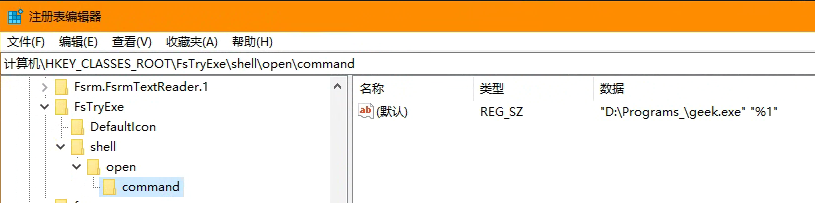
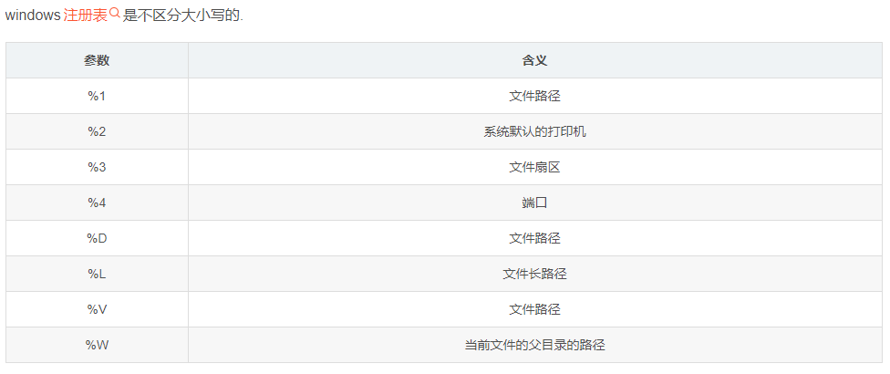

# 在 WEB 中唤起本地应用

>  windows 通过修改注册表可实现

## 基于谷歌浏览器

### 编写注册表文件

```
try.reg
```

```reg
Windows Registry Editor Version 5.00
[HKEY_CLASSES_ROOT\FsTryExe]
@="FsTryExe Protocol"
"URL Protocol"=""
[HKEY_CLASSES_ROOT\FsTryExe\DefaultIcon]
@="D:\Programs_\geek.exe"
[HKEY_CLASSES_ROOT\FsTryExe\shell]
@=""
[HKEY_CLASSES_ROOT\FsTryExe\shell\open]
@=""
[HKEY_CLASSES_ROOT\FsTryExe\shell\open\command]
@="\"D:\\Programs_\\geek.exe\" \"%1\""
```

其中

- `Windows Registry Editor Version 5.00` : 这行表明该文件是一个 Windows 注册表编辑器文件，这是标准的头部，用于告诉 Windows 如何解析文件。
- `[HKEY_CLASSES_ROOT\xxx]` : 是注册表路径
  - 注册表有五个预定义的根键（Root Keys）：
  - `HKEY_CLASSES_ROOT`（HKCR）：包含文件扩展名与应用程序之间的关联信息，以及系统中注册的 COM 组件和类的信息。
  - `HKEY_CURRENT_USER`（HKCU）：存储当前用户的个人配置信息，如桌面背景、文件夹选项等。
  - `HKEY_LOCAL_MACHINE`（HKLM）：存储计算机的全局配置信息，如硬件、操作系统设置等。这是一个非常重要的键，因为它包含了系统级别的设置。
  - `HKEY_USERS`：存储所有用户的配置信息。每个用户都有一个对应的子键。但是，请注意，通常不建议直接修改此键下的内容，除非您非常清楚自己在做什么。
  - `HKEY_CURRENT_CONFIG`：存储当前计算机的硬件配置信息。实际上，它是HKEY_LOCAL_MACHINE\System\CurrentControlSet\Hardware Profiles\Current 的快捷方式。
- `@=`: 是默认值
- `FsTryExe`: 是自定义的协议名称
- `[HKEY_CLASSES_ROOT\FsTryExe\shell]` : 创建一个名为 shell 的子键，这是一个固定键，代表GUI界面的处理。
- D:\Programs_\geek.exe: 是需要唤起的程序路径
- `[HKEY_CLASSES_ROOT\FsTryExe\shell\open]` : 在 shell 下创建一个名为 open 的子键。这耶是一个固定键，open 是一个标准动作，用来执行打开操作。
- `[HKEY_CLASSES_ROOT\FsTryExe\shell\open\command]` : 在 open 下创建一个名为 command 的子键。这是一个固定键，指定了当协议被触发时要执行命令。
- @="\"D:\\Programs_\\geek.exe\" \"%1\"" : 在 command 键下，设置默认值为 geek 的路径。 "%1" 是一个占位符，用于表示传递给协议的任何参数 。


保存后，双击执行

- 注册表注册结果
   

- 其他可用参数
   

### 浏览器中调用
```
<a id="exeUrl" href="FsTryExe://">run geek</a>
```

## 基于 Electron 程序

1. main.js 中添加唤起事件
   ```js
   const { app, BrowserWindow, Menu, ipcMain } = require('electron')
   const { exec } = require('child_process');
   
   const win = new BrowserWindow({
        width: 1366,
        height: 768,
        webPreferences: {
            // preload,
            nodeIntegration: true, // 允许在渲染进程中使用 Node.js 特性  
            contextIsolation: false, // 禁用上下文隔离  
            enableRemoteModule: true, // 允许使用 remote 模块  
            webSecurity: false // 关闭默认的 Web 安全策略  
        },
    })

   ipcMain.on('open-exe', (event, arg) => {
      exec(arg||'D:/Programs_/geek.exe', (error, stdout, stderr) => {
            if (error) {
               console.error(`执行错误: ${error}`);
               return;
            }

            console.log(`标准输出: ${stdout}`);
            if (stderr) {
               console.error(`标准错误输出: ${stderr}`);
            }
      });
   })

   // ...
   ```

2. html 中调用
   ```html
   <!DOCTYPE html>
   <html>

      <head>
         <meta charset="UTF-8"> 
         <script>
            const { ipcRenderer } = require('electron');
         </script>
      </head> 

      <body>
        <button id="electron-button">ELETRON EXE 调用测试</button>  
      </body>

      <script>
         document.getElementById('electron-button').addEventListener('click', function() {  
            ipcRenderer.send('open-exe', 'D:/Programs_/geek.exe');  
         });
      </script>  
   </html>
   ```

---

> [(Mac版)终于搞懂了浏览器是怎么唤醒本地应用了](https://juejin.cn/post/7321924572054650914)