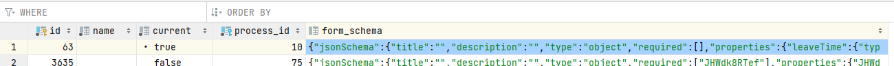
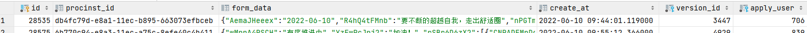

#  工作流流程表单数据字段解析 

工作流配置，从流程、表单、最终使用填写三方面定义一个具体流程；

不过因为每一个表单的字段定义并不是由程序直接写定或生成的，在程序中的名称（也就是key值）就不会有明确的定义，在使用过程中增加很多困扰；

每一具体的表单都有对应的实例JSON数据存储在数据库中，明白这些 JSON 数据的关联关系，就可以更明白一点 工作流 的配置逻辑；

## 需求分析：
人资需要统计每个人的请假、加班等数据，在表单毫无逻辑的 key 值定义情形下，直接抓取数据统计是不可能的，所以需要先用程序解析一下每个字段代表的含义，找到代表请假或加班时长的字段再进行统计；

## 流程定义：
略

## 表单定义：
表单定义后，定义 JSON 数据会存在 项企数据库的 workflow_process_form 表单中，草稿会暂时存在 workflow_process_form_draft 中；
  
  

workflow_process_form  表字段定义如上图，规定了当前表单是否是当前正在使用的表单，以及所属流程是哪个；

最后的 form_schems 定义的就是表单字段内容；
```json
{
	"jsonSchema": {
		"title": "",
		"description": "",
		"type": "object",
		"required": [],
		"properties": {
			"mTzwwwmBHA": {
				"type": "number",
				"title": "请假小时",
				"default": ""
			}
		}
	},
	"uiSchema": {
		"mTzwwwmBHA": {
			"ui:widget": "updown",
			"ui:options": {
				"shownodes": ["historyNode", "Event_0skejnv"],
				"disnodes": ["historyNode"]
			}
		}
	},
	"formData": {
		"mTzwwwmBHA": ""
	},
	"bizData": {
		"mTzwwwmBHA": {
			"type": "number",
			"fieldType": "common"
		}
	},
	"sequence": ["mTzwwwmBHA"]
}
```
展开后如上面的代码所示，可见当前表单只有一个 mTzwwwmBHA的字段

    其中 uiSchema 定义了展示在页面上的 UI  所应展示的内容及定义信息

         formData 定义的是表单默认情况下对应字段所填充的数据

         bizData 定义的是字段除 UI 层面定义外的其他属性，比如分类、在表单中是否可读，可写等；

         sequence 定义字段的排序规则

   在数据解析时着重关注 jsonSchema 字段，这里定义了表单中的所有字段，以及字段标题、类型。通过遍历 jsonSchema，比对 title，才能明确我们需要拿到的数据所对应的 key 值；

   对于多层级的数据，是以 properties 为子字段标志层层包裹构成了一个树结构；

## 表单数据：
在拿到表单对应的 key 值后，需要判断每一次表单的发起，发起人具体填写了什么；

表单实例数据存储在 workflow_process_history 表中：
  

workflow_process_history 定义的字段如上图，其中 procinst_id 关联了 工作流数据库中 流程实例的 id，可以通过这个关联关系查询到当前流程实例的状态，结束或者进行中；

在这里重点关注 form_data，这里面存储量每个字段的填写值；展开如下：
```
{"mTzwwwmBHA":"2020-01-01"}
```
最简单的数据结构，与 jsonSchema 中的第一个 properties 之后的数据层级结构相同，只不过除了字段的key：value之外没有其他信息；

综合form_schema 和 form_data 的信息，即可解析出我们需要的数据；

## 数据解析：

### 思路：
1. 明确需要查找的字段名称，并配置为可拓展的属性，在表单数据变动的时候通过较少的改动即可兼容；
2. 通过递归遍历 form_schema （的 properties），以 title 字段判决是否找到目标字段，保存该字段的层级路径；
   
    这里需注意一些 enum 数据需要稍稍特殊处理一下

3. 以相同的层级路径去 form_data 里查找用户手动填写的各种值，并保存；

4. 将拿到的数据处理入库；


### 代码实现：

- 定义所需数据 ：
  
  以加班表单为例
    ```js
        let overtimeNeedData = {
            reason: {
                keyWord: ['加班事由']
            },
            begainTime: {
                keyWord: ['加班开始时间'],
                require: true,
            },
            endTime: {
                keyWord: ['加班结束时间'],
                require: true,
            },
            duration: {
                keyWord: ['总时长（小时）']
            },
            compensate: {
                keyWord: ['加班补偿'],
                require: true,
            },
            hrAffirmDuration: {
                keyWord: ['人事核定加班小时', '核定加班小时'],
                require: true,
            },
        }
    ```

- 调取获取数据函数
  
    以 表单的 form_schema 和上面的所需数据为参数
    ```js
    const getData = (applyDetail, needData) => {
        for (let nd in needData) {
            if (needData[nd].noProcess) {
                continue
            }
            if (applyDetail.formSchema) {
                const { jsonSchema } = JSON.parse(applyDetail.formSchema)
                needData[nd].schemaPath = schemaRecursionObj({
                jsonSchema: jsonSchema || {},
                keyWord: needData[nd]['keyWord'],
                targetKeys: needData[nd]['keys'],
                schemaPath: [],
                require: nd.require
                })
                if (
                needData[nd].schemaPath
                && needData[nd].schemaPath.length
                ) {
                const lastKeyObj = needData[nd]
                    .schemaPath[needData[nd].schemaPath.length - 1]
                if (applyDetail.formData) {
                    const formData = JSON.parse(applyDetail.formData)
                    needData[nd].value = dataRecursionObj(
                        formData, 0, needData, lastKeyObj, nd
                    )
                } else {
                    console.warn(
                        `表单数据缺失：[${nd}]`,
                        applyDetail
                    );
                }
                } else {
                if (needData[nd].require) {
                    // 记录错误 关键数据没找到
                    console.warn(
                        `数据字段查找错误：${nd.needData[nd]['keyWord'].join('、')}`,
                        jsonSchema
                    );
                }
                }
            }
        }
    }
    ```
    其中的 schemaResourceObj 函数即为获取表单字段层级路径的递归函数，最终将表单字段的层级路径存在 needData 下，以便在 dataRecursionObj 中查找对应 value 的时候按同样的路径查取；

- schemaResourceObj 定义（字段层级信息查取）：
    ```js
        const schemaRecursionObj = ({
            jsonSchema, keyWord, targetKeys = [], schemaPath, require
        }) => {
            let schemaPath_ = JSON.parse(JSON.stringify(schemaPath))
            if (jsonSchema.properties) {
                for (let prKey in jsonSchema.properties) {
                    if (
                    keyWord.includes(jsonSchema.properties[prKey].title)
                    || targetKeys.includes(prKey)
                    ) {
                    schemaPath_.push({
                        prKey,
                        ...jsonSchema.properties[prKey]
                    })
                    return schemaPath_
                    } else if (jsonSchema.properties[prKey].properties) {
                    schemaPath_.push({
                        prKey,
                        ...jsonSchema.properties[prKey]
                    })
                    schemaPath_ = schemaRecursionObj({
                        jsonSchema: jsonSchema.properties[prKey],
                        keyWord,
                        targetKeys,
                        schemaPath: schemaPath_,
                        require,
                    })
                    if (!schemaPath_.length && require) {
                        console.warn('数据字段查找错误：', jsonSchema.properties);
                    }
                    if (schemaPath_.length > schemaPath.length) {
                        return schemaPath_
                    }
                    }
                }
            } else {
                return schemaPath_
            }
        }
    ```

- dataRecursionObj 定义（字段值获取）：
    ```js
        const dataRecursionObj = (dataObj, index, needData, lastKeyObj, nd) => {
            const keyObj = needData[nd].schemaPath[index]
            if (dataObj.hasOwnProperty(keyObj.prKey)) {
                if (lastKeyObj.prKey == keyObj.prKey) {
                    let gotValue = dataObj[keyObj.prKey]
                    if (keyObj.enum) {
                    let vIndex = keyObj.enum.findIndex(ke => ke == gotValue)
                    gotValue = keyObj.enumNames[vIndex]
                    }
                    return gotValue
                } else {
                    return dataRecursionObj(
                    dataObj[keyObj.prKey],
                    index + 1,
                    needData,
                    lastKeyObj,
                    nd
                    )
                }
            }
        }
    ```

    最终 在 getData 中定义的 needData 的每个元素会出现 value 字段，保存了对应表单所填写的数据；

---

以上代码，可以 [fs-人资](https://gitea.anxinyun.cn/gao.zhiyuan/HumanResource/src/branch/master/api/app/lib/schedule/attendance.js) / [虾爬の](https://gitee.com/yuan_yi/MantisShrimp/blob/master/server/app/controller/fsPep.js#L86) 中查看；