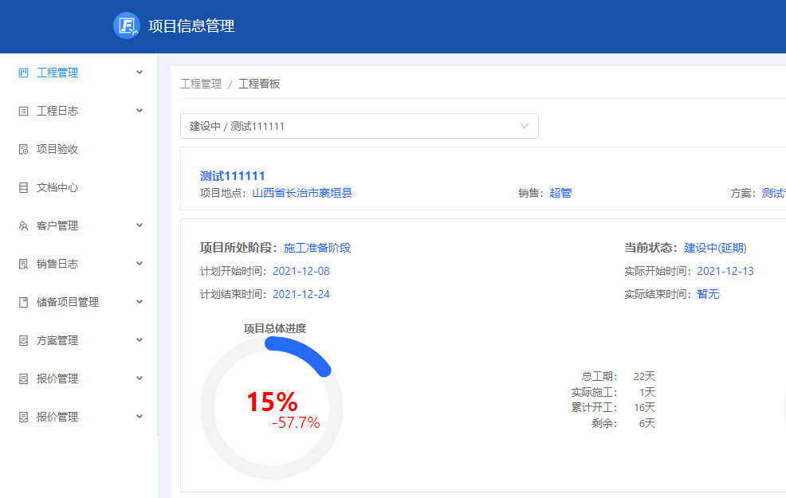
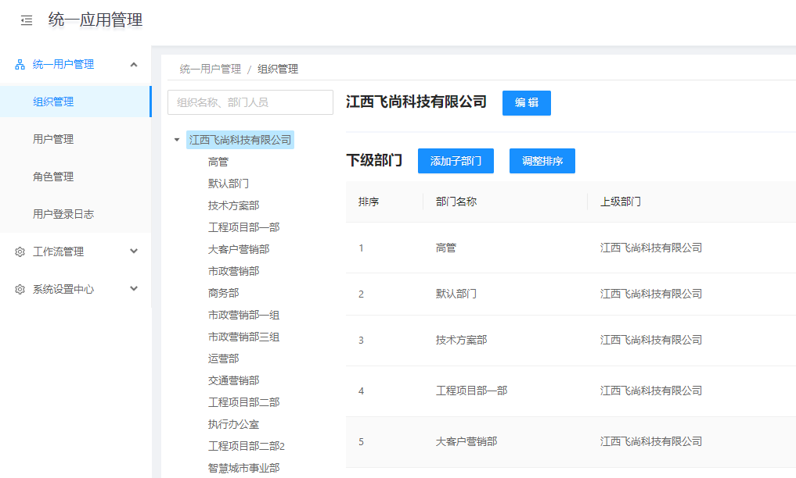
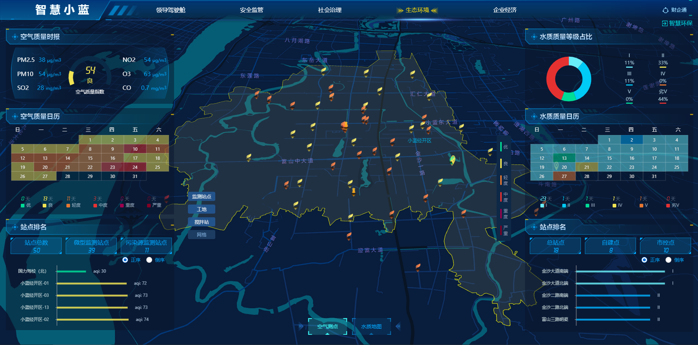

# 2021 年终总结

<kbd>高志远</kbd> <kbd>软件研发</kbd>

## 业绩、创新与质量

1. 主要开发了项目管理第二期相关内容(工程管理)
   
   这期间第一次开始对常用工具函数进行精简升级；

   

2. 设计并开发了企业管理（统一管理平台）平台第一个版本
   解决了多平台接入的鉴权、账号数据管理、已有项目数据接入等问题；
   开始引入 React 17 函数式组件进行编码，提升组件渲染效率；
   进一步封装工具函数；
   为后续安心云4.0的架设打下基础；

     

3. 升级项目前端框架 安心云4.0，全部使用高效率的 React 17 技术栈，辅以 Antd 4+ UI框架；  
   为安心云新版本开发及本地化项目提升效率；

   - 不使用 ReduxHelper

     Action
     ```js
     export const GET_ENTERPRISERSDETAILS = 'GET_ENTERPRISERSDETAILS';
     export const GET_ENTERPRISERSDETAILS_SUCCESS = 'GET_ENTERPRISERSDETAILS_SUCCESS';
     export const GET_ENTERPRISERSDETAILS_ERROR = "GET_ENTERPRISERSDETAILS_ERROR";

     export function getEnterprisesDetails(userId) {
        return dispatch => {
            const url = ApiTable.getEnterprisesDetails.replace('{userId}', userId)
            dispatch({ type: GET_ENTERPRISERSDETAILS });
            return Request.get(url)
                .then(res => dispatch({
                    type: GET_ENTERPRISERSDETAILS_SUCCESS,
                    payload: { enterprises: res }
                })
                    , error => dispatch({
                        type: GET_ENTERPRISERSDETAILS_ERROR,
                        error: '获取企业信息失败'
                    }));
        }
     }
     ```
     
     Reducer
     ```js
     import Immutable from 'immutable';
     import * as ActionTypes from '../actions/author';

     const authorListInitState = {
        data: [],
        isRequesting: false,
        enterprises: [],
     }

     export function author (state = authorListInitState, action) {
        const { type, payload } = action;

        switch (type) {
            //getenterprisesDetail
            case ActionTypes.GET_ENTERPRISERSDETAILS:
                return Immutable.fromJS(state).merge({
                    isRequesting: true
                }).toJS();
            case ActionTypes.GET_ENTERPRISERSDETAILS_SUCCESS:
                return Immutable.fromJS(state).merge({
                    isRequesting: false,
                    enterprises: payload.enterprises
                }).toJS();
            case ActionTypes.GET_ENTERPRISERSDETAILS_ERROR:
                return Immutable.fromJS(state).merge({
                    isRequesting: false
                }).toJS();
            default:
                return state;
        }
     }

     ```
   
   - 使用 ReduxHelper
     
     Action 
     ```js
     import { basicAction } from '@peace/utils'
     import { ApiTable } from '$utils'

     export function getCompanyOrganization(companyId) {
        return dispatch => basicAction({
            type: 'get',
            dispatch: dispatch,
            actionType: 'GET_COMPANY_ORG',
            url: ApiTable.getCompanyOrganization.replace('{companyId}', companyId),
            msg: { error: '获取组织信息失败' },
            reducer: { name: 'companyOrganization' }
        });
     }
     ```

     Reducer
     ```js
     export default {    
         // 什么都不需要写
     };
     ```
   
4. [智慧小蓝大屏项目](https://superxiaolan.anxinyun.cn/)：
   
     
   
5. [sequelize-automate-fs](https://www.npmjs.com/package/sequelize-automate-freesun)

   根据公司 api 架构设计，一键生成 ORM，节省大量精力与时间

   ```js
    // app/lib/models/
    /* eslint-disable*/
    'use strict';

    module.exports = dc => {
        const DataTypes = dc.ORM;
        const sequelize = dc.orm;
        const Company = sequelize.define("company", {
            id: {
            type: DataTypes.INTEGER,
            allowNull: false,
            defaultValue: null,
            comment: null,
            primaryKey: true,
            field: "id",
            autoIncrement: true,
            unique: "u_company_id_uindex"
            },
            name: {
            type: DataTypes.STRING,
            allowNull: false,
            defaultValue: null,
            comment: null,
            primaryKey: false,
            field: "name",
            autoIncrement: false
            },
        }, {
            tableName: "company",
            comment: "",
            indexes: []
        });
        dc.models.Company = Company;
        return Company;
    };
   ```

## 自我评价

2021 对于我是思想更加成熟的一年；

从工作上来说，我积极高效，解决问题迅速快捷；这得益于对这份工作的热爱，对工作内容的兴趣；使我可以一直保持钻研的态度；

从生活上来看，这一年尽显浮躁，幸好迷途知返，明白所需所求，从此可以静下心来，更进一步；

从思想上来讲，深刻理解了技术是为业务服务的精髓，代码优化是时时的事情，不是一时的事情；

## 问题与不足

- 对于技术，除了手头的工作还有更广阔的天地；

   - 扎实基础
     
     如：  
     - js 原型链 ~
     - sql 的高效率数据查询

   - 效率进步
     
     如：  
     - api 文档的自动维护
     - 多项目结合的分库分表设计
  
   - 前沿技术
     
     如：  
     - 机器学习 
       - [machine_learning](https://github.com/junku901/machine_learning)

         JavaScript 来设置和训练神经网络的库。 在 Node.js 和客户端中，它都非常容易进行安装，并且具有非常干净的 API，对于所有具备熟练技能级别的开发人员来说都是很合适的。 该库提供了许多实现了流行算法的示例，以帮助你了解核心的机器学习原理。
       - [TensorFlow.js](https://github.com/tensorflow/tfjs-core)
       
         Google 发布的一个开源的机器学习JavaScript 库，可用于不同的目的，例如在浏览器中训练神经网络，理解ML模型，用于教育目的等。你可以在推理模式中运行预先训练的模型。可以在 TypeScript（ES6 JavaScript）或 ES5 JavaScript 中编写代码。通过在 HTML 文件的 head 标签中包含以下代码并编写用于构建模型的 JS 程序，可以实现快速入门。

     - 大数据分析

- 对于业务，哪怕是经历的项目也不过是管中窥豹；

  >程序服务于项目，项目服务于人

  尤其是对于业务的不甚了解，是开发中欠缺的部分；

## 今后工作

首先，静下心来，工作、学习、思考；

其次，多关注业务，了解自己的工作在整个工程中的作用；

最后，积极提升技术，以**触类旁通**，应对**不时之需**；

总之：打铁还需自身硬，尚差且远；

## 考核建议

软件研发向上是产品，向下是测试，不是一个向外对接的工作；

所以多数时候，我们不能知道我们编码的产品产生了什么反响，如果能知道公司的软件产品所达成的一些业绩，我想研发们会更有成就感、更有动力；

---

## <span style="color:red">㊗</span>

<div style="background-image: linear-gradient(to right, #7f0102, #b80103, #7f0102);color:#ffffffef;text-align:center;padding:32px 0;font-size:64px;border-radius:12px;box-shadow:-3px 3px 3px black">
新年快乐
</div>