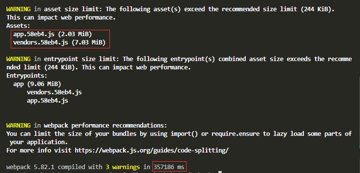
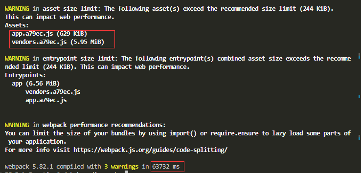

中鼎是工地项目较新的一个项目，而旧项目因历经版本多，一套代码内的模块分别为不同的项目服务，但是打包的时候全引入，导致打包速度慢、占用内存高，所以以下探讨如何在现有架构上分模块（项目）进行打包优化；

### MSUF

[什么是 MSUF](https://mp.weixin.qq.com/s?__biz=MjM5NDgyODI4MQ%3D%3D&mid=2247484533&idx=1&sn=9b15a67b88ebc95476fce1798eb49146)

[使用 MSUF](https://umijs.org/blog/mfsu-independent-usage)

MSUF 是 Umijs 基于 webpack 5 Module Federation 特性的提速方案；可以独立部署使用；
但是我们的 web 架构依然停留 node v12 的基础上，再加上前端 web 保留 node 服务的功能，改造为适配 node v16+ 的 MSUF 工程量较大，卒；
	
---
	
> 在这里需要讨论一个问题：前后端分离的情况下，是否还需要在前端 web 保留 node 服务的功能，也就是当前 `routes` 所包含的一些接口；	
	
### 改造现有代码
	
1. 减少打包体积
		
2. 按项目打包模块
    改造项目源码 `client/src`的入口文件`index.js`:合并`app.js`文件内容，并缀以项目名称，如`index_zhongding.js`
	
    ```js
    'use strict';
    import { render } from 'react-dom';
    import React, { useEffect } from 'react';

    import Layout from './layout';
    import Auth from './sections/auth';
    import { homePage } from './sections/homePage';

    const App = props => {

            const { projectName } = props
            useEffect(() => {
                document.title = projectName
            }, [])

            return (
                <Layout
                    title={projectName}
                    sections={[
                        homePage,
                        Auth,
                    ]}
                />
            )
    }
    render((<App projectName="项目运管调度平台" />), document.getElementById('App'));
    ```

    为了在构建的时候尽量少改动，所以`build`时传递需要构建的项目名称，如`npm run build --PARAMETER_NAME=zhongding`，这样的语句也可以写到`Dockerfile`的构建命令中；然后在`webpack.config.prod.js`中接收参数，以决定使用哪个入口文件；

    ```js
    const PARAMETER_NAME = process.env.npm_config_PARAMETER_NAME;

    const PATHS = {
        enter: path.join(
            __dirname,
            'client/src',
            PARAMETER_NAME ? 'index_' + PARAMETER_NAME + '.js' : 'index.js'
        ),
        app: path.join(
            __dirname,
            'client/src',
        ),
        build: path.join(__dirname, 'client/build')
    };
    ```

    --- 
    ##### 改造前构建：

    app.js  2.03 MiB

    vender.js 7.03 Mib

    

    ##### 经以上改造,创建新文件`index_test.js`，取消三分之二的`sections`模块：

    app.js  629 KiB 

    vender.js 5.95 Mib

    

    说明以上改造对于分模块构建是有效的；

    ---

当前web架构已经是延续至少 5 年的架构模式，后面的优化多是在这上面添砖加瓦，需要考虑是否全部推倒重新架构，采用纯前端前后分离的模式，引入Vite/MSUF等打包模式，可见的好处是开发时热更新快，构建快、包文件小、前后端完完全全分离，减少代码冗余，纯度++

