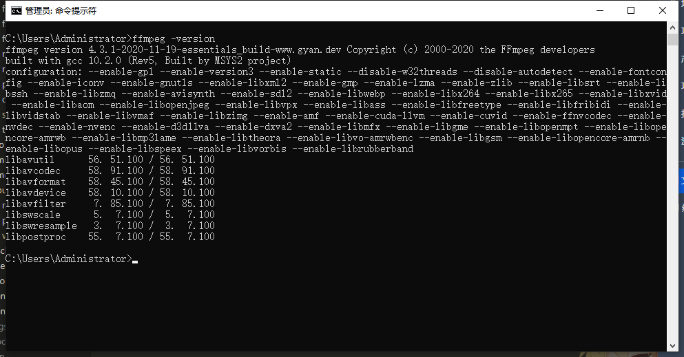

# 论视频文件（.mp4）的三种推流播放方式

## 背景
`昌建工地`项目采用本地化部署方式，文件上传至服务器磁盘内保存，其中`BIM视频`模块内视频最大达 221M，使用 `video` 标签直接播放无效；

```
<video
	src={v?.imageUrl}
	controls="controls"
>
```

更换 20M 左右视频均能播放，所以合理怀疑是文件大小问题，准备采用推流方式分片发送，以解决问题；

## 实现
### 方式一 / fs.createReadStream
为了缓解项目构建大小，一开始本着尽可能少的引入工具包的原则，搜索到了使用 `Node` de `fs` 读取文件流返回，进行视频推流；
- 采用 `express` 实现的网络实例
```
var express = require('express');
var router = express.Router();
var fs = require('fs');
router.get('/video', function (req, res, next) {
    let path = './assets/sintel.mp4';
    let stat = fs.statSync(path);
    let fileSize = stat.size;
    let range = req.headers.range;
    // fileSize 3332038
    if (range) {
        let parts = range.replace(/bytes=/, "").split("-");
        let start = parseInt(parts[0], 10);
        let end = parts[1] ? parseInt(parts[1], 10) : start + 999999;

        // end 在最后取值为 fileSize - 1 
        end = end > fileSize - 1 ? fileSize - 1 : end;
        let chunksize = (end - start) + 1;
        let file = fs.createReadStream(path, { start, end });
        let head = {
            'Content-Range': `bytes ${start}-${end}/${fileSize}`,
            'Accept-Ranges': 'bytes',
            'Content-Length': chunksize,
            'Content-Type': 'video/mp4',
        };
        res.writeHead(206, head);
        file.pipe(res);
    } else {
        let head = {
            'Content-Length': fileSize,
            'Content-Type': 'video/mp4',
        };
        res.writeHead(200, head);
        fs.createReadStream(path).pipe(res);
    }
});
```

到这里，需要介绍 http 请求头中的 Range、Content-Range：
- Range 
	用于请求头中，指定第一个字节的位置和最后一个字节的位置，一般格式：
	```
	Range:(unit=first byte pos)-[last byte pos] 
	```
- Content-Range
用于响应头，指定整个实体中的一部分的插入位置，他也指示了整个实体的长度。在服务器向客户返回一个部分响应，它必须描述响应覆盖的范围和整个实体长度。一般格式： 
```
Content-Range: bytes (unit first byte pos) - [last byte pos]/[entity legth] 
```

例如：

请求下载整个文件: 
		
```
GET /test.rar HTTP/1.1 
Connection: close 
Host: 116.1.219.219 
Range: bytes=0-801 //一般请求下载整个文件是bytes=0- 或不用这个头
```
		
一般正常回应
		
```
HTTP/1.1 200 OK 
Content-Length: 801      
Content-Type: application/octet-stream 
Content-Range: bytes 0-800/801 //801:文件总大小
```
		
[更进一步](https://blog.csdn.net/pud_zha/article/details/7924929)

---

使用 `koa` 来时实现：

```
async streamTest () {
	const { ctx } = this;
	try {
		 const { model, curUser, app, service } = ctx;
		 const { videoPath } = ctx.query

		 let filePath = PATH.join(
				__dirname,
				'../public/video/TEST.mp4',
		 )

		 let path = filePath;
		 let stat = fs.statSync(path);
		 let fileSize = stat.size;

		 let stream = fs.createReadStream(path);
		 let header = {
				'Content-Length': fileSize,
				'Content-Type': 'video/mp4'
		 };
		 ctx.set(header);
		 ctx.status = 200;
		 ctx.body = stream
		 stream.on('end', () => {
				ctx.res.end(); // 在文件读取结束时结束响应
		 });
	} catch (error) {
		 ctx.logger.error(new Error(error));
		 ctx.throw(400, {});
	}
}
```

---

前端调用

```
<video
	src={'video?videoPath=' + v?.imageUrl}
>
```

---

以上播放方式在本地开发环境可行，也能看到文件数据逐渐加载，但是部署到生产环境同样无效；

### 方式二 / FFmpeg
FFmpeg是一套可以用来记录、转换数字音频、视频，并能将其转化为流的开源计算机程序。

[官网下载](http://ffmpeg.org/download.html)

- windows部署：
	- 复制`bin`文件夹路径并添加到 `环境变量->系统变量的 'Path'`
(如果设置了用户的环境变量，必须重启，系统的环境变量不需要重启。)
	- 打开命令提示符输入命令“ffmpeg -version”，输出一些版本信息即安装成功。
    
- linux 以 centos 为例：
	- 安装EPEL仓库
	EPEL（Extra Packages for Enterprise Linux）仓库提供了CentOS服务器中许多额外的包。要安装FFmpeg，需要启用EPEL仓库。
	```
	sudo yum -y install epel-release
	```
	- 安装Nux Dextop仓库
	Nux Dextop仓库提供了在CentOS服务器上安装FFmpeg和其他多媒体工具所需的库。
	```
	sudo rpm -Uvh http://li.nux.ro/download/nux/dextop/el7/x86_64/nux-dextop-release-0-5.el7.nux.noarch.rpm
	```
	- 安装FFmpeg
	```
	sudo yum -y install ffmpeg ffmpeg-devel
	```
	- 栗子 : 将AVI文件转为MP4文件
	```
	ffmpeg -i input.avi -c:v libx264 -preset slow -crf 22 -c:a copy output.mp4
	```
	
---

实现代码 `koa`
```
async ffmpegTest () {
	const { ctx } = this;
	try {
		 const { model, curUser, app, service } = ctx;

		 let filePath = PATH.join(
				__dirname,
				'../public/video/TEST.mp4',
		 )

		 // 设置响应头
		 ctx.set('Content-Type', 'video/mp4');
		 ctx.set('Transfer-Encoding', 'chunked');
		 const command = ffmpeg(filePath)
				.format('mp4') // 必须写
				// .format('flv')  // 可以以此进行格式转换
				// .format('webm')
				// .format('ogv')
				// .format('ogg')
				// .videoBitrate(1000)
				// .size('640x480') // 大大减少输送体积
				.size('590x340')
				// .videoCodec('libx264') //设置视频编解码器
				// .frames(2500)// 指定帧计数
				.outputOptions(['-movflags frag_keyframe+empty_moov', '-preset ultrafast'])
				.on('progress', function (progress) {
					 console.info('Processing: ' + progress.percent + '% done'); 
				})
				.on('error', (err) => {
					 console.error('An error occurred:', err.message);
				})
				.on('end', () => {
					 console.log('Streaming finished');
				})
				.pipe(undefined, {
					 // end: false, autoClose: false
				});
		 ctx.body = command;
		 ctx.res.on('finish', () => {
				console.info('Ffmpeg Test 推流完成');
		 });

	} catch (error) {
		 ctx.logger.error(new Error(error));
		 ctx.throw(400, {});
	}
}
```

- 肯能遇到的错误 `Output stream closed`

  官方解答：
  When piping the output to an express stream, you may see that error happen from time to time. It happens when the browser closes the connection by itself, not waiting for the whole media to download, so that may well explain this error when it happens infrequently.

  However you may see it on each browser request. This is because many browsers actually make two requests when trying to stream a media. The first one will serve to determine the file format and codecs, and will stop after a few hundred bytes are downloaded, hence the error. The browser will then proceed to the actual streaming with a second (most likely chunked) request.

  [wiki](https://github.com/fluent-ffmpeg/node-fluent-ffmpeg/wiki/FAQ)

使用以上代码加载视频，可以看到 ffmpeg 有一个明显的读取，输出的过程，越大的文件越清晰的输出占用的资源越多；


设置 `size` 可以大大减小输出体积，最终可以应用在生产环境，但是有一个等待转码的过程，播放起来也并不流畅，还不能在视频时间轴上跳转播放；

### 方式三 / Nginx
使用 nginx 代理视频文件坐在文件夹，直接用 `video` 标签请求代理地址，传入具体的文件路径，则顺畅播放：

- nginx配置：

```
	server {
		listen 9458;
		location /BIM/ {
			root /home/fastest/; // 文件所在地址
		}
	}	
```

- `<video/>`

```
<video
	src={'http://xxx:9458/BIM/TEST.mp4'}
>
```

轻松省事有效果；
