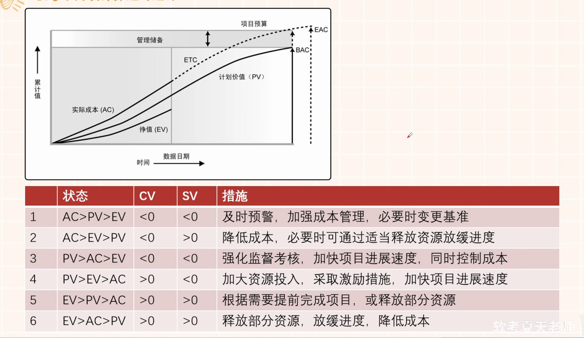

# 软考之系统集成项目管理

---

##  项目整体管理

- 所谓十五至尊图

    |                    | 启动过程组   | 计划过程组                                                                                        | 执行过程组                                     | 控制过程组                            | 收尾过程组 |
    | ------------------ | ------------ | ------------------------------------------------------------------------------------------------- | ---------------------------------------------- | ------------------------------------- | ---------- |
    | **项目整体管理**   | 制定项目章程 | 制定项目管理计划                                                                                  | 指导和管理项目执行                             | 监督和控制项目工作   整体变更控制 | 项目收尾   |
    | **项目范围管理**   |              | 规划范围管理 收集需求 范围定义 创建WBS                                                |                                                | 确认范围 控制范围                 |            |
    | **项目进度管理**   |              | 规划进度管理 活动定义 排列活动顺序 估算活动资源 估算活动持续时间 制定进度计划 |                                                | 控制进度                              |            |
    | **项目成本管理**   |              | 规划成本管理 估算成本 制定预算                                                            |                                                | 成本控制                              |            |
    | **项目质量管理**   |              | 规划质量管理                                                                                      | 管理质量                                       | 控制质量                              |            |
    | **项目资源管理**   |              | 规划人力资源管理                                                                                  | 组建项目团队 建设项目团队 管理项目团队 |                                       |            |
    | **项目沟通管理**   |              | 规划沟通管理                                                                                      | 管理沟通                                       | 控制沟通                              |            |
    | **项目风险管理**   |              | 规划风险管理 识别风险 实施定性风险分析 实施定量风险分析 规划风险应对              |                                                | 控制风险                              |            |
    | **项目采购管理**   |              | 规划采购管理                                                                                      | 实施采购                                       | 控制采购                              | 结束采购   |
    | **项目干系人管理** | 识别干系人   | 规划干系人管理                                                                                    | 管理干系人参与                                 | 控制干系人参与                        |            |

- **项目章程** 主要内容
  1. 概括性的项目描述和项目整体描述；
  2. 项目的目的或批准项目的理由，即为什么要做这个项目；
  3. 项目的总体要求，包括项目的总体范围和总体质量要求；
  4. 可测量的项目目标和相关的成功标准；
  5. 项目的主要风险，如项目的项目的主要风险类别；
  6. 总体里程碑进度计划；
  7. 总体预算；
  8. 项目的审批要求，即在项目的规划、执行、监控和收尾过程中，应该由谁来做出哪种批准；
  9. 委派的项目经理及其职责和职权；
  10. 发起人或其他批准项目章程的人员姓名和职权；

- **项目管理计划** 内容
  1. 所使用的项目管理过程；
  2. 每个特定项目管理过程的实施程度；
  3. 完成这些过程的工具和技术的描述；
  4. 项目所选用的生命周期及各阶段将采用的过程；
  5. 如何用选定的过程来管理具体的项目，包括包括过程之间的依赖与交互关系和基本的输入和输出；
  6. 如何执行工作来完成项目目标及对项目目标的描述；
  7. 如何监督和控制变更，明确如何对变更进行监控；
  8. 配置管理计划，用来明确如何进行配置管理；
  9. 对维护项目绩效基线的完整性的说明；
  10. 与项目干系人进行沟通的要求和技术；
  11. 为项目选择的生命周期模型；
  12. 为解决某些遗留问题和未定的决策，对于其内容、严重程度进行的关键管理评审；

- 监控项目工作
  > 所有监控过程组的输入，都有计划（`项目管理计划`），有`工作绩效数据`（整体管理是`工作绩效信息`）;

  > 所有监控过程组的输出，都有变更（`变更请求`），有更新（`项目管理计划更新、项目文件更新`），有`工作绩效信息`(整体管理是`工作绩效报告`)；

- **项目范围说明书**
  > 项目范围说明书是对项目范围、主要可交付成果、假设条件和制约因素的描述。项目范围说明书记录了整个范围，包括项目和产品范围。项目范围说明书详细描述项目的可交互成果，以及为创建这些可交付成果而必须开展的工作；

  详细的范围说明书包括：
  - 项目目标；
  - 项目范围描述；
  - 项目需求；
  - 项目边界；
  - 项目的可交付成果；
  - 项目的制约因素；
  - 假设条件；
  
- 创建 工作分解结构 - WBS
  - 步骤
    1. **识别和分析可交付成果及相关工作** / 该干什么
    2. **确定WBS的结构和编排方法** / 咋么分
    3. **自上而下逐层细化分解** / 开始分
    4. **为WBS组件制定和分配标识编码** / 指定
    5. **核实可交付成果分解的程度是否恰当** / 检查
  - 注意事项
    1. 在层次上保持项目的完整性，避免遗漏必要的组成部分；
    2. 一个工作单元只能从属于某个上层单元，避免交叉从属；
    3. 相同层次的工作单元应有相同性质；
    4. 工作单元应能分开不同的责任者和不同的工作内容；
    5. 便于项目管理计划和项目控制的需求；
    6. 最底层工作应具有可比性，是可管理的，可定量检查的；
    7. 应包括项目管理工作，包括分包出去的工作；

- 项目进度管理
  - 进度压缩 : 在不缩减项目范围的前提下，缩短进度工期，以满足进度制约因素、强制日期或其他进度目标。
    - 实现技术
      - 赶工：通过增加资源，以最小的成本增加来压缩进度工期的技术，如加班；赶工并非总是切实可行，可能导致风险和/或成本的增加；
      - 快速跟进：将正常情况下安顺序进行的活动或阶段改为至少是部分并行开展；
  - 缩短工期的方法：
    1. **赶工**，投入更多的资源或增加工作时间，以缩短关键活动的工期；
    2. **快速跟进**，并行施工，以缩短关键路径的长度；
    3. 使用高素质的资源或经验更丰富的人员；
    4. 经过甲方允许，**减小活动范围或降低活动要求**；
    5. **改进方法或技术**，以提高生产效率；
    6. **加强质量管理**，及时发现问题，减少返工，从而缩短工期；

- 项目成本管理
  - 项目成本估算
    - 主要步骤
        1. 识别并分析成本的构成科目（**组成部分**）
        2. 根据已识别的成本构成科目，估算每一科目的成本大小
        3. 分析成本估算结果，找出各种可以相互替代的成本，协调各种成本之间的比例关系（**优化**）
   - 项目成本预算
     - 主要步骤
       1. 将项目总成本分摊到项目工作分解结构的各个工作包上
       2. 将各个工作包成本再分配到该工作包所包含的各项活动上
       3. 确定各项成本预算所支出的时间计划及项目成本预算计划（批准的成本基准）
     - 应急储备属于成本基准，管理储备不属于，但是属于项目预算；

- 项目成本管理
  - 质量成本法
    - 一致性成本（项企期间防止失败的费用）
      - 预防成本（生成合规产品）
        - 培训
        - 流程文档化
        - 设备
        - 选择正确的做事时间
      - 评价成本（评定质量）
        - 测试
        - 破坏性测试导致的损失
        - 检查
    - 非一致性成本（项目期间和项目完成后用于处理失败的费用）
      - 内部失败成本（项目内部发现）
        - 返工
        - 废品
      - 外部失败成本（客户发现）
        - 责任
        - 保修
        - 业务流失

  - 质量审计目标
    - 识别全部正在实施的良好及最佳实践
    - 识别全部违规做法，差距及不足
    - 分享所在组织或行业中类似项目的良好实践
    - 积极、主动地提供协助，以改进过程的执行，从而帮助团队提高生产效率
    - 强调每次审计都应对组织经验教训的积累做出贡献

- 人力资源管理
  - 项目团队建设
    - 团队经历阶段
      1. 形成阶段
      2. 震荡阶段
      3. 规范阶段
      4. 发挥阶段
      5. 结束阶段
      - 无论目前团队处于什么阶段，新增加一个阶段或减少一个人，都要从形成阶段重新开始
  - 项目团队管理
    - 冲突管理的6种方法
      1. 问题解决：冲突各方一起积极地定义问题、收集问题的信息、制定解决方案，直到选择一个最合适的方案来解决冲突，此时为双赢或多赢。但在这个过程中，需要公开地协商，这是冲突管理中最理想的方案；
      2. 合作：集合多方的观点和意见，得出一个多数人接受和承诺的冲突解决方案；
      3. 强制：以牺牲其他各方观点为代价，强制采纳一方的观点；
      4. 妥协：冲突的各方协商并寻找一种能够使冲突各方都有一定程度满意、但冲突各方没有任何一方完全满意，是一种都做一些让步的冲突解决方法；
      5. 求同存异：冲突各方都关注他们一致的一面，而淡化不一致的一面。一般求同存异要求保持一种友好的氛围，但是回避了解决冲突的根源，也就是让大家都冷静下来，先把工作做完；
      6. 撤退：把眼前或潜在的冲突搁置起来，从冲突中撤退；
  - 项目经理所需具备的影响力
    - 5种基本权利
      - 合法的权力：高级管理层对项目经理授权的基础上，项目经理让员工工作的权利；
      - 强制力：使用惩罚、威胁或其他消极手段强迫员工做他们不想做的事。然而，一般强制力在团队的建设中不是一个很好的办法，通常会带来项目的失败，建议不要经常使用；
      - 专家权力：用个人知识和技能让员工改变他们的行为。如果项目经理让员工感到他在某些领域有专长，那么他们就会遵照项目经理的意见行事；
      - 奖励权力：使用一些激励措施来引导员工去工作。奖励包括薪资、职位、认可度、特殊的任务以及其他的奖励员工满意度的手段。大部分奖励理论认为，一些特定的奖励，如富有挑战性的工作、工作成就以及认可度才能真正引导员工改变行为或努力工作；
      - 感召权力：权力建立在个人感召权力的基础上。人们非常尊重某些具有感召权力的人，会按照他们所说的去做。
      
      尽量避免强制力，并且项目经理的合法权力、奖励权力和强制力是来自公司的授权，而其他的权力则是来自项目经理本身，多采用奖励权力和专家权力；

- 项目合同
  - 合同类型的选择
    - 若**工作范围很明确**，且项目的设计已具备详尽的细节，则使用**总价合同**
    - 若**工作性质清楚，但范围不是很清楚**，而且工作不复杂，又需要快速签订合同，则使用**工料合同**
    - 若**工作范围尚不清楚**，则使用**成本补偿合同**
    - 若双方分担风险，则使用工料合同；若**买方承担成本风险**，则使用**成本补偿合同**；若**买方承担成本风险**，则使用**总价合同**
    - 若购买标准产品，且数量不大，则使用单边合同（订购单）

- 项目文档配置管理
  - **配置管理员**负责在整个项目周期中负责进行配置管理活动，具体有：
    1. 编写配置管理计划
    2. 建立和维护配置管理系统
    3. 建立和维护配置库
    4. 配置项识别
    5. 建立和管理基线
    6. 版本管理和配置控制
    7. 配置状态报告
    8. 配置审计
    9. 发布管理和交互
    10. 对项目成员进行配置管理培训

- 项目风险
  - 定性风险分析的工具和技术
    1. 风险概率和影响评估
    2. **概率和影响矩阵风险值**=风险发生的概率*风险发生后的后果
    3. 风险数据质量评估：评估风险数据对风险管理的有用成都的一种技术，用来考察人们对风险的理解程度，以及考察风险数据的准确性、质量、可靠性和完整性。风险数据的质量，直接影响定性分析的结果；
    4. 风险分类；
    5. 风险紧迫性评估：综合考虑风险的紧迫性及从概率和影响矩阵中得到的风险登记，从而得到最终的风险严重性级别；
    6. 专家判断；
  - 定量风险分析的工具和技术
    1. 数据收集和展示技术
       - 访谈
       - 概率分析
    2. 定量风险分析和建模技术
       - 敏感性分析：有助于确定哪些风险对项目具有最大的潜在影响
       - 预期货币价值（EMV）分析：当某些情况在未来可能发生或不发生时，计算平均结果的一种统计方法（不确定性下的分析）
       - 建模和模拟（蒙特卡洛分析）：项目模拟旨在使用一个模型，计算项目各细节方面的不确定性对项目目标的潜在影响
    3. 专家判断

---

- 成本预算
  - PV 计划价值 / 预算 - 不包含管理储备 / Planned Value
  - EV 挣值 / 已完成且被认可的工作的成本 / Earned Value
  - AC 实际成本 / 实际花费 为完成 EV 所产生的所有成本 包括不被认可的 / Actual Cost
  ---
  - 在计划进行中的某一时间点进行观测
    - SV = EV - PV 进度偏差 / 挣值与计划价值之差 / 代表计划进度提前或落后 / Schedule Variance
    - CV = EV - AC 成本偏差 / 挣值与实际成本之差 / 代表预算消费亏空或盈余 / Cost Variance
    - SPI = EV **/** PV 进度绩效指数 / 挣值与计划价值之比 / 代表工作效率 / Schedule Performance Index
      - SPI > 1 已完工工作量超过计划
      - SPI < 1 已完成工作量未达计划目标
    - CPI = EV **/** AC 成本绩效指数 / 挣值与实际成本之比 / 代表成本效率 / Cost Performance Index
      - CPI > 1 已完成工作的成本结余了
      - CPI < 1 已完成工作的成本超支了
  - 预测技术
    - BAC = ∑PV 完工预算 / 完成所有工作所需预算 - 不包含管理储备 / Budget At Completion
    - ETC 完工尚需估算 / 完成剩余工作还需花费 / Estimate To Complete
      - ETC = BAC - EV 非典型计算 / 以后不会再发生之前的偏差 - 也就是做了纠正
      - ETC = （BAC - EV）**/** CPI 典型计算 / 之前的偏差后面还将继续
    - EAC 完工估算 / 完成全部工作时需要花费的成本预算
      - EAC = AC + ETC
      - EAC = AC + BAC - EV 非典型计算
      - EAC = AC + (BAC - EV) **/** CPI = BAC **/** CPI 典型计算
    - VAC = BAC - EAC 完工总偏差 / 基于非典型偏差计算 / Variance At Completion
    - TCPI 完工尚需绩效指数 / 完成剩余工作所需成本与剩余预算之比 / To Complete Performance Index
      - TCPI = (BAC - EV) **/** (BAC - AC)
      - TCPI = (BAC - EV) **/** (EAC - AC)

    