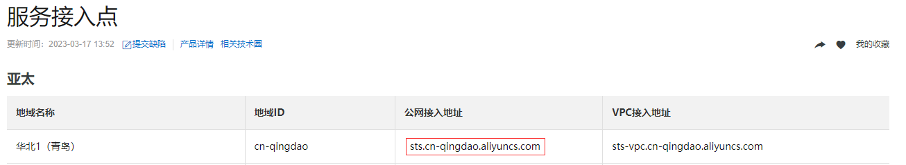

# 阿里OSS大文件分片上传和下载

## 需求
中鼎需要上传10G大文件，以阿里OSS进行预研，因阿里文档着实晦涩且繁复，颇费了一番工夫；

## 上传
基于 Antd v4 Upload 组件的 customRequest 属性实现自定义上传功能，

为了避免大文件以web服务器中转上传造成的资源和时间浪费，采取直接在客户端-浏览器上传的方式上传文件；

为了避免暴露阿里OSS秘钥，需要使用 STS服务给其他用户颁发一个临时访问凭证。该用户可使用临时访问凭证在规定时间内访问OSS资源。

临时访问凭证无需透露您的长期密钥，使OSS资源访问更加安全。

创建 STS给新用户的步骤见[【链接】](https://help.aliyun.com/document_detail/100624.html)：

至第三步【创建用于获取临时访问凭证的角色】

即可获取接下来项目中所需要的 `ramAccessKey`, `ramSecretKey`, `arn` 三个参数

还需另外一个参数 `endpoint`，是根据 bucket 所在地区决定的，可以打开[【链接】](https://help.aliyun.com/document_detail/100624.html)查询，取对应地区的【公网接入地址】（如下图）


至第四步【为角色授予上传文件的权限】，可使用如下配置
```json
{
    "Version": "1",
    "Statement": [
        {
           "Effect": "Allow",
           "Action": [
             "oss:PutObject"
           ],
           "Resource": [
             "acs:oss:*:*:examplebucket/*"
           ]
        }
    ]
} 
```
其中 examplebucket 为允许访问的 bucket 名称；

第五步【获取临时凭证】

需要在项目api中实现，上传文件时，请求此接口以获取临时凭证；
```js
    const aliStsToken = async (ctx) => {
        const { accessKey, secretKey, bucket, region, endpoint, arn, ramAccessKey, ramSecretKey } = opts.aliOss
        if (lastStsTokenRes) { // 做个缓存
            if (moment().isAfter(moment(lastStsTokenRes.Expiration).subtract(3, 'minutes'))) {
                ctx.status = 200;
                ctx.body = lastStsTokenRes
            }
        }
        const sts = new StsClient({
            endpoint: endpoint,  // check this from sts console
            accessKeyId: ramAccessKey,  // check this from aliyun console
            accessKeySecret: ramSecretKey // check this from aliyun console
        });

        const stsTokenRes = await sts.assumeRole(
            arn,
            'xxx'
        ); 

        lastStsTokenRes = stsTokenRes.Credentials

        ctx.status = 200;
        ctx.body = stsTokenRes.Credentials;
    }
```

接下来可以使用临时凭证 上传文件
```js
    const client = new OSS({
        // yourRegion填写Bucket所在地域。以华东1（杭州）为例，Region填写为oss-cn-hangzhou。
        region: that.aliRegion,
        // 从STS服务获取的临时访问密钥（AccessKey ID和AccessKey Secret）。
        accessKeyId: stsRes.AccessKeyId,
        accessKeySecret: stsRes.AccessKeySecret,
        // 从STS服务获取的安全令牌（SecurityToken）。
        stsToken: stsRes.SecurityToken,
        // 填写Bucket名称，例如examplebucket。
        bucket: that.aliBucket,
    });

    let uploadRes = null
    let uploadPath = `/${uploadType_}/${uuidv4()}/` + params.file.name
    if (
        // false &&
        params.file.size < 1024 * 1024 * 1
    ) {
        params.onProgress({ percent: 40 })
        uploadRes = await client.put(
            uploadPath,
            params.file
        );
    } else {
        uploadRes = await client.multipartUpload(uploadPath, params.file, {
            progress: (p, _checkpoint) => {
                // Object的上传进度。
                // console.log(p);
                // 分片上传的断点信息。
                // console.log(_checkpoint);
                params.onProgress({ percent: p * 100 })
            },
            // 设置并发上传的分片数量。
            parallel: 4,
            // 设置分片大小。默认值为1 MB，最小值为100 KB。
            partSize: 1024 * 1024 * 3, // 3m
        });
    }

    // console.log(uploadRes);
```

其中 stsRes 为获取的临时凭证信息

在上传完成之后 可以调用 antd Upload组件的 onSuccess 方法结束上传状态；

## 下载

文件下载，同样使用临时凭证[【文档链接】](https://help.aliyun.com/document_detail/64052.htm)；
```js
    const client = new OSS({
        // yourRegion填写Bucket所在地域。以华东1（杭州）为例，Region填写为oss-cn-hangzhou。
        region: that.aliRegion,
        // 从STS服务获取的临时访问密钥（AccessKey ID和AccessKey Secret）。
        accessKeyId: stsRes.AccessKeyId,
        accessKeySecret: stsRes.AccessKeySecret,
        // 从STS服务获取的安全令牌（SecurityToken）。
        stsToken: stsRes.SecurityToken,
        // 填写Bucket名称，例如examplebucket。
        bucket: that.aliBucket,
    });
    // 配置响应头实现通过URL访问时自动下载文件，并设置下载后的文件名。
    const response = {
        'content-disposition': `attachment; filename=${encodeURIComponent(file.name)}`
    }
    // 填写Object完整路径。Object完整路径中不能包含Bucket名称。
    url = client.signatureUrl(file.storageUrl, { response });
```
再使用 a 标签或 window.open 打开 url 即可；


